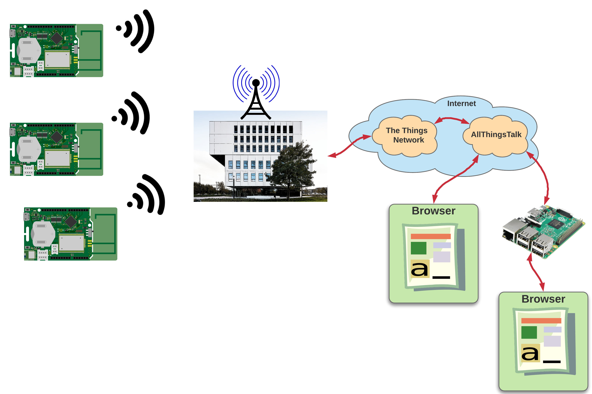

# LoRaWAN Workshop

Welkom op de LoRaWAN Workshop door de VIVES hogeschool - Campus Brugge Station.

Deze workshop geeft een introductie in de draadloze communicatietechnologie LoRaWAN. Voor deze workshop maken we gebruik van een [Arduino](https://www.arduino.cc/) compatibel ontwikkelbord, namelijk de [Sodaq ExpLoRer](https://shop.sodaq.com/explorer.html). Dit bord laat heel makkelijk toe [Grove](http://wiki.seeedstudio.com/Grove/) sensoren aan te koppelen.

Tijdens het eerste deel van de deze workshop gaan we de sensoren inlezen en de informatie draadloos verzenden via LoRaWAN. We zullen hierbij gebruik maken van [The Things Network](https://www.thethingsnetwork.org/) om onze gegevens te bundelen en beschikbaar te stellen. Vervolgens gaan we deze gegevens binnenhalen met een Node-RED flow die deze beschikbaar zal stellen via MQTT. Dit laat toe om onze applicaties te laten abonneren op updates van data.

In het tweede deel van deze workshop bouwen we zelf een dashboard die de gegevens kan visualiseren. Deze webpagina zullen we zelf gaan hosten op een [Raspberry Pi](https://www.raspberrypi.org/).

Wat gaan we dus allemaal doen:

1. Arduino en SODAQ ExpLoRer
2. Grove sensoren uitlezen
3. De uitgelezen sensorwaarden verzenden met LoRaWAN
4. Deze gegevens opvangen met *The Things Network*
5. Opvangen van onze data met Node-RED en beschikbaar stellen via MQTT
6. Bouwen van een eigen dashboard
7. Webserver opzetten op de Raspberry Pi
