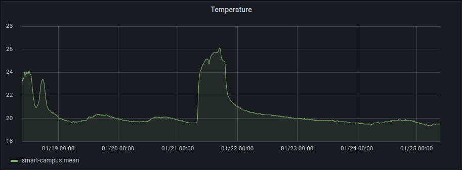
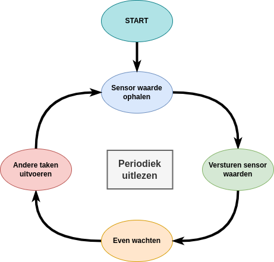
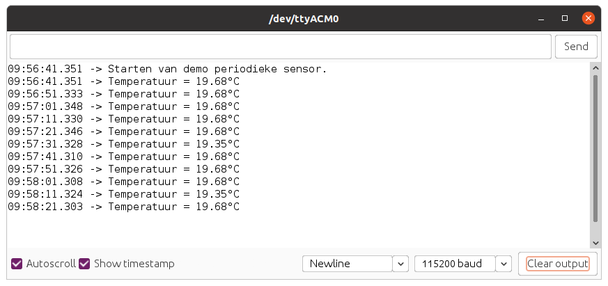
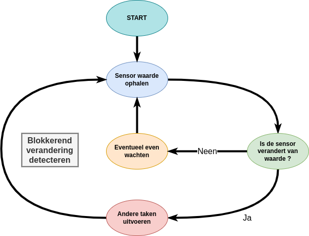
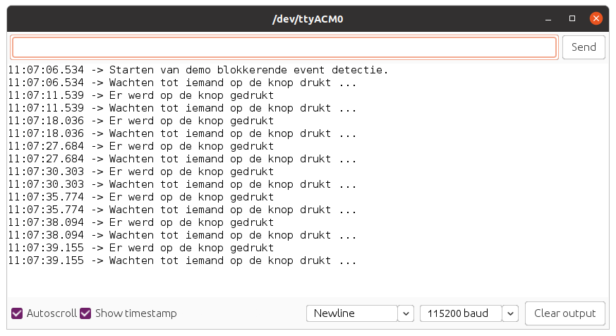
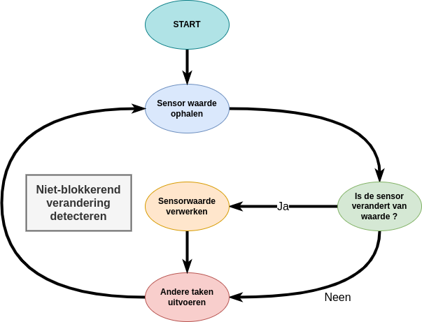
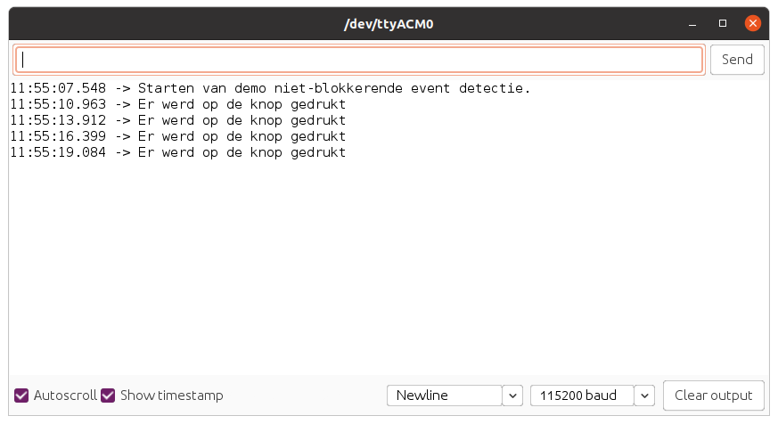

# Datacaptatie

Onder datacaptatie verstaan we het binnenhalen van de data van een bepaalde bron. Dit kan bv. van een sensor zijn die aan onze microcontroller hangt. Afhankelijk van de sensor, zal er op een bepaalde manier moeten worden gecommuniceerd met de sensor. Later hierover meer.

Vervolgens gaan we de data dan verzamelen en doorsturen naar "het internet" voor opslag, verwerking, visualisatie, ...

Afhankelijk van de sensor en de toepassing kan het uitlezen van de sensoren op verschillende manieren gebeuren. Zo kunnen we een sensor periodiek uitlezen of kunnen we kijken naar een verandering en deze dan pas reporteren.

## Periodiek uitlezen

Bepaalde sensoren gaan we periodiek uitlezen. Dit doen we wanneer we een **vast tijdsinterval** willen hebben tussen de verschillende waarden. Meestal is dit met het oog op de latere **statistische verwerking en visualisatie in bv een grafiek**.

Typische voorbeelden zijn:

* het uitlezen van de temperatuur, luchtvochtigheid, ...
* het opmeten van vocht in de bodem
* het uitlezen van een digitale elektriciteitsmeter
* ...



Hierbij gaan we om de bepaalde tijd (vast interval) de sensorwaarde capteren en versturen zoals aangegeven in volgende diagram.



### Demo Sketch

Onderstaand vind je een demo sketch die de on-board temperatuur sensor periodiek uitleest. De huidige temperatuur wordt vervolgens weergegeven in de seriele monitor.

```cpp
//**********************************************************
// De setup van Arduino, wordt in het begin van je sketch
// eenmalig uitgevoerd.
// Als je sensor moet initialiseren, dan doe je dit hier
//**********************************************************
void setup() {
  SerialUSB.begin(115200);

  // 10 seconden wachten op SerialUSB. 
  while ((!SerialUSB) && (millis() < 10000)) { }

  SerialUSB.println("Starten van demo periodieke sensor.");
}

//**********************************************************
// De main loop van Arduino, deze blijft telkens herhalen.
//**********************************************************
void loop() {
  // Uitlezen van on-board temperatuur sensor
  float temperature = get_temperature();

  // Versturen, verwerken, ... van de sensor-waarde
  SerialUSB.print("Temperatuur = ");
  SerialUSB.print(temperature);
  SerialUSB.println("°C");
  
  // Even wachten voor volgende meting
  delay(10000);
}

//**********************************************************
// Temperatuur bepalen van de on-board sensor.
//**********************************************************
float get_temperature()
{
  //10mV per C, 0C is 500mV
  float mVolts = (float)analogRead(TEMP_SENSOR) * 3300.0 / 1023.0;
  float temperature = (mVolts - 500.0) / 10.0;

  // Geef de waarde terug
  return temperature;
}
```

De vertraging kan worden verkleind of worden vergroot naar eigen wens.



## Verandering detecteren

Niet alle sensoren zijn geschikt om periodiek uit te lezen en deze waarde te rapporteren. Van sommige sensoren willen we niet periodiek de huidige staat weten, maar willen we eerder weten wanneer de waarde verandert. Een aantal typische voorbeelden hiervan zijn:

* een drukknop die van staat verandert
* een bewegingssensor die beweging detecteert
* een reed-contact dat wordt verbroken
* ...

Om de verandering te detecteren kunnen we op 2 manieren te werk gaan. We kunnen werken met een interrupt of we kunnen pollen (snel sampelen). Werken met interrupts zou ons hier iets te ver weg leiden en brengt ook andere problematieken met zich mee. Vandaar dat we de focus hier op polling gaan leggen.

Bij polling gaan we regelmatig controlleren of de sensorwaarde is verandert ten opzicht van de waarde die de sensor voordien had. De snelheid waarmee we pollen is wel belangrijk. Dit dient snel genoeg te zijn om de verandering te kunnen waarnemen. Moest je bv. maar om de seconde een drukknop pollen, is de kans groot dat je een "snelle druk" mist.

Afhankelijk van de applicatie kunnen we deze detectie op twee manieren implementeren, namelijk blokkerend of niet-blokkerend.

### Blokkerend

Wanneer we blokkerend wachten op een verandering of gebeurtenis moeten we er ons van bewust zijn dat onze applicatie ondertussen niets anders doet dan wachten op de verandering. Van zodra de gebeurtenis heeft plaatsgevonden kan de applicatie verder en eventueel andere taken uitvoeren.



#### Demo Sketch

```cpp
//**********************************************************
// De setup van Arduino, wordt in het begin van je sketch
// eenmalig uitgevoerd.
// Als je sensor moet initialiseren, dan doe je dit hier
//**********************************************************
void setup() {
  SerialUSB.begin(115200);

  // Configuratie digitale pin als ingang
  pinMode(BUTTON, INPUT);

  // 10 seconden wachten op SerialUSB. 
  while ((!SerialUSB) && (millis() < 10000)) { }

  SerialUSB.println("Starten van demo blokkerende event detectie.");
}

//**********************************************************
// De main loop van Arduino, deze blijft telkens herhalen.
//**********************************************************
void loop() {
  SerialUSB.println("Wachten tot iemand op de knop drukt ...");

  // Wachten tot iemand op de knop drukt
  wait_for_button_press();

  // Versturen, verwerken, ... van de drukknop event
  SerialUSB.println("Er werd op de knop gedrukt");
  
  // Hier kunnen we pas iets anders doen ...
}

//**********************************************************
// Wacht op verandering van de drukknop BUTTON
//**********************************************************
void wait_for_button_press()
{
  // Lees de huidige stand van de drukknop
  int previousState = digitalRead(BUTTON);
  int state = previousState;

  // Wachten op verandering van de staat van de knop.
  // We wachten ook zolang de knop ingedrukt is (state == LOW)
  //    (loslaten negeren we dus, enkel indrukken)
  while (state == previousState || state  == LOW) {
    previousState = state;          // Nieuwe staat opslaan in oude staat
    state = digitalRead(BUTTON);    // Nieuwe staat inlezen
    delay(10);    // Even wachten voor ontdendering
  }
}
```

<!-- Sodaq Explorer cannot detect push button being pushed down. It has some circuit attached to the push button that automatically pulls the level high after push and debounces the circuit. -->



### Niet-blokkerend

Stel dat je tijdens het wachten op deze gebeurtenis ook iets anders wil gaan doen in je applicatie. Een typisch voorbeeld is een LED laten aan en uitgaan om te tonen dat het systeem operationeel is. Met de blokkerende code van vorig voorbeeld lukt dit niet of je moet deze code in de while-lus gaan plaatsen van `wait_for_button_press` en dat zou niet zo proper zijn.

De oplossing ligt erin om de functie `wait_for_button_press` niet-blokkerend te maken zodat je ook andere taken kan uitvoeren. Deze functie dient dan wel te reporteren of de gebeurtenis heeft plaatsgevonden of niet. Daarnaast moeten we er ook rekening mee houden dat deze "andere taken" niet te veel in beslag mogen nemen, anders zou het kunnen zijn dat we de gebeurtenis missen.



#### Demo Sketch

```cpp
// Globale variabelen met de staat van de drukknop
int previousState = 0;
int currentState = 0;

// Teller voor de LED
int ledCounter = 0;

//**********************************************************
// De setup van Arduino, wordt in het begin van je sketch
// eenmalig uitgevoerd.
// Als je sensor moet initialiseren, dan doe je dit hier
//**********************************************************
void setup() {
  SerialUSB.begin(115200);

  // Configuratie digitale pin als ingang
  pinMode(BUTTON, INPUT);

  // We lezen ook de "start staat" in
  previousState = digitalRead(BUTTON);
  currentState = previousState;

  // Configuratie van een LED
  pinMode(LED_BUILTIN, OUTPUT);

  // 10 seconden wachten op SerialUSB. 
  while ((!SerialUSB) && (millis() < 10000)) { }

  SerialUSB.println("Starten van demo niet-blokkerende event detectie.");
}

//**********************************************************
// De main loop van Arduino, deze blijft telkens herhalen.
//**********************************************************
void loop() {
  if (has_button_been_pressed()) {
    // Versturen, verwerken, ... van de drukknop event
    SerialUSB.println("Er werd op de knop gedrukt");
  }

  // Hier kunnen we pas iets anders doen ...
  // Bv. een LED aan en uit zetten
  // We kunnen hier echter wel geen grote delay plaatsen anders
  // kunnen we de knop event missen.
  ledCounter++;
  delay(1);   // 1ms delay
  if (ledCounter >= 1000) {
    // We "togglen" de LED
    digitalWrite(LED_BUILTIN, !digitalRead(LED_BUILTIN));

    // Vergeet niet van de ledCounter te resetten
    ledCounter = 0;
  }
}

//**********************************************************
// Controlleer of er op de knop BUTTON werd gedrukt
//**********************************************************
bool has_button_been_pressed()
{
  currentState = digitalRead(BUTTON);

  if (currentState != previousState) {
    // Nieuwe staat opslaan in oude staat
    previousState = currentState;
    delay(10);    // Even wachten voor ontdendering

    // We willen enkel het "loslaten" detecteren
    if (currentState == HIGH) {
      // Aangeven dat de knop werd ingedrukt
      return true;
    }
  }

  // Er vond geen verandering plaats
  return false;
}
```


