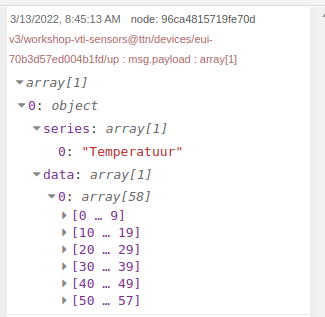
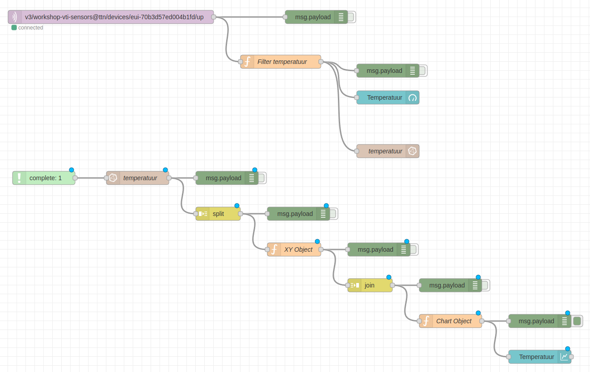

# InfluxDB

[InfluxDB](https://www.influxdata.com/) is een open-source tijdreeksdatabase (TSDB), met andere woorden een database die specifiek is ontworpen voor het bijhouden van tijdsgebonden data. InfluxDB blinkt uit voor het opslaan en ophalen van tijdreeksgegevens - denk maar aan monitoring gegevens, applicatiestatistieken, Internet of Things-sensorgegevens en realtime analyses.

Ook binnen de domotica-wereld wordt er veel gebruik gemaakt van InfluxDB. Zo heeft zowel [OpenHAB](https://www.openhab.org/) als [Home Assistant](https://www.home-assistant.io/) een InfluxDB instantie draaien in de achtergrond voor het bijhouden van al hun tijdsgebonden data.

Voor het visualiseren van tijdsgebonden data wordt ook heel dikwijls gebruik gemaakt van [Grafana](https://grafana.com/), een multi-platform open source dashboarding applicatie die heel makkelijk te koppelen is aan een InfluxDB.

Naast uitgebreide documentatie bestaan er ook tal van libraries om vanuit allerhande programmeertalen een koppeling te leggen met een InfluxDB database, alsook vanuit Node-RED.

::: warning InfluxDB v1.x vs v2.x
Merk op dat er twee versies bestaan van InfluxDB, namelijk v1.x en v2.x. De laatste versie brengt heel wat nieuwe zaken met zich mee en is niet meer compatibel met de vorige versie. Zo wordt er onder andere gebruik gemaakt van een nieuwe query-language. Wij maken voor deze workshop gebruik van de nieuwe versie, zijnde v2.x.
:::

## Installatie van InfluxDB

InfluxDB kan je makkelijk installeren op de Raspberry Pi via *apt*. Om dit mogelijk te maken dient de repo van influx eerst worden toegevoegd:

```bash
curl https://repos.influxdata.com/influxdb.key | gpg --dearmor | sudo tee /usr/share/keyrings/influxdb-archive-keyring.gpg >/dev/null
echo "deb [signed-by=/usr/share/keyrings/influxdb-archive-keyring.gpg] https://repos.influxdata.com/debian $(lsb_release -cs) stable" | sudo tee /etc/apt/sources.list.d/influxdb.list
sudo apt update
```

Vervolgens kan je `influxdb2` installeren:

```bash
sudo apt -y install influxdb2
```

Om de influxdb service te starten en ook automatisch te laten starten wanneer de Rasbian boot, kan je gebruik maken van volgende commands:

```bash
sudo systemctl unmask influxdb
sudo systemctl enable influxdb
sudo systemctl start influxdb
```

Aan de hand van het volgende command kan je dan nagaan of de service succesvol kon worden opgestart:

```bash
sudo systemctl status influxdb
```

## Configuratie van InfluxDB

Zodra InfluxDB is geïnstalleerd kunnen we van slag gaan via de web interface om de configuratie te voltooien.

Je kan hiervoor surfen naar [http://localhost:8086](http://localhost:8086).

Vervolgens dien je volgende gegevens op te geven:

* `Username` en `Password`: deze account is nodig om via de webinterface toegang te krijgen tot je data en de management ervan te doen. Zorg dat je deze niet kwijt speelt gedurende de tijd van de workshop.
* `Initial Organization Name`: een organisatie is eigenlijk een groepering van gebruikers. Hier kan je bv. `workshop` ingeven.
* `Initial Bucket Name`: dit is de naam van je initiële database (dit wordt een bucket genoemd bij influx).

Zodra je alles hebt ingevuld kan je op `Continue` klikken om verder te gaan.


Vervolgens mag je klikken op `Configure Later`.

## Installatie Node-RED InfluxDB

Wanneer we vanuit Node-RED willen communiceren met InfluxDB, dienen we dit via nodes te doen. Standaard is er echter geen ondersteuning vanuit Node-RED voor InfluxDB. Gelukkig is er een library hiervoor beschikbaar.

Klik rechts bovenaan op de menu-knop (drie strepen onder elkaar) en kies de optie `Manage Palette`. Open vervolgens het tabblad `Install` en zoek naar `influxdb`. Vervolgens klik je de `Install` knop voor de module `node-red-contrib-influxdb`.


Als alles gelukt is zou er nu naast de module `Installed` moeten verschijnen. Klik op `Close` om de overlay te sluiten en terug te keren naar de flow-editor.

In Node-RED vind je nu links tussen de andere nodes in de categorie `storage` de nodes `influxdb in` en `influxdb out`.

## Wegschrijven Data

Data wegschrijven naar InfluxDB vanuit Node-RED is heel eenvoudig. Het enige dat we dienen te doen is een `influxdb out` node te koppelen aan onze huidige flow en deze correct te configureren.

Koppel een `influxdb out` node zoals hieronder aangegeven aan de `Filter temperatuur` node:


Voor de configuratie dienen we eerst en vooral een koppeling te maken met de InfluxDB service. Dit doen we door een nieuwe connectie toe te voegen:


Daar vul je volgende parameters in:

* Name: `InfluxDB2`, vrij te kiezen kies een duidelijke naam.
* Version: `2.0` (noodzakelijk aangezien we met de nieuwe InfluxDB v2.x werken)
* URL: `http://localhost:8086` is correct als je de InfluxDB service op dezelfde Raspberry Pi hebt draaien.

Vooraleer we het API token (dit is een soort authenticatie sleutel) kunnen invullen, dienen we zo een token te genereren via de web portal [http://localhost:8086/](http://localhost:8086/) van InfluxDB. Als je daar navigeert naar `Data => API Tokens` en bovenaan rechts klikt op `Generate API Token => Read/Write API Token`, kan je voor de `iot` bucket - selecteer de bucket door er op te klikken - een API token genereren. Geef je API token ook een beschrijvende naam vooraleer je op `Save` klikt.


Het token kan je dan raadplegen door op de naam te klikken en vervolgens op `Copy to Clipboard` te klikken. Nu kan je het pasten in het `Token` field van je Node-RED InfluxDB connectie.


Eens tevreden met de configuratie, kan je op `Add` klikken.

Voor de node zelf vullen we volgende configuratie parameters in:

* Name: `temperatuur`, een beschrijvende naam voor de functie van de node
* Server: `[v2.0] InfluxDB2`, de connectie die we net gemaakt hebben
* Organization: `workshop`, dit is de organisatie die je hebt gemaakt bij de initiële configuratie van InfluxDB
* Bucket: `iot`, de naam van onze "database"
* Measurement: `temperatuur`, de naam die we onze gemeten waarde geven

Dan zou je tot dit resultaat moeten komen:


Indien alles goed gaat zou je geen foutmeldingen mogen zien verschijnen.

### Data Raadplegen via Web Portal

Via de web portal [http://localhost:8086/](http://localhost:8086/) van InfluxDB kunnen we nu controleren of onze data wel degelijk in de `iot` bucket terecht komt. Navigeer naar de web portal en begeef je vervolgens naar de `Explorer`.

Hier kunnen we nu via de data explorer heel makkelijk een grafiek genereren van onze data. Dit doe je door volgende selecties te maken:

* FROM: `iot`, de bucket waaruit we onze data willen halen
* Filter: `_measurement` en `temperatuur`, de measurement die we willen raadplegen. Dit is de reeks van gemeten waarden.
* Filter: `_field_` en `value`, het veld van de measurement die we willen ophalen.
* Time Range (rechts naast `Script Editor`): `Past 1h`, geeft aan in welke tijdsrange we geïnteresseerd zijn.

Wanneer je op `Submit` drukt zou je nu de grafiek moeten zien verschijnen.


Wanneer je op `Script Editor` klikt kan je de echte *query* zien die wordt gebruikt om de data op te halen. Dit gaan we straks nog nodig hebben.

## Ophalen Data

Nu onze bucket stilaan wordt gevuld met data van ons embedded device, wordt het tijd om te kijken hoe we onze historische data uit InfluxDB halen om een grafiek te tonen.

Eerst en vooral dienen we een `influxdb in` node in onze flow te plaatsen. Aangezien we een trigger nodig hebben om onze `influxdb in` node te activeren, gaan we een `complete` node hier dienst laten doen. We kunnen de `complete` node best laten wachten tot de `temperatuur influxdb out` node klaar is. Dat betekent gaat er voor zorgen dat onze grafiek ook de net toegevoegde waarde zal tonen.

<!-- TODO: Deze mss nog vervangen door nieuwe screenshot -->


En natuurlijk koppelen we aan de uitgang van onze `influxdb in` node nog een `debug` node om te kijken wat de output is en of alles goed loopt.


### Configuratie InfluxDB in Node

Voor de configuratie van de `influxdb in` node moeten we volgende parameters configureren:

* Name: `temperatuur`, een zinnige naam voor de node
* Server: `InfluxDB2`, dit is de connectie die we reeds hebben gemaakt met InfluxDB
* Organization: `workshop`, opnieuw de organisatie die we hebben gekozen bij het initialiseren van InfluxDB

De eigenlijke query kunnen we laten genereren door de web portal van InfluxDB. Navigeer naar de web portal en begeef je vervolgens naar de `Explorer`.

Hier kunnen we nu via de data explorer de basis queries genereren die we in NodeRED kunnen gebruiken. Dit doe je door volgende selecties te maken:

* FROM: `iot`, de bucket waaruit we onze data willen halen
* Filter: `_measurement` en `temperatuur`, de measurement die we willen raadplegen. Dit is de reeks van gemeten waarden.
* Filter: `_field_` en `value`, het veld van de measurement die we willen ophalen.
* Time Range (rechts naast `Script Editor`): `Past 1h`, geeft aan in welke tijdsrange we geïnteresseerd zijn.

Wanneer je op `Submit` drukt zou je de grafiek moeten zien verschijnen met de data.

Om de eigenlijke query te verkrijgen, kan je vervolgens op `Script Editor` klikken en zou je onderstaande query moeten krijgen:

```
from(bucket: "iot")
  |> range(start: v.timeRangeStart, stop: v.timeRangeStop)
  |> filter(fn: (r) => r["_measurement"] == "temperatuur")
  |> filter(fn: (r) => r["_field"] == "value")
  |> aggregateWindow(every: v.windowPeriod, fn: mean, createEmpty: false)
  |> yield(name: "mean")
```

Binnen deze query worden echter een aantal parameters gebruikt die afkomstig zijn van de web portal. `v.timeRangeStart` en `v.timeRangeStop` stellen we `Range` voor die werd geselecteerd via de web portal interface. Deze dienen we aan te passen.

Je kan onderstaande aanpassingen in de `Script Editor` aanpassen en vervolgens testen.

* Vervang `v.timeRangeStart` door `-1d` wat aangeeft dat de start van de range 1 dag geleden is.
* Vervang `v.timeRangeStop` door `now()` wat een ingebouwde functie is voor het huidige tijdstip.
* Vervang `v.windowPeriod` door `1m` wat er voor zorgt dat er per minuut een gemiddelde waarde wordt bepaald.

Deze query gaat dus met andere woorden de waarden van het afgelopen uur ophalen en per minuut een waarde voorzien.

Dit zou dan het resultaat moeten zijn:

```
from(bucket: "iot")
  |> range(start: -1d, stop: now())
  |> filter(fn: (r) => r["_measurement"] == "temperatuur")
  |> filter(fn: (r) => r["_field"] == "value")
  |> aggregateWindow(every: 1m, fn: mean, createEmpty: false)
  |> yield(name: "mean")
```

::: tip Flux
Alle informatie over de Flux query language kan je in de documentatie terug vinden: [https://docs.influxdata.com/flux/v0.x/](https://docs.influxdata.com/flux/v0.x/)
:::

Deze query mag je dan letterlijk kopieren naar het `Query` field van de `influxdb in` node in je NodeRED flow.


Deploy de flow en open vervolgens de Debug messages om te zien of er data uit de `influxdb in` node komt.

Wanneer we de data inspecteren zien we dat we een array krijgen van objecten met daarin de temperatuur in het `_value` veld:


## Grafiek Historiek

Het maken van een grafiek vereist wat kennis van de `chart` node en vooral van hoe deze de datareeks verwacht om af te beelden. Als je echter weet dat de `chart` node gebruik maakt van [Chart.js](https://www.chartjs.org/), een zeer populaire JavaScript library, om grafieken en dergelijke te produceren dan kan je vrij veel informatie vinden online. De beste online documentatie is natuurlijk deze van de library zelf: [https://www.chartjs.org/docs/](https://www.chartjs.org/docs/)

De data die we aan de `chart` node die we aan de grafiek aanleveren dient van volgende formaat te zijn:

```js
msg.payload = [{
  series: ["Temperatuur"],
  data: [ msg.payload ],
}];
```

Hier bij is

* `Temperatuur`: een array van titels voor de grafieken
* `data`: een array van de eigenlijke datapunten die dienen afgebeeld te worden. Hierbij is elk element een object met een `x` en `y` property.

Merk op dat er meerdere data reeksen kunnen worden afgebeeld binnen 1 grafiek. Vandaar dat alle properties van dit object eigenlijk arrays zijn. Wij gaan ons echter beperken tot 1 reeks per grafiek.

Uit onze `influxdb in` node komt reeds een array van objecten. Maar in plaats van `x` en `y` properties hebben we hier `_time` en `_value` properties. Dit dienen we om te vormen.

Het makkelijkste dat we kunnen doen is de originele lijst van objecten opsplitsen, de objecten dan vervangen met objecten van de correcte vorm, om vervolgens de objecten weer samen te voegen tot een lijst.

### Opsplitsen

Om de lijst van objecten op te splitsen kunnen we gebruik maken van de node `split`. Deze node vinden we terug onder de category `sequence`. Hang gerust ook een `debug` node aan de uitgang van de `split` node.


De data die uit de `split` node komt zou er nu als volgt moeten uitzien:

```json
{
  "result": "mean",
  "table": 0,
  "_start": "2022-03-12T07:29:20.574438712Z",
  "_stop": "2022-03-13T07:29:20.574438712Z",
  "_time": "2022-03-13T07:28:00Z",
  "_value": 25.88,
  "_field": "value",
  "_measurement": "temperatuur"
}
```

### Omvormen

Het object dat uit de `split` node komt dienen we nu te vervangen door een object met `x` en `y` properties. Dit kunnen we het makkelijkste realiseren aan de hand van een `function` node met wat JavaScript erin.


Met volgende JavaScript code kunnen we een inkomend object met de properties `_time` en `_value` makkelijk omvormen naar een nieuw object met de properties `x` en `y`:

```js
msg.payload = {
   x: msg.payload._time,
   y: msg.payload._value
} 

return msg;
```

Als alles goed gaat zou dit nu het resultaat moeten zijn:

```json
{
  "x": "2022-03-13T07:33:00Z",
  "y": 25.8
}
```

### Samenvoegen

Aangezien we opnieuw een array van objecten willen, dienen we de objecten nu opnieuw samen te voegen met een `join` node die we tevens terug vinden in de category `sequence`.


Het resultaat zou er nu zo moeten uitzien:


### Chart Object

Als laatste dienen we nu nog een `function` node te voorzien zodat we de data kunnen aanleveren aan de `chart` node.


Aan de hand van volgende JavaScript code kunnen we nu het gewenste object bekomen:

```js
msg.payload = [{
  series: ["Temperatuur"],
  data: [ msg.payload ]
}];

return msg;
```

Het resultaat zou er nu zo moeten uitzien:



### Temperatuur Chart

Het resultaat van de laatste `function` node kunnen we nu rechtstreeks aan onze `chart` node van voordien koppelen. Natuurlijk dien je dan wel de koppeling met de node `Filter temperatuur` te verwijderen.



Zodra er een nieuwe temperatuur binnenkomt zou de grafiek moeten worden voorzien van de laatste 60 waarden:


### Opkuis

Als we de flow nu nog wat opkuisen en onze tussenliggende `debug` nodes verwijderen komen we aan een mooi eindresultaat:


