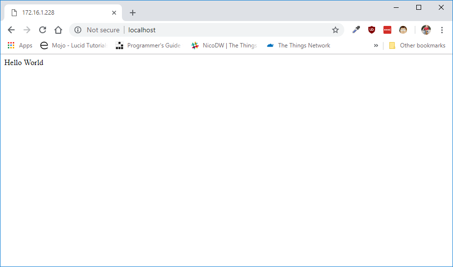
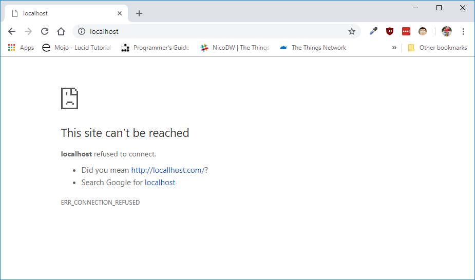

# Opzetten van een LAMP stack

Wanneer we een moderne website op een Raspberry Pi (of elke andere machine) willen hosten, hebben we een aantal basiscomponenten nodig zoals:

* **L**inux - het operating systeem waar alles op draait
* **A**pache - een webserver, welke onze pagina's aanbied aan de browser van de gebruiker
* **M**ySQL - een database server die toelaat om gegevens op te slaan
* **P**HP - een scripting taal die toelaat dynamische pagina's te bouwen die op de server worden verwerkt

Deze combinatie van componenten wordt in de webdeveloper wereld een LAMP stack genoemd.


Linux is reeds aanwezig op onze Raspberry Pi onder de vorm van Raspbian. Dus dit hoeven we niet meer te installeren. Voor deze workshop heb je in principe enkel Linux en de Webserver (Apache) nodig. De andere componenten worden ook besproken voor het geval je deze later zelf zou nodig hebben.

In volgende paragrafen staan er hoofdzakelijk commando's die dienen te worden uitgevoerd in de terminal. Deze kan je op Raspbian openen door te navigeren naar `Start => Tools => Terminal`. Je krijgt dan volgend scherm te zien. Hier type je de commando's dan gewoon in waarna je op `ENTER` duwt.

## Updaten van Raspbian

Vooraleer te starten is het altijd een goed idee om het besturingssysteem zelf te updaten naar de laatste nieuwe versie.

```shell
sudo apt update
sudo apt upgrade -y
```

Eens klaar met installeren van de updates kan je verder gaan.

## Installeren van de Webserver

Als webserver maken we gebruik van Apache, een heel gekende en bewezen webserver. Een veelvoorkomend alternatief is Nginx (uitgesproken als Engine X), maar Apache is iets makkelijker op te zetten.

```shell
sudo apt install apache2 -y
```

### Webserver testen

Je kan de webserver op dit moment reeds testen door op de Raspberry Pi te surfen naar `http://localhost` en dan zou je onderstaande pagina moeten krijgen.


Indien je vanop een andere computer naar de Raspberry Pi wil surfen heb je het IP address van de Pi nodig. Dit kan je achterhalen door het commando `ifconfig` uit te voeren in de terminal. Het IP adres vind je dan bij de `eth0` interface naast `inet`. In het voorbeeld hieronder is het IP adres `172.16.1.228`.

```shell
pi@raspberrypi:~ $ ifconfig
eth0: flags=4163<UP,BROADCAST,RUNNING,MULTICAST>  mtu 1500
        inet 172.16.1.228  netmask 255.255.0.0  broadcast 172.16.255.255
        inet6 fe80::6f6:6b2a:3fc2:1c1  prefixlen 64  scopeid 0x20<link>
        ...

lo: flags=73<UP,LOOPBACK,RUNNING>  mtu 65536
        ....

wlan0: flags=4099<UP,BROADCAST,MULTICAST>  mtu 1500
        ...
```

Je kan in dit geval dan surfen naar `http://172.16.1.228` waar je het IP adres vervang door dit van de Pi.

## Installeren van PHP

Naast de PHP engine moeten we ook een module installeren die Apache toelaat om PHP aan te roepen. Dit kan allemaal via onderstaand commando.

```shell
sudo apt install php libapache2-mod-php -y
```

### Testen van PHP

Test of PHP werkt kan worden gerealiseerd door een kleine "Hello World" pagina te maken. Voer onderstaande commando's uit om een editor te openen waarin we een klein PHP script maken.

```shell
cd /var/www/html
sudo nano index.php
```

Plaats hier de onderstaande code:

```php
<?php echo "Hello World";
```

Sla de wijzigingen op door eerst de toetsencombinatie `CTRL-o` in te drukken en vervolgens `CTRL-x` om af te sluiten.

Vervolgens dienen we aan Apache duidelijk te maken dat de PHP index pagina (de startpagina als het ware) voorrang moet krijgen bij het openen van de website op de statische HTML index pagina. Dit doen we door eerste configuratie te openen van Apache.

```shell
cd /etc/apache2
sudo nano apache2.conf
```

Scroll nu naar beneden en voeg `DirectoryIndex index.php` toe aan de Directory `/var/www` sectie zoals hieronder aangegeven.

```conf
<Directory /var/www/>
        Options Indexes FollowSymLinks
        AllowOverride None
        Require all granted
        DirectoryIndex index.php
</Directory>
```

Sla de wijzigingen op door eerst de toetsencombinatie `CTRL-o` in te drukken en vervolgens `CTRL-x` om af te sluiten.

De server moet nu worden herstart:

```shell
sudo service apache2 restart
```

Surf nu naar `http://localhost/` en dan zou je de "Hello World" tekst moeten krijgen.



## Installeren van MySQL

MySQL is een veelvoorkomende database manager (DBMS). Naast MySQL dien je ook een bibliotheek voor PHP te installeren. Vervolgens best even de webserver herstarten.

```shell
sudo apt install mysql-server php-mysql -y
sudo service apache2 restart
```

Vervolgens dient de DBMS verder te worden beveiligd. Voer hiervoor onderstaand commando uit:

```shell
sudo mysql_secure_installation
```

Beantwoord hierbij de vragen als volgt:

* Het huidige root wachtwoord: duw gewoon op `ENTER`
* Het instellen van een nieuw root wachtwoord: kies hier voor `Y` (yes).
* Nieuw wachtwoord: kies hier een sterk wachtwoord. Laat dit niet leeg. Zorg dat je dit niet kwijtraakt.
* Verwijderen anonieme gebruiker: kies `Y` (yes)
* Niet toelaten om root user van buitenaf aan te melden: kies `Y` (yes)
* Verwijderen test database: kies `Y` (yes)
* Herladen privileges: kies `Y` (yes)

### Beheren database

Voor het beheren van je databases kan je gebruik maken van een PHP webapplicatie die `phpMyAdmin` noemt. Hier kan je grafisch je databases mee benaderen, backups nemen, data importeren, ...

Je kan deze app installeren aan de hand van het volgende commando:

```shell
sudo apt install phpmyadmin -y
```

Tijdens de installatie zal je een aantal vragen krijgen waaronder:

* Welke webserver je wil configureren: kies hier voor *apache2* (selecteer door op `SPATIE` te drukken)
* Of je de `dbconfig-common` configuratie wil voorzien: kies hier voor `Yes`
* Het phpmyadmin configuratie wachtwoord: kies hier opnieuw een sterk wachtwoord. Dit wordt gebruikt voor de `phpmyadmin` gebruiker.

Als alles goed gaat kan je nu surfen naar `http://localhost/phpmyadmin` en krijg je de inlogpagina te zien. Je kan nu inloggen met de `root` user of met de `phpmyadmin` user (deze heeft enkel rechten op de phpmyadmin database).

