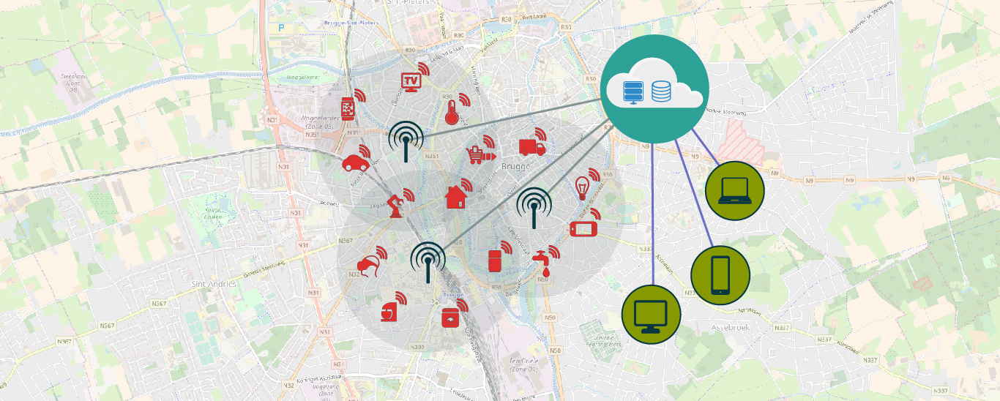
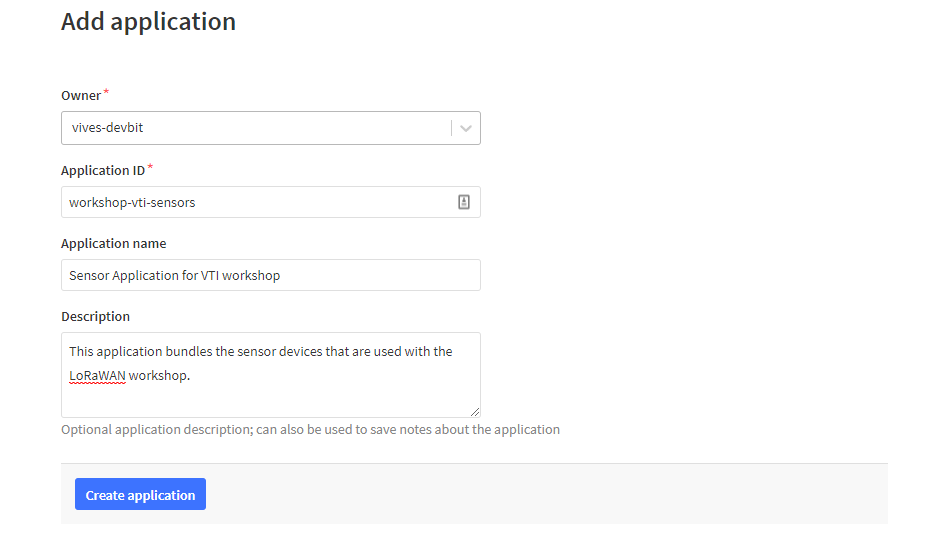
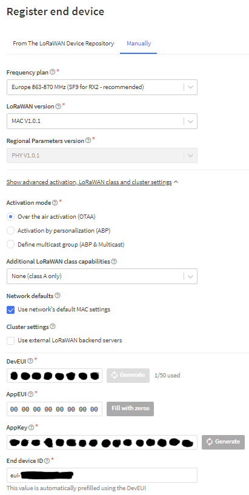

# LoRaWAN



## Wat is LoRaWAN

LoRaWAN (Long Range Wide Area Network) is een specificatie voor telecommunicatie geschikt voor langeafstandscommunicatie met weinig vermogen. De technologie wordt gebruikt voor machine-naar-machine communicatie en het Internet of Things.

De architectuur bestaat uit *gateways*, *netwerkservers* en *applicatieservers*. Er worden RF-chips van Semtech gebruikt die een spread spectrum uitzenden. De nodes versturen een versleuteld bericht via radio. In Europa is deze frequentie 868 MHz. Dit bericht wordt ontvangen door de gateway. De gateway is verbonden met het Internet en stuurt het bericht door naar de netwerkservers. De berichten kunnen worden opgehaald door een applicatieserver. Die kan bepalen of er data teruggezonden moet worden, of de data dient opslagen te worden in een database, ... . Een webapplicatie doet dan dienst als interface voor de gebruiker.

## The Things Network

The Things Network bouwt een globaal gedistribueerd, crowd-sourced en open IoT datanetwerk dat eigendom is, en opgezet wordt door zijn gebruikers. Door gebruik te maken van LoRaWAN technologie voorziet The Things Network een end-to-end stack: van sensoren (de nodes), gateways, netwerk servers, sensor beheer en integratie met cloud providers en IoT platformen. Alles is volledig veilig geïmplementeerd en configureerbaar door de eindgebruiker.

### Nieuwe TTN applicatie bouwen

Sensoren kunnen communiceren met een `applicatie` van The Things Network waarin ze geregistreerd worden. Om sensoren te registreren moet er eerst een applicatie gebouwd worden.

Je kan een applicatie bouwen door te surfen naar The Things Network [console](https://console.thethingsnetwork.org/applications/add). Daar dien je een aantal gegevens in te geven:

* **Application ID**: Hier kies je zelf een uniek *ID* dat bestaat uit kleine alfanumerieke letters. Spaties zijn niet toegestaan, maar een `-` teken wel.
* **Application description**: Hier kan je een kleine beschrijving plaatsen over de applicatie die je wil toevoegen.



Klik dan op **Add Application** om te eindigen. Je zal doorverwezen worden naar de toegevoegde applicatie pagina. Hier zal je de gegenereerde **App EUI** en **Access Keys** terugvinden (deze hebben we later nog nodig).

### Nieuwe sensor toevoegen

Vooralleer een sensor kan communiceren met The Things Network moeten we deze registreren in een applicatie.

Open de applicatie in The Things Network [console](https://console.thethingsnetwork.org/applications/) en klik op **Register device**. Er zullen een aantal gegevens gevraagd worden:

* **Device ID**: Hier kies je zelf een uniek *ID* dat bestaat uit kleine alfanumerieke letters. Spaties zijn niet toegestaan, maar een `-` teken wel.
* **Device EUI**: Druk op het :twisted_rightwards_arrows: icoontje om een willekeurige EUI te berekenen bij het aanmaken van de sensor.
* **App Key**: Deze laten we ook automatisch genereren.



Klik op **Register** om te eindigen. Je zal doorverwezen worden naar de overzichtspagina van de nieuwe sensor. Daar kan je de nodige gegevens (`DevEUI`, `AppEUI` en `AppKey`) vinden die we straks in de code zullen moeten gebruiken.

## Sodaq LoRaWAN voorbeeld

`Hello world` voorbeelden zijn bij programmeren de meest eenvoudige voorbeelden om iets aan te tonen. Dit voorbeeld geeft het meest eenvoudige programma om de temperatuur van de ingebouwde sensor te verzenden via LoRaWAN.

::: tip
In de code staat hier en daar wat commentaar met de tekst `TODO:`. Deze tekst wordt door programmeurs gebruikt om zich er aan te herinneren dat er nog iets gedaan moet worden. Kijk dus uit naar `TODO:` tekst, je zal daar optioneel of verplicht nog iets moeten aanpassen.
:::

## DevEUI, AppEUI en AppKey

Elke LoRaWAN toepassing heeft een aantal instellingen die in de code juist ingesteld moeten worden.

* **DevEUI**: Unieke identificatie van de sensor.
* **AppEUI**: Identificatie van de `App` waartoe de sensor behoort.
* **AppKey**: Encryptiesleutel voor de `App` zodat niemand jouw gegevens kan zien.

Zonder de juiste gegevens komen jouw sensorwaarden niet aan bij de juist applicatie. Vergeet deze dus zeker niet aan te passen in je code. De exacte waarden kan je terug vinden in de console van de Things Network. 

Nu de sensor geconfigureerd is kunnen we deze ook gaan programmeren. Dit doen we in de Arduino IDE.

Bibliotheken: Zorg dat de benodigde bibliotheken geïnstalleerd zijn via de Arduino bibliotheken manager:

`Schets -> Bibliotheek gebruiken -> Bibliotheken beheren`

Installeer de `Sodaq_RN2483` en `Sodaq_wdt` bibliotheken.

Zorg er ook voor dat het juiste `Board` geselecteerd (`SODAQ Explorer`) is onder `Hulpmiddelen -> Board:`

### Eenvoudig LoRaWAN verzenden voorbeeld

```cpp
#include <Sodaq_RN2483.h>

#define debugSerial SerialUSB
#define loraSerial Serial2

//**********************************************************
// TODO: verander de waarden van DevEUI, AppEUI en APPkey
//**********************************************************

static uint8_t DevEUI[8] = { 0x00, 0x00, 0x00, 0x00, 0x00, 0x00, 0x00, 0x00 };
const uint8_t AppEUI[8] = { 0x00, 0x00, 0x00, 0x00, 0x00, 0x00, 0x00, 0x00 };
const uint8_t AppKey[16] = { 0x00, 0x00, 0x00, 0x00, 0x00, 0x00, 0x00, 0x00, 0x00, 0x00, 0x00, 0x00, 0x00, 0x00, 0x00, 0x00 };

//**********************************************************
// TODO: De port waarop de data wordt verzonden
//       Anders per soort sensor
//**********************************************************
const int port = 1;

// Buffer die data kan bevatten
uint8_t buffer[16];

void setup()
{
    delay(1000);
    SerialUSB.begin(115200);
    while ((!SerialUSB) && (millis() < 30000));
    debugSerial.println("Starting LoRaWAN");

    // Configuratie van LoRaWAN
    loraSerial.begin(LoRaBee.getDefaultBaudRate());
    LoRaBee.init(loraSerial, LORA_RESET);
    setupLoRa();
}

void loop()
{
    float reading = getTemperature();
    debugSerial.println(reading);

    // Buffer vullen met onze data (temperatuur)
    buffer[0] = ((int)(reading * 100) >> 8) & 0xFF;
    buffer[1] = ((int)(reading * 100) >> 0) & 0xFF;

    // buffer verzenden met LoRa
    sendWithLoRa(2);      // 2 = aantal bytes

    // Tijd om te wachten (milliseconden)
    delay(10000); 
}

float getTemperature()
{
    //10mV per C, 0C is 500mV
    float mVolts = (float)analogRead(TEMP_SENSOR) * 3300.0 / 1023.0;
    float temp = (mVolts - 500.0) / 10.0;
    return temp;
}

void setupLoRa()
{
    if (LoRaBee.initOTA(loraSerial, DevEUI, AppEUI, AppKey, true)) {
        debugSerial.println("Network connection successful.");
    }
    else {
        debugSerial.println("Network connection failed!");
    }
    LoRaBee.setSpreadingFactor(7);
}

void sendWithLoRa(int numberOfBytes) {
    switch (LoRaBee.send(port, buffer, numberOfBytes))
    {
        case NoError:
          debugSerial.println("Successful transmission.");
          break;
        case NoResponse:
          debugSerial.println("There was no response from the device.");
          break;
        case Timeout:
          debugSerial.println("Connection timed-out. Check your serial connection to the device! Sleeping for 20sec.");
          delay(20000);
          break;
        case PayloadSizeError:
          debugSerial.println("The size of the payload is greater than allowed. Transmission failed!");
          break;
        case InternalError:
          debugSerial.println("Oh No! This shouldn not happen. Something is really wrong! The program will reset the RN module.");
          setupLoRa();
          break;
        case Busy:
          debugSerial.println("The device is busy. Sleeping for 10 extra seconds.");
          delay(10000);
          break;
        case NetworkFatalError:
          debugSerial.println("There is a non-recoverable error with the network connection. The program will reset the RN module.");
          setupLoRa();
          break;
        case NotConnected:
          debugSerial.println("The device is not connected to the network. The program will reset the RN module.");
          setupLoRa();
          break;
        case NoAcknowledgment:
          debugSerial.println("There was no acknowledgment sent back!");
          break;
        default:
          break;
    }
}
```