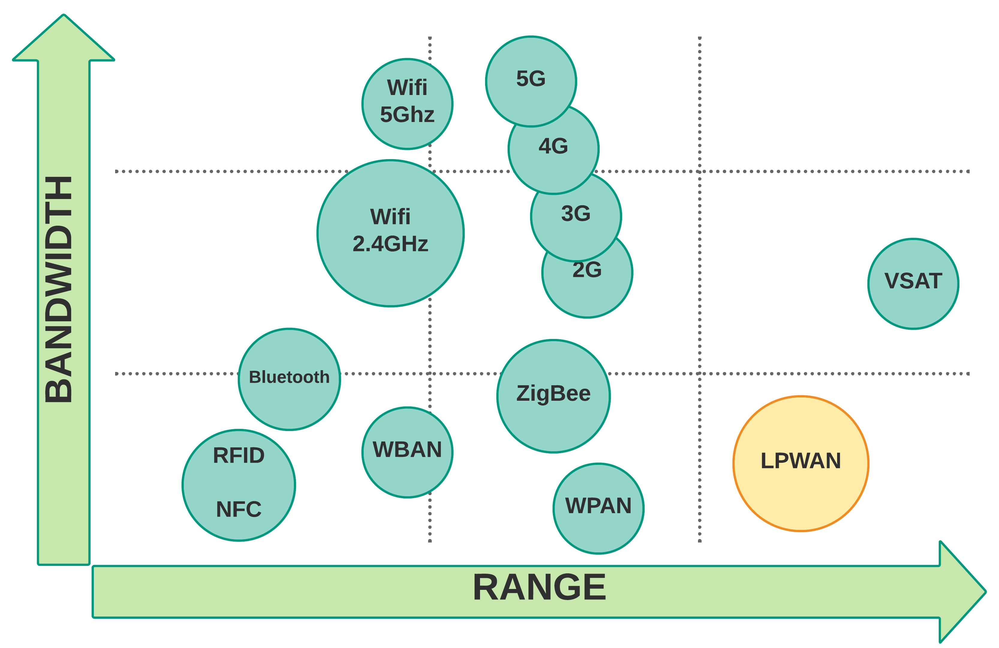
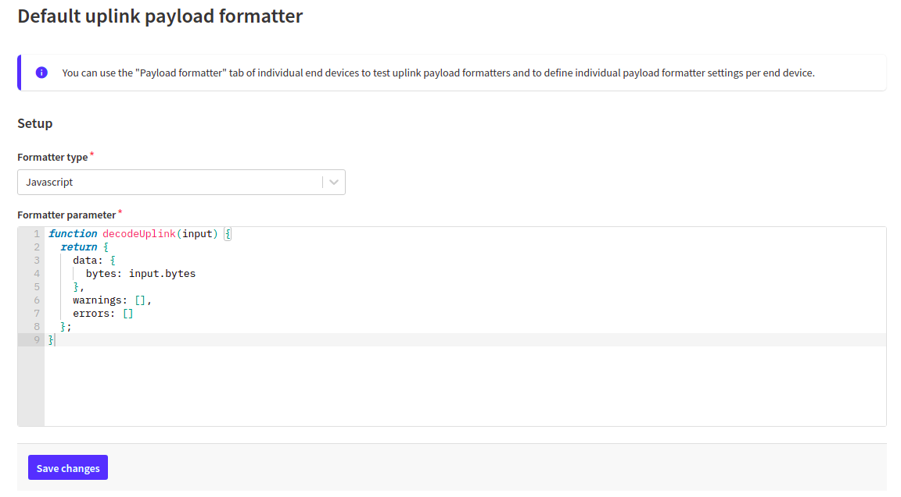
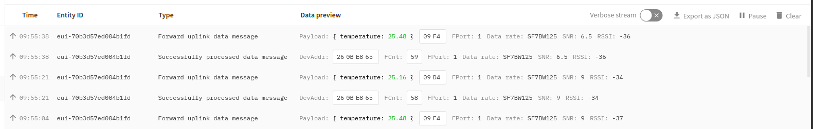

# LoRaWAN


## Wat is LoRaWAN

LoRaWAN (Long Range Wide Area Network) is een specificatie voor telecommunicatie geschikt voor **lange afstandscommunicatie met weinig vermogen**. De technologie wordt gebruikt voor machine-naar-machine communicatie en het Internet of Things.



De architectuur bestaat uit *gateways*, *netwerkservers* en *applicatieservers*. Er worden RF-chips van Semtech gebruikt die een spread spectrum uitzenden. De nodes versturen een versleuteld bericht via radio. In Europa gebeurt dit op een frequentie van 868 MHz. Dit bericht wordt ontvangen door de gateways in het bereik van de zender. De gateways zijn verbonden met het Internet en sturen het bericht door naar de netwerkservers. Deze berichten kunnen vervolgens worden opgehaald door een applicatieserver. Die kan bepalen of er data teruggezonden moet worden, of de data dient opgeslagen te worden in een database... Een webapplicatie doet dan dienst als interface voor de gebruiker.

## The Things Network

The Things Network bouwt een globaal gedistribueerd, crowd-sourced en open IoT datanetwerk dat eigendom is van, en opgezet wordt door zijn gebruikers. Door gebruik te maken van LoRaWAN technologie voorziet The Things Network een end-to-end stack: van sensoren (de nodes), gateways, netwerk servers, sensor beheer en integratie met cloud providers en IoT platformen. Alles is volledig veilig geïmplementeerd en configureerbaar door de eindgebruiker.

Vooraleer je met dit alles aan de slag kan gaan, dien je echter wel eerst een account te maken op [The Things Network](https://www.thethingsnetwork.org/). Druk bovenaan op `Sign up` en vul je gegevens in.

### Nieuwe TTN applicatie bouwen

Sensoren kunnen communiceren met een *applicatie* van The Things Network waarin ze geregistreerd worden. Om sensoren te registreren moet er eerst een applicatie gebouwd worden.

Je kan een applicatie bouwen door te surfen naar [The Things Network console](https://eu1.cloud.thethings.network/console/applications).

Daar dien je dan een aantal gegevens in te geven:

* **Owner**: De beheerder van de applicatie. Dit ben je in dit geval natuurlijk zelf.
* **Application ID**: Hier kies je zelf een uniek *ID* dat bestaat uit kleine alfanumerieke letters. Spaties zijn niet toegestaan, maar een `-` teken wel.
* **Application name**: Dit kan een meer gebruiksvriendelijk naam zijn voor je applicatie in tegenstelling tot het ID.
* **Description**: Hier kan je een kleine beschrijving plaatsen over de applicatie die je wil toevoegen.


Klik dan op **Create application** om te eindigen. Je zal doorverwezen worden naar de toegevoegde applicatie pagina. Hier zal je de volledige applicatie en de bijhorende sensoren kunnen beheren. Straks zullen we hier ook de data van onze devices zien binnenstromen.

### Nieuwe sensor toevoegen

Vooralleer een sensor kan communiceren met The Things Network moeten we deze registreren in een applicatie.

Open de applicatie in [The Things Network console](https://eu1.cloud.thethings.network/console/applications) en klik op **Add end device**.

Als je een kant-en-klare LoRaWAN sensor koopt, bestaat de kans dat je deze kan selecteren van de drop down op de huidige pagina.


Wij zijn natuurlijk techneuten en maken graag de dingen zelf. Vandaar dat wij moeten kiezen om een device **Manually** toe te voegen.

Er zullen een aantal gegevens gevraagd worden:

* **Frequency plan**: de frequentieband waarop de LoRaWAN chip werkt. Voor Europa kan je kiezen voor `Europe 863-870 MHz (SF9 for RX2 - recommended)`
* **LoRaWAN version**: de versie van LoRaWAN die door de chip (hier de Microchip RN2483) wordt ondersteund. Voor de RN2483 is dit `MAC V1.0.1`.
* **Activation mode**: de manier waarop het device met het netwerk verbind.
  * ABP (activation-by-personalization) is de minder veilige optie omdat hier de encryptie sleutels in het device worden opgeslagen.
  * OTAA (Over-the-air-activation) is de meest veilige optie omdat er hier een join-procedure plaatsvind die resulteert in encryption keys die worden gegenereerd op het device en op de network server. Niet alle devices ondersteunen dit echter. De RN2483 en bijhorende bibliotheek gelukkig wel.

Vervolgens zal je ook onderstaande parameters dienen te genereren door op het :twisted_rightwards_arrows: icoontje te klikken:

* **DevEUI**: een unieke identificatie voor je device.
* **AppEUI** (also called *JoinEUI*): een unieke identificatie voor de join server. Dit wordt aangeboden door de verkoper van het device of in ons geval mag je dit allemaal `0` maken.
* **AppKey**: een geheime sleutel die wordt gebruikt om de `AppSKey` en `NwkSKey` sessie sleutels te genereren die beiden worden gebruikt om het LoRaWAN bericht te versleutelen.

::: tip `AppSKey` en `NwkSKey`

De `AppSKey` of de applicatie sessie key is een key die gebruikt wordt om de berichten te versleutelen tussen je device en de applicatie server. De `NwkSKey` of de de network sessie key is een key die gebruikt wordt om de berichten te versleutelen tussen je device en de network server. Wanneer je geen OTAA maar ABP gebruikt zal je deze geheime sleutels zowel in je device als op de Things Network moeten voorzien. Bij OTAA worden die automatisch gegenereerd op basis van de `AppKey` en wat andere informatie.
:::

Het **End device ID** wordt automatisch gegenereerd voor jou op basis van je `DevEUI`.


Klik op **Register end device** om te eindigen. Je zal doorverwezen worden naar de overzichtspagina van de nieuwe sensor. Daar kan je de nodige gegevens (`DevEUI`, `AppEUI` en `AppKey`) vinden die we straks in de code zullen moeten gebruiken.

## SODAQ LoRaWAN voorbeeld

`Hello world` voorbeelden zijn bij programmeren de meest eenvoudige voorbeelden om iets aan te tonen. Dit voorbeeld geeft het meest eenvoudige programma om de **temperatuur van de ingebouwde sensor** te verzenden via LoRaWAN.

::: tip
In de code staat hier en daar wat commentaar met de tekst `TODO:`. Deze tekst wordt door programmeurs gebruikt om zich er aan te herinneren dat er nog iets gedaan moet worden. Kijk dus uit naar `TODO:` tekst, je zal daar optioneel of verplicht nog iets moeten aanpassen.
:::

```cpp

#include <Sodaq_RN2483.h>

#define loraSerial Serial2

//**********************************************************
// TODO: Verander de waarden van DevEUI, AppEUI en APPkey
//       volgens deze aangegeven op de console van
//       The Things Network.
//**********************************************************
static const uint8_t DevEUI[8] = { 0x00, 0x00, 0x00, 0x00, 0x00, 0x00, 0x00, 0x00 };
static const uint8_t AppEUI[8] = { 0x00, 0x00, 0x00, 0x00, 0x00, 0x00, 0x00, 0x00 };
static const uint8_t AppKey[16] = { 0x00, 0x00, 0x00, 0x00, 0x00, 0x00, 0x00, 0x00, 0x00, 0x00, 0x00, 0x00, 0x00, 0x00, 0x00, 0x00 };

//**********************************************************
// Niet aanpassen. Maakt de buffer voor data.
//**********************************************************
const int SIZE_OF_BUFFER = 32;
uint8_t buffer[SIZE_OF_BUFFER];   // Buffer voor bericht
uint8_t numberOfDataBytes = 1;    // Aantal te versturen bytes

// Aangeven of LoRaWAN bericht klaar is om te versturen
bool sendLoraMessage = false;     

//**********************************************************
// Staat van event gebaseerde sensoren
//**********************************************************
int previousState = 0;
int currentState = 0;

//**********************************************************
// De setup van Arduino, wordt in het begin van je sketch
// eenmalig uitgevoerd.
// Als je sensor moet initialiseren, dan doe je dit hier
//**********************************************************
void setup() {
  pinMode(LED_BLUE, OUTPUT);         // Blauwe LED als uitgang
  pinMode(LED_RED, OUTPUT);          // Rode LED als uitgang
  pinMode(LED_GREEN, OUTPUT);        // Groene LED als uitgang

  status_connecting();
    
  SerialUSB.begin(115200);

  // 10 seconden wachten op SerialUSB. 
  while ((!SerialUSB) && (millis() < 10000)) { }

  SerialUSB.println("Starten van LoRaWAN temperatuur demo.");

  // Configuratie digitale pin als ingang
  pinMode(BUTTON, INPUT);

  // We lezen ook de "start staat" in
  previousState = digitalRead(BUTTON);
  currentState = previousState;

  // Configuratie van LoRaWAN
  loraSerial.begin(LoRaBee.getDefaultBaudRate());
  LoRaBee.init(loraSerial, LORA_RESET);
  setup_lora();
}

//**********************************************************
// De main loop van Arduino, deze blijft telkens herhalen.
//
//    Hier kies je een type sensor:
//       - periodiek uitgelezen (met delay erin)
//       - event gebaseerde sensoren (zonder delay erin)
//**********************************************************
void loop() {
    // Periodiek sensor uitlezen
    sample_periodic_sensor();

    // OF

    // Event gebaseerde sensor
    // check_sensor_for_event();

    // Verzenden met LoRaWAN als er bericht klaar staat
    if (sendLoraMessage) {
      SerialUSB.println("Starten met verzenden van LoRaWAN message");
      send_message_with_lora(1);
      sendLoraMessage = false;
    }

    // Delay verwijderen bij event gebaseerde sensoren
    delay(10000);     // Tijd om te wachten (milliseconden)
}

//**********************************************************
// TODO: Uitlezen van een periodieke sensor en vullen van buffer.
//       Dit moet worden aangepast naargelang de sensor
//**********************************************************
void sample_periodic_sensor() {
  //10mV per C, 0C is 500mV
  float mVolts = (float)analogRead(TEMP_SENSOR) * 3300.0 / 1023.0;
  float temperature = (mVolts - 500.0) / 10.0;

  // Uitschrijven naar seriële monitor
  SerialUSB.print("Temperatuur = ");
  SerialUSB.print(temperature);
  SerialUSB.println("°C");

  // Buffer vullen met onze data (temperatuur)
  buffer[0] = ((int)(temperature * 100) >> 8) & 0xFF;
  buffer[1] = ((int)(temperature * 100) >> 0) & 0xFF;
  numberOfDataBytes = 2;

  // Geef aan dat er een bericht klaar is om te verzenden
  sendLoraMessage = true;
}

//**********************************************************
// TODO: Detecteer een verandering voor een event gebaseerde
//       sensor.
//**********************************************************
void check_sensor_for_event() {
  currentState = digitalRead(BUTTON);

  if (currentState != previousState) {
    // Nieuwe staat opslaan in oude staat
    previousState = currentState;
    delay(10);    // Even wachten voor ontdendering

    // We willen enkel het "loslaten" detecteren
    if (currentState == HIGH) {
      SerialUSB.println("De knop werd ingedrukt");

      // Dit gaan we verzenden met LoRaWAN
      buffer[0] = HIGH;
      numberOfDataBytes = 1;
      sendLoraMessage = true;
    }
  }
}

//**********************************************************
// Niet aanpassen. Dit zijn de functies die de LoRa data verzenden.
//**********************************************************
void setup_lora() {
  if (LoRaBee.initOTA(loraSerial, DevEUI, AppEUI, AppKey, true)) {
    SerialUSB.println("LoRaWAN - Network connectie OK");
    status_ok();
  } else {
    SerialUSB.println("LoRaWAN - Network connectie gefaald!");
    status_error();
  }
  LoRaBee.setSpreadingFactor(7);
}

void send_message_with_lora(unsigned int port) {
  status_sending();
  int status = LoRaBee.send(port, buffer, numberOfDataBytes);

  switch (status) {
    case NoError:
      SerialUSB.println("LoRaWAN - Bericht verstuurd.");
      status_ok();
      break;
    case NoResponse:
      SerialUSB.println("LoRaWAN - De RN2483 chip reageert niet meer.");
      status_warning();
      break;
    case Timeout:
      SerialUSB.println("LoRaWAN - Connectie time-out. 20 seconden wachten ...");
      status_warning();
      delay(20000);
      break;
    case PayloadSizeError:
      SerialUSB.println("LoRaWAN - Transmissie gefaald. Het bericht was te groot.");
      status_warning();
      break;
    case InternalError:
      SerialUSB.println("LoRaWAN - Interne fout. Resetting RN2483 ...");
      status_error();
      setup_lora();
      break;
    case Busy:
      SerialUSB.println("LoRaWAN - RN2483 is bezet. 10 seconden wachten ...");
      status_error();
      delay(10000);
      break;
    case NetworkFatalError:
      SerialUSB.println("LoRaWAN - Er was een network fout. Resetting RN2483 ...");
      status_error();
      setup_lora();
      break;
    case NotConnected:
      SerialUSB.println("LoRaWAN - Connectie verloren. Resetting RN2483 ...");
      status_error();
      setup_lora();
      break;
    case NoAcknowledgment:
      SerialUSB.println("LoRaWAN - Er werd geen bevestiging ontvangen.");
      status_warning();
      break;
    default:
      break;
  }
}

//**********************************************************
// Niet aanpassen. Status RGB led
//**********************************************************
void status_connecting() {
  digitalWrite(LED_BLUE, LOW);
  digitalWrite(LED_GREEN, HIGH);
  digitalWrite(LED_RED, HIGH);
}

void status_ok() {
  digitalWrite(LED_BLUE, HIGH);
  digitalWrite(LED_GREEN, LOW);
  digitalWrite(LED_RED, HIGH);
}

void status_sending() {
  digitalWrite(LED_BLUE, LOW);
  digitalWrite(LED_GREEN, LOW);
  digitalWrite(LED_RED, HIGH);
}

void status_warning() {
  digitalWrite(LED_BLUE, HIGH);
  digitalWrite(LED_GREEN, LOW);
  digitalWrite(LED_RED, LOW);
}

void status_error() {
  digitalWrite(LED_BLUE, HIGH);
  digitalWrite(LED_GREEN, HIGH);
  digitalWrite(LED_RED, LOW);
}
```

De frequentieband waarvan LoRa gebruik maakt is een vrije band (ISM). Deze mag "gratis" worden gebruikt en is ook gedeeld met andere toepassingen. Er zijn echter wel een aantal regels waaraan we ons dienen te houden. Zo mag een LoRaWAN device maar 1% van de tijd zenden, de andere 99% mag het device niets zenden. Dit betekent als je LoRaWAN berichtje bv. `50ms` air-time in beslag neemt, dat je maar om de `5s` zo een bericht mag sturen. De `consumed_airtime` kan je raadplegen in de *Event details*  bij the Things Network Console live data.

### DevEUI, AppEUI en AppKey

Elke LoRaWAN toepassing heeft een aantal instellingen die in de code juist ingesteld moeten worden.

* **DevEUI**: Unieke identificatie van de sensor.
* **AppEUI**: Identificatie van de `App` waartoe de sensor behoort.
* **AppKey**: Encryptiesleutel voor de `App` zodat niemand jouw gegevens kan zien.

Zonder de juiste gegevens komen jouw sensorwaarden niet aan bij de juist applicatie. Vergeet deze dus zeker niet aan te passen in je code. De exacte waarden kan je terug vinden in de console van de Things Network.

Door op de bekjes `<>` te klikken kan je de keys omzetten naar een komma gescheiden formaat dat je rechtstreeks in je code kan plakken.

### Bibliotheken

Vooraleer we nu de firmware kunnen compileren en flashen dienen we nog twee bibliotheken te installeren. Dit doen we in de Arduino IDE. Navigeer hiervoor naar `Tools => Manage Libraries...`.

Zoek eerst naar `Sodaq_RN2483` en installeer de laatste versie van de bibliotheek door op `Install` te klikken.


Vervolgens dien je ook de `Sodaq_wdt` bibliotheek te zoeken en te installeren.


### Flashen

Nu de sensor geconfigureerd is kunnen we deze ook gaan programmeren.

Zorg er voor dat het juiste board geselecteerd is onder `Tools => Board`, namelijk `SODAQ ExpLoRer`.

## Data op The Things Network

Navigeer nu terug naar jouw applicatie op [The Things Network console](https://eu1.cloud.thethings.network/console/applications). Als alles goed gaat zou je onder `Live data` jouw gegevens moeten zien binnen komen.


Voorlopig zijn dit nog ruwe bytes, maar als er data binnen komt zit je goed.

Komt er geen data binnen, kijk dan eens naar de seriele monitor of er geen errors worden gegeven. Controleer ook nog eens of je de keys wel correct hebt ingegeven.

### The Things Network Decoder

Wanneer de data op de TTN binnenkomt dan zijn dit ruwe bytes. Dit is vrij low-level en zou de eindapplicatie dwingen om de ruwe data om te zetten naar eigenlijke informatie. We kunnen dit proces door de TTN laten doen. Dit maakt debuggen makkelijker en zorgt er ook voor dat een applicatie die gebruik wil maken van de data dit niet meer hoeft te doen.

::: tip Ruwe bytes
Merk op dat we het aantal te verzenden bytes to laag mogelijk proberen te houden (om de *air-time* zo laag mogelijk te houden). Dit betekent dan ook dat we geen ASCII karakters of JSON of zo gaan verzenden maar wel gecodeerde bytes. Dit heeft dan wel als nadeel dat we dit terug moeten decoderen.
:::

Open je applicatie op [The Things Network console](https://eu1.cloud.thethings.network/console/applications).

Klik links op `Payload formatters` en klik op `Uplink`om de formatter in te stellen voor de berichtjes die binnenkomen van het device. Stel het type formatter vervolgens in op `Javascript`.



We kunnen nu in het venster een stukje JavaScript code plaatsen die de raw bytes omzet naar een meer leesbaar en verwerkbaar formaat. Typisch gebruiken we voor deze dingen JSON.

Kopieer onderstaande JavaScript code en plaats dit in het `decoder` venster.

```js
function decodeUplink(input) {
  let message = {
    data: {},
    warnings: [],
    errors: []
  };

  if (input.fPort == 1) {
    message.data.temperature = (input.bytes[1] + input.bytes[0]*256)/100.0;
  }

  return message;
}
```

Klik vervolgens op `Save changes` om de wijzigingen op te slaan.

Als je je nu begeeft naar `Live data` zou je niet meer de ruwe bytes mogen zien voor de `Payload` maar een leesbaar JSON object met de temperatuur erin. Controleer voor alle zekerheid dat de waarde hetzelfde is als in de seriele monitor van Arduino IDE.



Later zullen we payload decoder nog verder uitbreiden voor de andere sensoren.

<!-- ### Decoders Sensoren

Controlleer voor alle zekerheid dat de `port` van de decoder dezelfde is als deze van je applicatie op de Sodaq.

#### Push Button

```js
function Decoder(bytes, port) {
  // Decode an uplink message from a buffer
  // (array) of bytes to an object of fields.
  var decoded = {};

  if (port == 17 || port == 28 || port == 31) {
    decoded.state = (bytes[0] == 0xFF ? true : false);
    decoded.event = true;
  }

  return decoded;
}
```

#### Switch (P)

```js
function Decoder(bytes, port) {
  // Decode an uplink message from a buffer
  // (array) of bytes to an object of fields.
  var decoded = {};

  if (port == 17 || port == 28 || port == 31) {
    decoded.state = (bytes[0] == 0xFF ? true : false);
    decoded.event = true;
  }

  return decoded;
}
```

#### Q Touch Sensor

```js
function Decoder(bytes, port) {
  // Decode an uplink message from a buffer
  // (array) of bytes to an object of fields.
  var decoded = {};

  if (port == 17 || port == 28 || port == 31) {
    decoded.state = (bytes[0] == 0xFF ? true : false);
    decoded.event = true;
  }

  return decoded;
}
```

#### RFID 125kHz Reader

```js
function Decoder(bytes, port) {
  // Decode an uplink message from a buffer
  // (array) of bytes to an object of fields.
  var decoded = {};

  if (port == 25) {
    var id = "";
    for (var i = 0; i < bytes.length; i++) {
      id += String.fromCharCode(bytes[i]);
    }
    decoded.id = id;
    decoded.single_byte = bytes[0] | bytes[1];
  }

  return decoded;
}
```

#### Bewegingssensor

```js
function Decoder(bytes, port) {
  // Decode an uplink message from a buffer
  // (array) of bytes to an object of fields.
  var decoded = {};

  if (port == 16) {
    decoded.motion = bytes[0];
  }

  return decoded;
}
```

#### Rotatiesensor

```js
function Decoder(bytes, port) {
  // Decode an uplink message from a buffer
  // (array) of bytes to an object of fields.
  var decoded = {};

  if (port == 11) {
    decoded.rotation = bytes[0];
  }

  return decoded;
}
```

#### Temperatuur, druk en vochtigheidssensor

```js
function Decoder(bytes, port) {
  // Decode an uplink message from a buffer
  // (array) of bytes to an object of fields.
  var decoded = {};

  if (port == 10) {
    decoded.temperature = (bytes[1] + bytes[0]*256)/100.0;
    decoded.pressure = (bytes[4] + bytes[3]*256 + bytes[2]*256*256) / 100.0;
    decoded.humidity = bytes[5];
  }

  return decoded;
}
``` -->
