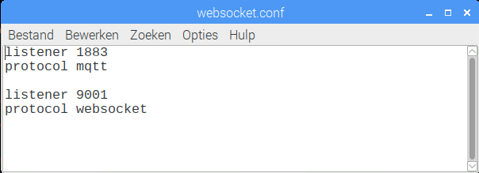

# Mosquitto

Mosquitto is een MQTT broker, ook wel server genoemd. Het laat toe verschillende toestellen met elkaar te communiceren.

## MQTT

MQTT is één van de meest gebruikte protocollen voor Internet of Things apparaten te laten communiceren met elkaar. MQTT staat voor Message Queuing Telemetry Transport. Het is een zeer lichtgewicht berichten protocol dat gebruik maakt van **publish/subscribe** mechanisme om gegevens tussen verschillende clients uit te wisselen. Het is klein in formaat, laag in vermogenverbruik en gebruikt geminimaliseerde data paketten, ideaal voor 'machine tot machine' of Internet of Things.


### Publiceren en abonneren

Stel dat je een temperatuur sensor hebt. Deze wil zijn waarden doorsturen naar een MQTT broker. Aan de andere kant hebben we toestellen zoals computers en smartphones die deze waarden willen ontvangen om ze weer te geven of te verwerken. Dan zijn er twee dingen die gebeuren.

* De sensor geeft een **topic** op waaronder het zijn gegevens zal publiceren. Bijvoorbeeld `temperatuur`. Dan zal het zijn temperatuurwaarde **publiceren**.
* Iedereen die de gegevens wil ontvangen kan zich dan gaan **abonneren** op `temperatuur`. Elke keer dat de sensor nieuwe gegevens publiceert worden alle abonnees automatisch verwittigd met de nieuwe temperatuur waarde.


## Mosquitto

[Mosquitto](https://mosquitto.org/) is één van de broker servers die gebruikt kan worden om met MQTT te communiceren. Het is een eenvoudig en lichte broker, en werkt perfect op een Raspberry Pi. We kunnen deze perfect gebruiken voor deze toepassing. We zullen nu kijken om Mosquitto te installeren en configureren op de Raspberry Pi.

## Installatie

Het installeren van Mosquitto is zeer eenvoudig en is beschikbaar met `apt`. Voer volgende commando uit in de commandolijn om Mosquitto te installeren.

```shell
sudo apt install mosquitto
```

Als alles goed verlopen is, dan is Mosquitto geïnstalleerd op je Raspberry Pi.

### Configuratie

Omdat we de waarden van onze toepassing wensen binnen te lezen met een browser, moeten we ook gebruik gaan maken van het *websocket* protocol. Andere protocollen worden uit veiligheidsoverwegingen niet ondersteund door browsers. Gelukkig heeft Mosquitto ingebakken ondersteuning om MQTT communicatie op te zetten via het websocket protocol. We moeten deze ondersteuning enkel nog activeren aan de hand van een configuratie bestand.

Je kan een nieuw configuratie bestand creëren met onderstaande commando's.

```shell
sudo touch /etc/mosquitto/conf.d/websocket.conf
sudo leafpad /etc/mosquitto/conf.d/websocket.conf
```

In het configuratiebestand plaatsen we dan volgende instellingen:

```text
listener 1883
protocol mqtt

listener 9001
protocol websockets
```

De instellingen activeren het mqtt-protocol op poort `1883`, en het websocket-protocol op poort `9001`.



Om de instellingen toe te passen moeten we enkel nog Mosquitto heropstarten. Dit kan met volgende commando:

```shell
sudo systemctl restart mosquitto
```

Als alles goed verlopen is zijn we nu klaar met de MQTT broker, in ons geval Mosquitto.