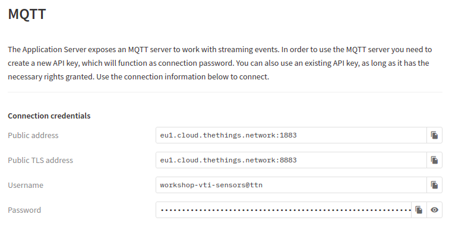

# MQTT

MQTT is één van de meest gebruikte protocollen voor Internet of Things apparaten te laten communiceren met elkaar. MQTT staat voor Message Queuing Telemetry Transport. Het is een zeer lichtgewicht berichten protocol dat gebruik maakt van **publish/subscribe** mechanisme om gegevens tussen verschillende clients uit te wisselen. Het is klein in formaat, laag in vermogenverbruik en gebruikt geminimaliseerde data paketten, ideaal voor *machine tot machine* communicatie en dus ook voor het Internet of Things.

## Publiceren en abonneren

Stel dat je een temperatuur sensor hebt. Deze wil zijn waarden doorsturen naar een MQTT broker. Aan de andere kant hebben we toestellen zoals computers en smartphones die deze waarden willen ontvangen om ze weer te geven of te verwerken. Dan zijn er twee dingen die gebeuren.

* De sensor geeft een **topic** op waaronder het zijn gegevens zal publiceren. Bijvoorbeeld `sensoren/temperatuur`. Dan zal het zijn temperatuurwaarde **publiceren**.
* Iedereen die de gegevens wil ontvangen kan zich dan gaan **abonneren** op `sensoren/temperatuur`. Elke keer dat de sensor nieuwe gegevens publiceert worden alle abonnees automatisch verwittigd met de nieuwe temperatuur waarde.

De centrale component binnen dit hele gebeuren is de MQTT broker.

## The Things Network Broker

In ons geval moeten we niet zelf een broker voorzien. The Things Network voorziet een MQTT broker waarop wij ons kunnen abonneren om onze sensor data te ontvangen.

Vooraleer we echter kunnen abonneren op het topic van onze sensoren, dienen we een username en wachtwoord te hebben ter authenticatie.

Navigeer op de applicatie pagina hiervoor naar `Integrations => MQTT`. Daar krijg je de gegevens te zien die we straks nodig hebben voor de MQTT connectie op te zetten.

Het wachtwoord dienen we echter wel nog te genereren onder de vorm van een API key. Klik naast `Password` op de knop `Generate new API key`.

Er bestaan heel wat MQTT clients waarmee je kan subscriben en publishen op en naar een MQTT broker. Zo zijn [MQTTBox](https://chrome.google.com/webstore/detail/mqttbox/kaajoficamnjijhkeomgfljpicifbkaf) en [MQTT Explorer](http://mqtt-explorer.com/) uitermate gebruiksvriendelijk.

Daarnaast bestaat er bijna voor elke programmeertaal een library die een connectie kan voorzien met MQTT. Zo ook Node-RED, wat we in het volgende hoofdstuk gaan gebruiken om onze sensor data te capteren.
