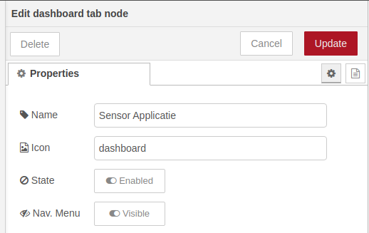

# Node-RED Dashboard

Node-RED Dashboard is een module voor Node-RED die een toolbox aanlevert om heel snel een live dashboard te bouwen voor je Node-RED flow. Dit is uitmate handig voor het visualiseren van allerhande data.

Naast heel wat widgets voor het afbeelden van data werden tevens container elementen voorzien zodat we het dashboard kunnen structureren en widgets in groepen kunnen bundelen.

Meer informatie over Node-RED Dashboard kan je tevens op [https://flows.nodered.org/node/node-red-dashboard](https://flows.nodered.org/node/node-red-dashboard) vinden.

## Installatie

Node-RED Dashboard is niet standaard meegeleverd met Node-RED maar moet apart worden geïnstalleerd als module.

Klik rechts bovenaan op de menu-knop (drie strepen onder elkaar) en kies de optie `Manage Palette`. Open vervolgens het tabblad `Install` en zoek naar `dashboard`. Vervolgens klik je de `Install` knop voor de module `node-red-dashboard`.

Als alles gelukt is zou er nu naast de module `Installed` moeten verschijnen. Klik op `Close` om de overlay te sluiten en terug te keren naar de flow-editor.

In Node-RED vind je nu links tussen de andere nodes de categorie `dashboard`. Je vindt hier allerhande nodes voor grafische input en output via het dashboard.

## Raadplegen Dashboard

Het dashboard kan je raadplegen door te surfen naar de URL [http://localhost:1880/ui](http://localhost:1880/ui). Merk op dat dit gewoon de URL is Node-RED met `/ui` erachter (ui = user interface).

Voorlopig krijg je de melding dat er nog geen dashboard bestaat.

## Introductie Dashboard

Een dashboard bestaat uit grafische componenten die data afbeelden en interactie met de gebruiker toelaten. Denk maar aan grafieken, knoppen, textinvoer, ...

De grafische elementen worden ingedeeld in groepen (groups) en deze worden afgebeeld op een tabblad (tabs). De groups en tabs kan je beheren via de Layout manager (klik rechts bovenaan in Node-RED op de dashboard knop).

Start met het maken van een nieuwe `Tab` en geef deze bv. de naam `Sensor Applicatie`.

Binnen deze *Tab* kan je nu een `group` maken met widgets. Maak een nieuwe `group` en noem deze bv. `Temperatuur`.

### Een Widget toevoegen

De volgende stap bestaat eruit om de temperatuur op het dashboard af te beelden aan de hand van een geschikte widget. We hebben onder andere keus uit:

* `text`: het afbeelden van tekst of dergelijke data
* `gauge`: een "graadmeter", handig voor het afbeelden van de huidige waarde
* `chart`: voor het afbeelden van een grafiek

Om de huidige temperatuur af te beelden gaan we een `gauge` gebruiken. Sleep de node op je flow en koppel deze aan je filter node die de temperatuur output.

Dubbelklik de `gauge` node om deze te configureren. Je kan hier ook kiezen tot welke `group` van je dashboard deze node dient te behoren. Pas de configuratie aan zoals hieronder aangegeven.

Vergeet niet om je flow te deployen vooraleer je een kijkje neemt op de dashboard.

### Grafieken

Als we het verloop van de temperatuur willen weergeven, dan kunnen we gebruik maken van de `chart` component. Voeg deze toe aan je flow met onderstaande configuratie.

Na het deployen van je flow zou je volgende resultaat moeten bekomen.

## What's Next

Het grote nadeel van deze setup is dat Node-RED de data niet permanent bijhoud. Met andere woorden als je Node-RED herstart ben je je data kwijt. Dit is meestal niet wat je wil.

Dit kunnen we oplossen aan de hand van een database.
