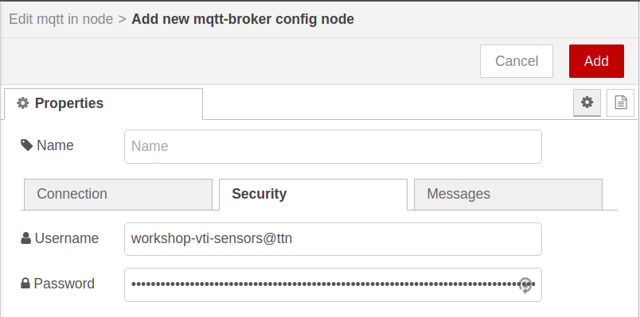
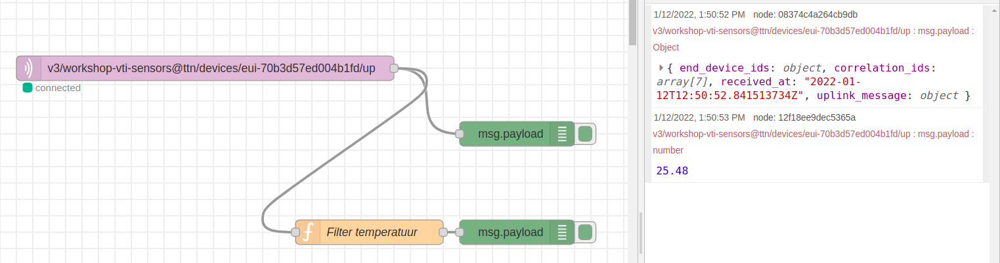

# Node-RED


Node-RED is een flow gebaseerde visuele ontwikkelomgeving ontwikkeld door IBM. Het laat toe hardware toestellen, API's en online diensten met elkaar te communiceren in het teken van het Internet of Things.

Node-RED is een browser omgeving die toelaat JavaScript functies te creëren. Elementen van een toepassing kunnen opgeslagen worden of gedeeld worden voor hergebruik. Het draait op Node.js. Alle flows die gebouwd worden, worden opgeslagen aan de hand van JSON.

## Installatie

<!-- [https://nodered.org/docs/hardware/raspberrypi](https://nodered.org/docs/hardware/raspberrypi) -->
Om Node-RED te installeren op de Raspberry PI moeten we volgend commando gaan uitvoeren in een terminal (commandolijn).

```bash
bash <(curl -sL https://raw.githubusercontent.com/node-red/linux-installers/master/deb/update-nodejs-and-nodered)
```

Het installatiescript zal een paar vragen stellen vooralleer het uitgevoerd wordt. Antwoord op beide vragen met *ja* door op `y` en `ENTER` te drukken.


De installatie zal daarna van start gaan. Dit kan een aantal minuten duren. De voortgang van de installatie wordt aangeduid aan de hand van groene vinkjes. Wanneer alles goed gegaan is, en de installatie klaar is zou je het volgende moeten zien:


### The Things Network integratie

Node-RED heeft een plug-in die toelaat elementen van The Things Network te gebruiken. De installatie van deze plugin gebeurt terug via de commandolijn. Voer volgende commando's uit.

```bash
cd $HOME/.node-red
npm install node-red-contrib-ttn
```

### Node-RED opstarten na het herstarten van de Pi

Je kan er voor kiezen om Node-RED automatisch te laten opstarten wanneer de Raspberry Pi gestart wordt. Dit kan handig zijn omdat de configuratie dan altijd beschikbaar is voor de webpagina. Je hoeft het dan niet eerst manueel op te starten, het gedraagt zich dan als een echte server.

Dit instellen kan terug via de commandolijn met het volgende commando:

```bash
sudo systemctl enable nodered.service
```

<!-- https://www.thethingsnetwork.org/docs/applications/nodered/quick-start.html -->

## Opstarten van Node-RED

Na de installatie zal in de taakbalk bovenaan een icoon verschijnven voor Node-RED.


Dit icoon kan gebruikt worden om Node-RED op te starten. Er zal een commandolijn opgestart worden dat Node-RED in de achtergrond zal opstarten. Na het opstarten mag dit venster gewoon weer gesloten worden.


Node-RED interactie zal vanaf nu volledig via de browser gebeuren door te surfen naar [http://localhost:1880](http://localhost:1880). Je zal dan volgende interface te zien krijgen.


## Configuratie

Nu dat Node-RED geïnstalleerd is, kan er een configuratie gebouwd worden voor onze toepassing. In dit voorbeeld zal een **temperatuursensor** uitgelezen worden vanuit The Things Network, en zullen we deze waarde gaan publiceren via MQTT zodat de data real-time beschikbaar gesteld wordt aan elke toepassing die geïnteresseerd is, zoals bijvoorbeeld een webapplicatie.

We dienen dus een flow te bouwen die de sensorwaarde binnenkrijgt van The Things Network en deze dan publiceert naar de MQTT broker op onze Raspberry Pi. Hiervoor dienen we gebruik te maken van de `mqtt in` en `mqtt out` node.

::: warning ttn uplink node
Voordien werd deze opstelling gebouwd door een koppeling te maken met The Things Network aan de hand van een `ttn uplink` node. Het probleem hiermee was echter dat telkens de Node-RED flow opnieuw werd gestart een nieuwe connectie werd opgezet en de oude niet goed werd afgesloten (intern probleem van de node). The Things Network liet echter maar een beperkt aantal connecties toe, wat er voor zorgde dat na een aantal pogingen geen connectie meer kon worden gemaakt met The Things Network. Dit probleem hebben we via de MQTT API niet.
:::

Merk op dat een node die data genereert (uitvoer) aan de rechterkant kan gekoppeld worden en een node die data binnen neemt (invoer) aan de linkerkant gekoppeld kan worden.

### De mqtt input node

We starten met de `mqtt input` node zodat we eerst de data van The Things Network kunnen binnen halen.

Zoek de node `mqtt input` in de lijst aan de linker kant, en sleep deze naar het centrale deel. Indien je deze niet direct terug kan vinden, dan kan je aan de linkerkant bovenaan ook gebruik maken van de `filter nodes` zoekfunctie.

Vervolgens kunnen we ook een `debug` node aan de uitgang van de `mqtt input` koppelen zodat we de informatie makkelijk kunnen raadplegen die van The Things Network komt.


Nu dienen we de node nog te configureren zodat deze connectie maakt met de MQTT broker van The Things Network.

#### Configuratie van de mqtt input node

Dubbelklik op de `mqtt input` node om de configuratie te tonen. Hier dienen we de gegevens van The Things Network in te stellen. Met deze configuratie gaan we aangeven van welke applicatie van The Things Network we gegevens willen ontvangen. We dienen dan ook de juiste `access key` in te stellen.


Klik op de knop met het potlood icoontje, rechts naast het invoerveld `Add new mqtt broker...`. Je krijgt dan het volgende te zien:


Eerst en vooral dienen we in het tabblad **Connection** de **server** in te stellen op `eu.thethings.network`.


Vervolgens moeten we een bruikersnaam en wachtwoord ingeven in het tabblad **Security**. Hiervoor moeten we het `App ID` en de `Access Key` van de The Things Network applicatie achterhalen. Deze gegevens kan je terugvinden op de [console](https://console.thethingsnetwork.org/applications) van The Things Network.

Het `App ID` kan je terugvinden onder `Application overview`.


De `Access Key` kan je terugvinden onderaan bij `Access Keys`. Je kan de key kopieren door op het klembord icoontje te klikken.


Gebruik het `App ID` in Node RED als `Username` en de `Access Key` als `Password` .



Klik vervolgens bovenaan rechts op de knop `Add`.

Als laatste dienen we ook in te stellen waar onze temperatuursensor data kan worden bekomen. Dit doen we door het topic in te stellen op basis van de naam die we aan ons device hebben gegeven. Dit kunnen we terug vinden op de [console](https://console.thethingsnetwork.org/applications) van The Things Network. Klik bovenaan rechts op `Devices` en kopieer de naam van je device.

Bijvoorbeeld:


De naam van het device dien je in het topic `+/devices/+/up` in te vullen in plaats van het 2de `+` teken. Voor het `labsensor` device wordt dit dus: `+/devices/labsensor/up`


Als laatste dienen we de mqtt node output ook in te stellen zodat deze een JavaScript object terug geeft in plaats van een pure JSON string. Dit laat ons toe om later makkelijker te filteren. Selecteer als output `A parsed JSON Object`.


Klik vervolgens op `Done`. Dit zou je eindresultaat moeten zijn:


Indien je nu op het kleine debug beestje klikt rechts bovenaan in Node RED dan zou je reeds data moeten zien binnenkomen van je sensor.


### Filteren data

Op dit moment krijgen we niet enkel onze data binnen van de TTN maar ook allerlei metadata. We dienen eerst onze data er uit te filteren vooraleer deze terug door te sturen naar onze eigen MQTT broker.

Hiervoor kan je gebruik maken van de algemene `function node`. Als je hier op dubbelklikt kan je een stukje JavaScript code bouwen om uit te voeren.

```js
msg.payload = msg.payload.payload_fields.temperature;
return msg;
```

Best kan je de `Name` van de node instellen op bv. `Filter temperatuur`. Sla de aanpassingen op door op `Done` te klikken.

Hang vervolgens de `function` node aan de output van `mqtt in` node.

Tevens kan je aan de output van de `function` een `debug` node hangen zodat we zien wat er van data uit komt.



### De mqtt output node

Voor het verzenden van de gefilterde data kan er gebruik worden gemaakt van een `mqtt output` node. Deze mag je rechtstreeks aan de output van de `Filter temperatuur` function node hangen.


Nu moeten we enkel nog de MQTT node configureren. Dit doen we terug door te dubbelklikken op de mqtt node. We krijgen dan volgende scherm te zien:


Eerst dienen we een server in te stellen. Dit kunnen we doen door op de knop te drukken met het potlood icoontje rechts naast `Add new mqtt-broker...`. Let wel op dat je niet de bestaande `eu.thethings.network:1883` aanpast, maar eerst `Add new mqtt broker` selecteert. Dan komen we op volgende venster terrecht waar we de gegevens van de server kunnen invullen. Hier vullen we voor zowel de naam als de server `localhost` in om aan te geven dat de MQTT broker op het zelfde toestel geïnstalleerd staat.


Klik daarna op de `Add` knop bovenaan om de MQTT broker toe te voegen aan Node-RED.

Nu kunnen we de node zelf configureren. We dienen een `topic` te kiezen. Dit topic moet voor elke sensor uniek zijn. Aangezien we in dit voorbeeld een temperatuursensor gebruiken kiezen we een topic `workshop/temperature`. Voor een andere sensor kan een ander topic genomen worden dat voorafgegaan wordt door `workshop/`.

Belangrijk is dat we ook de `Retain` correct instellen op `true`. Dit zal er voor zorgen dat de laatste waarde doorgestuurd wordt naar de geabonneerden, zodat niet gewacht moet worden op een nieuwe waarde van de sensor.


Klik op `Done` om het configuratievenster te sluiten en de aanpassingen op te slaan.

## Flow uitvoeren

Wanneer alles correct geconfigureerd is zou de flow er als volgt moeten uitzien.


Je kan de flow activeren door bovenaan rechts op de knop `Deploy` te drukken. De flow zal nu uitgevoerd worden. Node-RED zal deze ook op de achtergrond blijven uitvoeren. Dat wil dus zeggen dat je de webbrowser gerust mag afsluiten en alles zal blijven werken.
