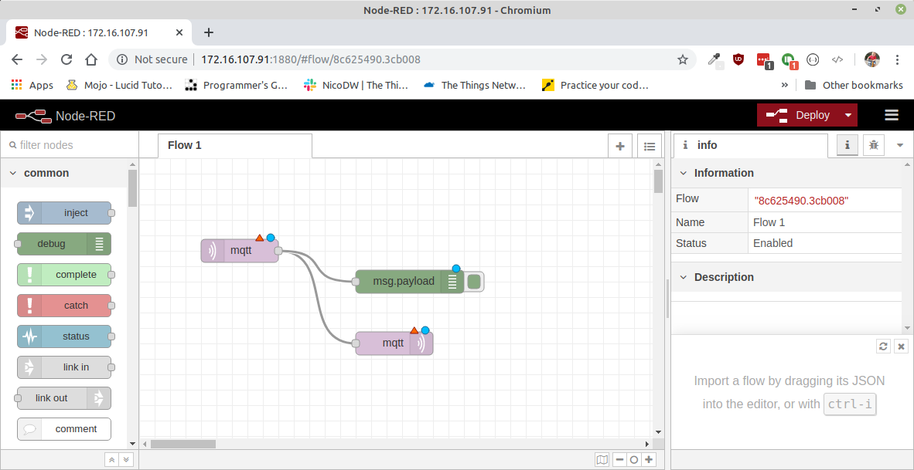

# Node-RED


Node-RED is een flow gebaseerde visuele ontwikkelomgeving ontwikkeld door IBM. Het laat toe hardware toestellen, API's en online diensten met elkaar te laten communiceren in het teken van het Internet of Things.

Node_RED is een browser omgeving dat toelaat JavaScript functies te creëren. Elementen van een toepassing kunnen opgeslagen worden of gedeeld worden voor hergebruik. Het draait op Node.js. Alle flows die gebouwd worden, worden opgeslagen aan de hand van JSON.


## Installatie

<!-- [https://nodered.org/docs/hardware/raspberrypi](https://nodered.org/docs/hardware/raspberrypi) -->
Om Node-RED te installeren op de raspberry pi moeten we volgende commando gaan uitvoeren in een commandolijn terminal.

```
bash <(curl -sL https://raw.githubusercontent.com/node-red/raspbian-deb-package/master/resources/update-nodejs-and-nodered)
```
Het installatiescript zal een paar vragen stellen vooralleer het uitgevoerd zal worden. Antwoord op beide vragen met *ja* door op `y` en `enter` te drukken.


De installatie zal daarna van start gaan. Dit kan een aantal minuten duren. De voortgang van de installie wordt aangeduid aan de van groene vinkjes. Wanneer alles goed gegaan is, en de installatie klaar is zou je het volgende moeten zien:


### The Things Network integratie

Node-RED heeft een plug-in welke toelaat elementen van The Things Network te gebruiken. De installatie van deze plugin gebeurt terug via de commandolijn. Voor volgende commando's uit.

```
cd $HOME/.node-red
npm install node-red-contrib-ttn
```

### Node-RED opstarten na het herstarten van de Pi

Je kan er voor kiezen om Node-RED automatisch te laten opstarten wanner de Raspberry Pi gestart wordt. Dit kan handig zijn omdat de configuratie dan altijd beschikbaar is voor de webpagina. Je hoeft het dan niet eerst manueel op te starten, het gedraagt zich dan als een echte server.

Dit instellen kan terug via de commandolijn met het volgende commando:

```
sudo systemctl enable nodered.service
```

<!-- https://www.thethingsnetwork.org/docs/applications/nodered/quick-start.html -->

## Opstarten

Na de installatie zal in de taakbalk bovenaan een icoon verschijnven voor Node-RED.


Dit icoon kan gebruikt worden om Node-RED op te starten. Er zal een commandolijn opgestart worden dat Node-RED in de achtergrond zal opstarten. Na het opstarten mag dit venster gewoon weer gesloten worden. 


Node-RED interactie zal vanaf nu volledig via de browser gebeuren door te surfen naar [http://localhost:1880](http://localhost:1880). Je zal dan deze interface te zien krijgen.


## Configuratie

Nu dat Node-RED geïnstalleerd is kan er een configuratie gebouwd worden voor onze toepassing. In dit voorbeeld zal een temperatuursensor uitgelezen worden vanuit The Things Network, en zullen we deze waarde gaan publiceren via MQTT zodat de data real-time beschikbaar gesteld wordt aan elke toepassing die geïnteresseerd is, zoals bij voorbeeld een webapplicatie.

We dienen dus een flow te bouwen die de sensor waarde als uitvoer heeft, en MQTT als invoer. In dit voorbeeld dienen we gebruik te maken van een `ttn uplink` node, en een `mqtt` node. Merk op dat een uitvoer node aan de rechterkant kan gekoppeld worden en dat een invoer node aan de linkerkant gekoppeld kan worden.

Zoek de twee nodes in aan de linker kant, en sleep ze naar het centrale deel. Indien je ze niet direct terug kan vinden, dan kan je aan de linkerkant bovenaan ook gebruik maken van de `filter nodes` zoekfunctie.

De nodes mogen dan ook aan elkaar gekoppeld worden zodat de uitvoer van de `ttn uplink` node naar de invoer van de `mqtt` node zal gaan.

Hieronder kan je een voorbeeld zien



Nu de nodes correct aan elkaar gekoppeld zijn, dienen we ze nog te configureren

### `ttn uplink` node configureren

Dubbel klik op de `ttn uplink` node om zijn configuratie te tonen. Het eerste wat we daar moeten doen is de TTN App instellen. Met deze configuratie gaan we aangeven aan welke applicatie van The Things Network we gegevens willen ontvangen. We dienen dan ook de juiste `access key` in te stellen.


Klik op de knop aanpassen, met het icoontje, rechts naast het invoerveld 'Add new ttn app...'. Je krijgt dan het volgende te zien:


Daar moeten we het `App ID` en de `Access Key` van de The Things Network applicatie gaan invullen. Deze gegevens kan je terugvinden op de [console](https://console.thethingsnetork.org/applications) van The Things Network. 

Het `App ID` kan je terugvinden onder `Application overview`.


De `Access Key` kan je terugvinden onderaan bij `Access Keys`


Copier en plak beide gegevens in Node-RED en klik op de knop `Update`. De bovenstaande stappen moeten normaal maar 1 maal gebeuren in Node-RED. Deze gegevens zullen bewaard worden zodat je ze ook kunt gebruiken bij andere flows. Je zal nu verder kunnen gaan met het configureren van de node.

Vul nu een naam in voor de node. Dit mag om het even zijn, in dit voorbeeld nemen we een naam die het soort sensor beschrijft. Verder dienen we nog een `Device ID` op te geven. Dit id moet overeenkomen met het Device ID vanop The Things Network console.


### `mqtt` node configureren

Nu moeten we enkel nog de MQTT node configureren. Dit doen we terug door te dubbelklikken op de mqtt node. We krijgen dan volgende scherm te zien:


Eerst dienen we een server in te stellen dit kunnen we doen door op de aanpassen knop te drukken rechts naast `Add new mqtt-broker...`. Dan komen we op volgende venster terrecht waar we de server kunnen invullen. Hier vullen we `localhost` in om aan te geven dat de MQTT broker op het zelfde toestel geinstalleerd staat.


Klik daarna op de `Add` knop bovenaan om de MQTT broker toe te voegen aan Node-RED.

Nu kunnen we de node zelf configureren. We dienen een `topic` te kiezen. Dit topic moet voor elke sensor uniek zijn. Aangezien we in dit voorbeeld een temperatuursensor gebruiken kiezen we een topic `workshop/temperature`. Voor een andere sensor kan een ander topic genomen worden dat voorafgegaan wordt door `workshop/`.

Belangrijk is dat we ook de `Retain` correct instellen op `true`. Dit zal er voor zorgen dat de laatste waarde doorgestuurd wordt naar de geabonneerden, zodat niet gewacht moet worden op een nieuwe waarde van de sensor. 


## Flow uitvoeren

Wanneer alles correct geconfigureerd is zou de flow er als volgt moeten uitzien.

