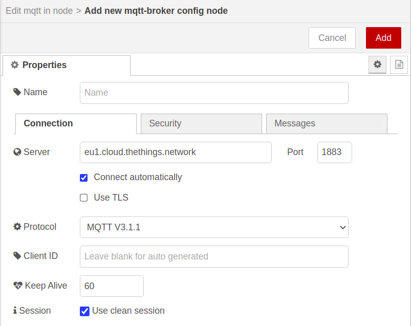
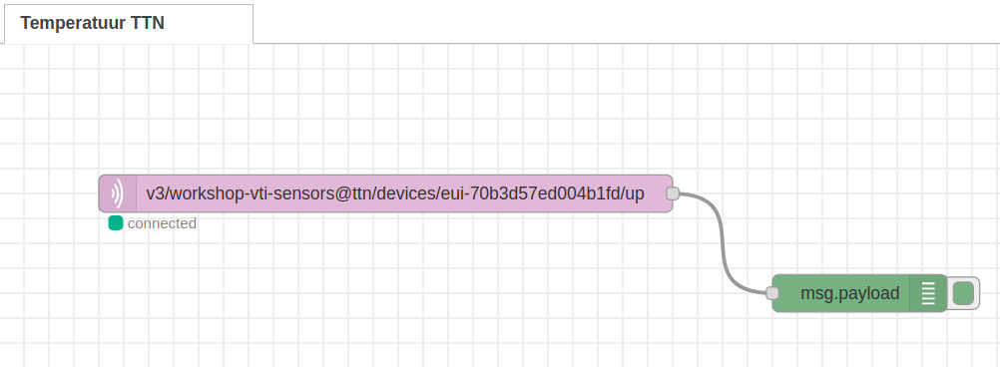

# Node-RED


Node-RED is een flow gebaseerde visuele ontwikkelomgeving ontwikkeld door IBM. Het laat toe hardware toestellen, API's en online diensten met elkaar te communiceren in het teken van het Internet of Things.

Node-RED is een browser omgeving die toelaat JavaScript functies te creëren. Elementen van een toepassing kunnen opgeslagen worden of gedeeld worden voor hergebruik. Het draait op Node.js. Alle flows die gebouwd worden, worden opgeslagen aan de hand van JSON.

## Installatie

<!-- [https://nodered.org/docs/hardware/raspberrypi](https://nodered.org/docs/hardware/raspberrypi) -->
Om Node-RED te installeren op de Raspberry PI moeten we volgend commando gaan uitvoeren in een terminal (commandolijn).

```bash
bash <(curl -sL https://raw.githubusercontent.com/node-red/linux-installers/master/deb/update-nodejs-and-nodered)
```

Het installatiescript zal een paar vragen stellen vooralleer het uitgevoerd wordt. Antwoord op beide vragen met *ja* door op `y` en `ENTER` te drukken.


De installatie zal daarna van start gaan. Dit kan een aantal minuten duren. De voortgang van de installatie wordt aangeduid aan de hand van groene vinkjes. Wanneer alles goed gegaan is, en de installatie klaar is zou je het volgende moeten zien:


## Opstarten van Node-RED

Na de installatie zal in de taakbalk bovenaan een icoon verschijnen voor Node-RED.


Dit icoon kan gebruikt worden om Node-RED op te starten. Er zal een commandolijn opgestart worden dat Node-RED in de achtergrond zal opstarten. Na het opstarten mag dit venster gewoon weer gesloten worden.


Node-RED interactie zal vanaf nu volledig via de browser gebeuren door te surfen naar [http://localhost:1880](http://localhost:1880). Je zal dan volgende interface te zien krijgen.


### Automatisch starten

Je kan er ook voor kiezen om Node-RED automatisch te laten opstarten wanneer de Raspberry Pi gestart wordt. Dit kan handig zijn omdat de flows dan altijd beschikbaar zijn. Je hoeft het dan niet eerst manueel op te starten, het gedraagt zich dan als een echte server.

Dit instellen kan terug via de commandolijn met het volgende commando:

```bash
sudo systemctl enable nodered.service
```

<!-- https://www.thethingsnetwork.org/docs/applications/nodered/quick-start.html -->

## Flow voor data captatie

Nu dat Node-RED geïnstalleerd is, kan er een flow gebouwd worden voor onze toepassing. In dit voorbeeld zal een **temperatuursensor** uitgelezen worden vanuit The Things Network. Hiervoor dienen we gebruik te maken van de `mqtt in` node.

Merk op dat een node die data genereert (uitvoer) aan de rechterkant kan gekoppeld worden en een node die data binnen neemt (invoer) aan de linkerkant gekoppeld kan worden.

### De mqtt input node

We starten met de `mqtt input` node zodat we eerst de data van The Things Network kunnen binnen halen.

Zoek de node `mqtt input` in de lijst aan de linker kant, en sleep deze naar het centrale deel. Indien je deze niet direct terug kan vinden, dan kan je aan de linkerkant bovenaan ook gebruik maken van de `filter nodes` zoekfunctie.

Vervolgens kunnen we ook een `debug` node aan de uitgang van de `mqtt input` koppelen zodat we de informatie makkelijk kunnen raadplegen die van The Things Network komt.


Nu dienen we de node nog te configureren zodat deze connectie maakt met de MQTT broker van The Things Network.

#### Configuratie van de mqtt input node

Dubbelklik op de `mqtt input` node om de configuratie te tonen. Hier dienen we de gegevens van The Things Network in te stellen. Met deze configuratie gaan we aangeven van welke applicatie van The Things Network we gegevens willen ontvangen. We dienen dan ook de juiste `access key` in te stellen.


Klik op de knop met het potlood icoontje, rechts naast het invoerveld `Add new mqtt broker...`.

Herinner u dat we alle authenticatie gegevens terugvinden op de applicatie pagina van The Things Network onder `Integrations => MQTT`.


Eerst en vooral dienen we in het tabblad **Connection** de **server** in te stellen op `eu1.cloud.thethings.network`. De andere parameters mag je standaard laten.



Vervolgens moeten we een bruikersnaam en wachtwoord ingeven in het tabblad **Security**. Als gebruikersnaam hebben we het application id met de postfix `@ttn` en als wachtwoord hebben de API key nodig. Beiden vinden we terug op The Things Network onder `Integrations => MQTT`.


Klik vervolgens bovenaan rechts op de knop `Add`.

Als laatste dienen we ook in te stellen waar onze temperatuursensor data kan worden bekomen. Dit doen we door het **topic** correct in te stellen. Het topic heeft hierbij het volgende formaat:

```text
`v3/__app_id__@ttn/devices/__device_id__/up`
```

Waarbij we `__app_id__` dienen te vervangen door het application ID en `__device_id__` door het device ID (startend met `eui-`). Deze gegeven kan je opnieuw terug vinden op the [The Things Network console](https://eu1.cloud.thethings.network/console/applications).

Bijvoorbeeld:

```text
v3/workshop-vti-sensors@ttn/devices/eui-70b3d57ed004b1fd/up
```

Als laatste dienen we de mqtt node output ook in te stellen zodat deze een JavaScript object terug geeft in plaats van een pure JSON string. Dit laat ons toe om later makkelijker te filteren. Selecteer als output `A parsed JSON Object`.


Klik vervolgens op `Done` en op `Deploy`. Dit zou dan je eindresultaat moeten zijn:



Indien je nu op het kleine debug beestje rechts bovenaan klikt dan zou je na een tijdje reeds data moeten zien binnenkomen van je sensor.


De eigenlijke data vind je dan terug onder `uplink_message => decoded_payload`.

### Filteren data

Op dit moment krijgen we niet enkel onze data binnen van de TTN maar ook allerlei metadata. We dienen eerst onze data er uit te filteren vooraleer we hier verder aan de slag mee kunnen.

Hiervoor kan je gebruik maken van de algemene `function node`. Als je hier op dubbelklikt kan je een stukje JavaScript code bouwen om uit te voeren.

```js
msg.payload = msg.payload.uplink_message.decoded_payload.temperature;
return msg;
```

Best kan je de `Name` van de node instellen op bv. `Filter temperatuur`. Sla de aanpassingen op door op `Done` te klikken.

Hang vervolgens de `function` node aan de output van `mqtt in` node.

Tevens kan je aan de output van de `function` een `debug` node hangen zodat we zien wat er van data uit komt.


## Flow uitvoeren

Wanneer alles correct geconfigureerd is zou de flow er als volgt moeten uitzien.


Je kan de flow activeren door bovenaan rechts op de knop `Deploy` te drukken. De flow zal nu uitgevoerd worden. Node-RED zal deze ook op de achtergrond blijven uitvoeren. Dat wil dus zeggen dat je de webbrowser gerust mag afsluiten en alles zal blijven werken.

## En nu ?

Op dit moment gaat onze data nog volledig verloren. We zijn nu echter wel op een punt gekomen waar we de data wel terug ter onze beschikking hebben. Vanaf hier kunnen we er alle kanten mee uit. Terug versturen naar een eigen MQTT broker, opslaan in een database, visualiseren in een dashboard...
