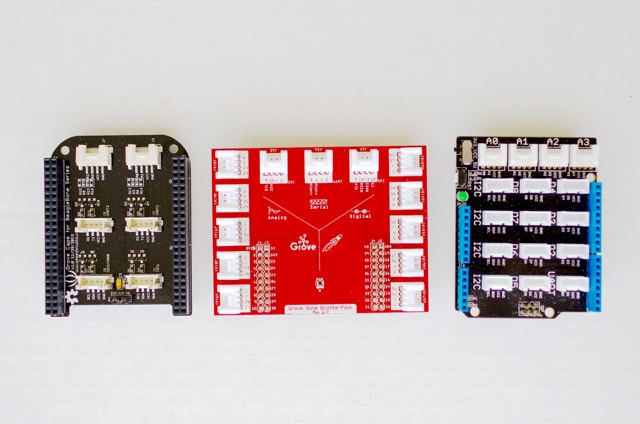
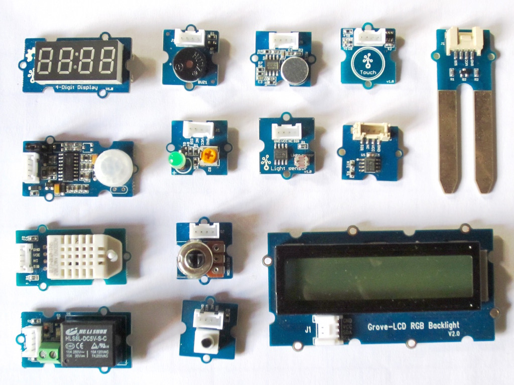

# Grove Sensoren

Grove is een modulair, gestandaardiseerd prototypesysteem voor allerhande elementen die connecteerbaar zijn met een ontwikkelbord zoals Arduino. In vergelijking met een jumper- of soldeersysteem is het eenvoudiger om verbindingen te maken en meer toegankelijk voor deze die hier kaas hebben van gegeten.

Het Grove systeem bestaat typisch uit 3 delen:

* een **adapterbord** laat toe om het grove systeem aan een ontwikkelbord te koppelen zoals Arduino of Raspberry Pi. Dit is typisch in de vorm van een shield of cape.
* een groot assortiment van **modules**, waaronder sensoren, actuatoren, displays, ...
* een **4-pins connector** die de module verbind met het adapterbord en bijgevolg ook met je ontwikkelbord.

De basiseenheid, in het algemeen een microprocessor, maakt een eenvoudige verbinding mogelijk van elke ingang of uitgang van de Grove-modules. En elke Grove-module adresseert meestal een enkele functie, zoals een eenvoudige knop of een complexere hartslagsensor.

Niet elke module maakt gebruik van dezelfde communicatiestandaard. Het is dus wel belangrijk te kijken van welke connector je gebruik maakt om je module aan te sluiten. Zo bestaat er onder andere:

* **I2C**, een **bus-communicatiesysteem** dat bestaat uit een master (het ontwikkelbord) en slaves (de modules). Doordat het een bussysteem is kan je ook meerdere modules aansluiten.
* **UART**, een **seriele punt-tot-punt communicatiestandaard** die toelaat om 2 dingen met elkaar te laten communiceren.
* een **analoge** connectie (aangeduid met de letter `A`), waarbij het signaal van de module een analoge waarde is die meestal gelegen is tussen 0 en 5V.
* een **digitale** connectie (aangeduid met de letter `D`), waarbij het signaal van de module een digitaal TTL signaal is.

Elke module is voorzien van documentatie en voorbeelden om snel aan de slag te kunnen. Al deze informatie is te vinden op [http://wiki.seeedstudio.com/Grove_System/](http://wiki.seeedstudio.com/Grove_System/).

## Sensoren

* [Push Button](./push_button/README.md)
* [Switch (P)](./switch/README.md)
* [Q Touch Sensor](./q_touch/README.md)
* [RFID 125kHz Reader](./rfid/README.md)
* [Bewegingssensor](./motion-sensor/README.md)
* [Rotatiesensor](./rotary-sensor/README.md)
* [Temperatuur, druk en vochtigheidssensor](./tph-sensor/README.md)
  