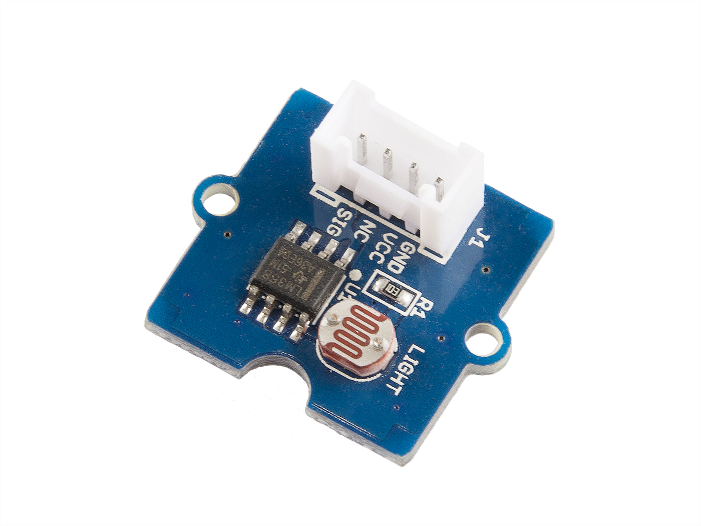
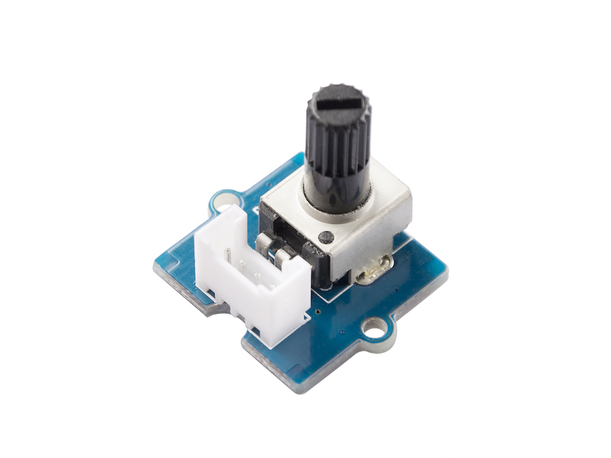
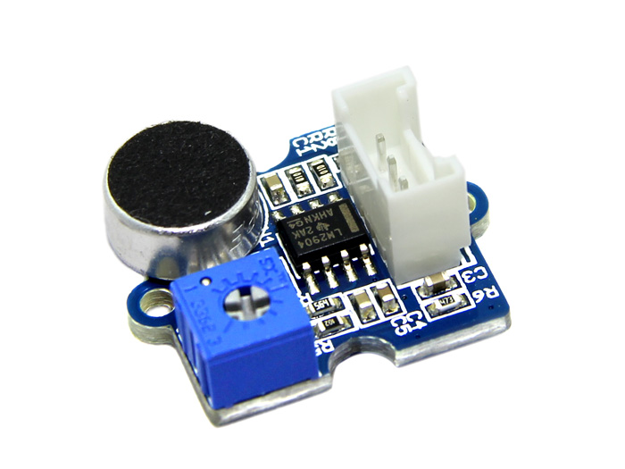
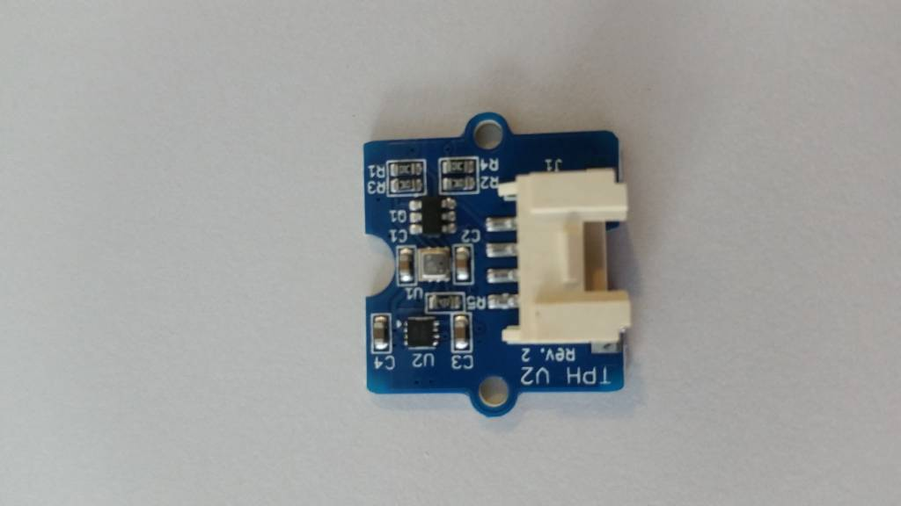
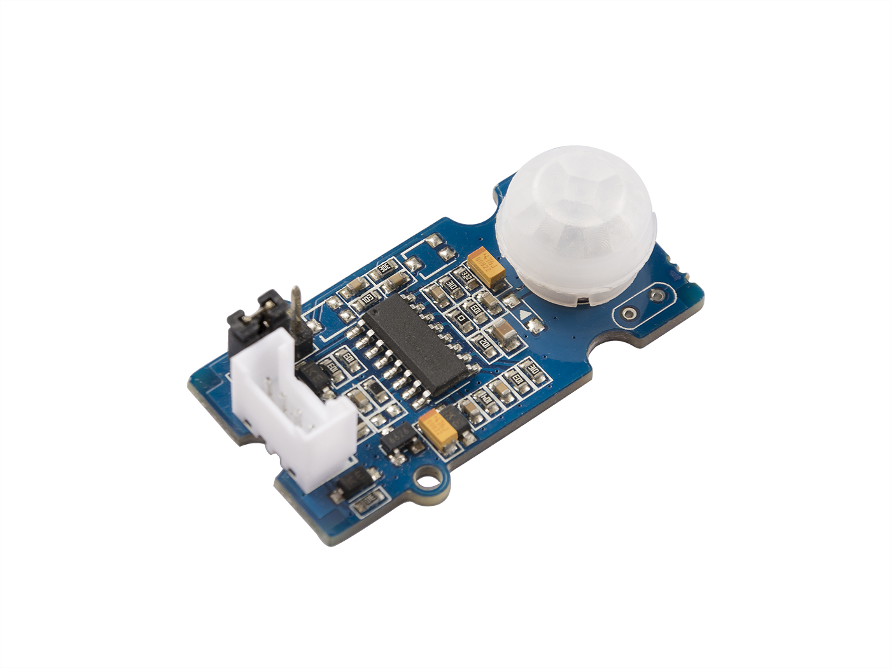

# Grove sensors

## Light Sensor

More information:
[https://www.seeedstudio.com/Grove-Light-Sensor-p-746.html]()

## Rotary Angle Sensor

More information:
[https://www.seeedstudio.com/Grove-Rotary-Angle-Sensor-p-770.html]()

## Loudness Sensor

More information:
[https://www.seeedstudio.com/Grove-Loudness-Sensor-p-1382.html]()

## Temperature - Pressure - Humidity

More information:
[https://shop.sodaq.com/tph-v2.html]()

## Motion Sensor

More information:
[https://www.seeedstudio.com/Grove-PIR-Motion-Sensor-p-802.html]()