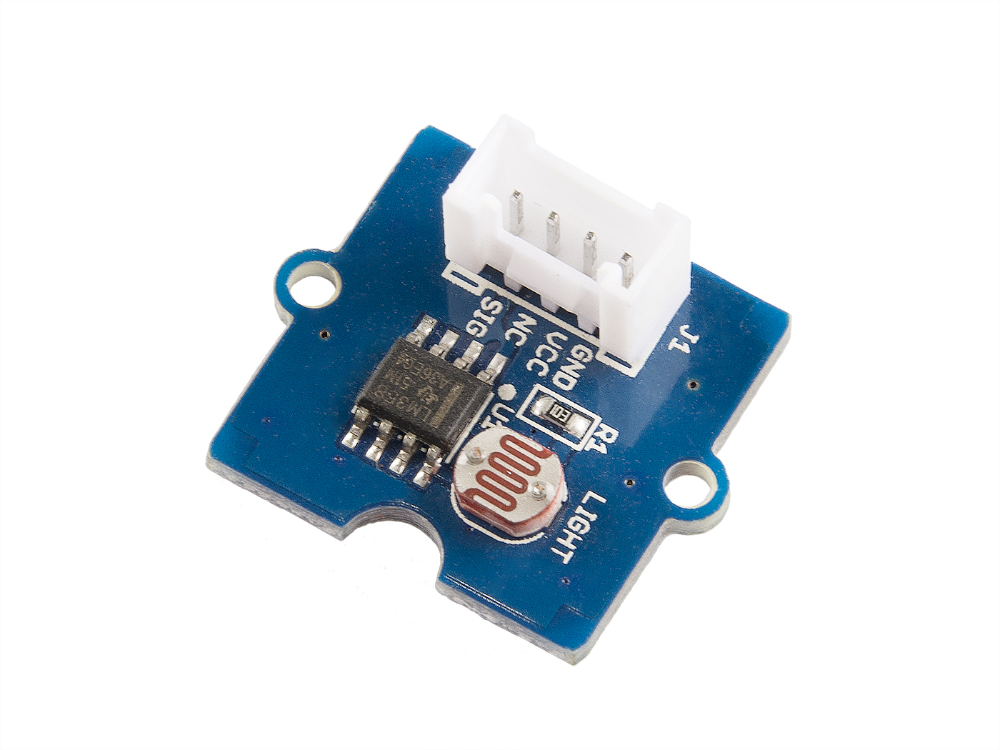
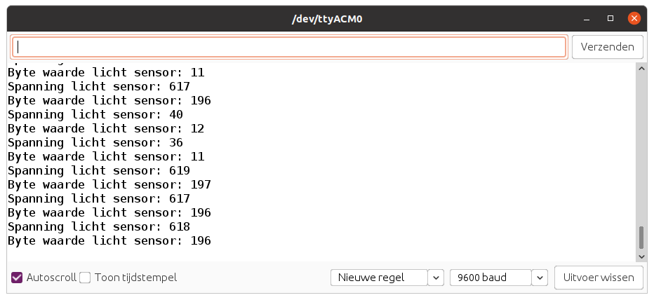

# Light Sensor

De Light Sensor integreert een lichtafhankelijke weerstand om de intensiteit van het licht te detecteren. De weerstand van de fotoweerstand neemt af wanneer de intensiteit van het licht toeneemt. Een dubbele OpAmp-chip LM358 aan boord produceert een spanning die overeenkomt met de lichtintensiteit (d.w.z. gebaseerd op de weerstandswaarde). Het uitgangssignaal heeft een analoge waarde, hoe helderder het licht, hoe groter de waarde.



## Aansluiten

Om de lichtsensor te verbinden met het SODAQ bord dien je eerst en vooral een **4-pins connector** aan te sluiten op de PCB. Vervolgens sluit je de andere zijde van de connector aan op het SODAQ bord. Opgelet, je dient hier wel de connectie te maken met de correcte header op het SODAQ bord, namelijk deze **met de digitale/analoge pins**, niet de I2C header. In volgende afbeelding wordt dit nog eens weergegeven.


Als je de markeringen op de PCB van de lichtsensor bekijkt en vergelijkt met deze op het SODAQ bord, zal je zien dat de output van de sensor (aangeduid met `SIG`) is aangesloten op `A8`. NC staat voor *Not Connected* of niet aangesloten.

## Starter Applicatie

Onderstaand vind je een demo sketch die de analoge spanning van de lichtsensor inleest om de `100` milliseconden. De huidige waarde van de sensor wordt vervolgens weergegeven in de console.

De vertraging kan worden aangepast.

```cpp
//**********************************************************
// Hier gaan we globale variabelen declareren.
// Deze zijn beschikbaar doorheen de volledige sketch.
//**********************************************************
const int LIGHT_PIN = A8;         // Pin van de Light sensor
const int LIGHT_MAX_VALUE = 800;  // Maximum waarde bij veel licht

//**********************************************************
// De setup van Arduino, wordt in het begin van je sketch
// eenmalig uitgevoerd.
// Als je sensor moet initialiseren, dan doe je dit hier
//**********************************************************
void setup() {
  SerialUSB.begin(115200);

  // 10 seconden wachten op SerialUSB. 
  while ((!SerialUSB) && (millis() < 10000)) { }
  
  pinMode(LIGHT_PIN, INPUT);          // Analoge pin als ingang

  SerialUSB.println("Starten van starter sketch licht sensor.");
}

//**********************************************************
// De main loop van Arduino, deze blijft telkens herhalen.
//**********************************************************
void loop() {
  // Lees de waarde van de licht sensor uit
  int lightVoltage = analogRead(LIGHT_PIN);
  SerialUSB.print("Spanning licht sensor: ");
  SerialUSB.println(lightVoltage);

  // Omzetten naar een waarde tussen 0 en 255
  int byteValue = map(lightVoltage, 0, LIGHT_MAX_VALUE, 0, 255);
  SerialUSB.print("Byte waarde licht sensor: ");
  SerialUSB.println(byteValue);

  // 100 milliseconden wachten, kan je verhogen of verlagen
  delay(100);
}
```

De output zou er dan als volgt moeten uitzien:



Dit type sensor komt overeen met een temperatuursensor. Je leest de waarde periodiek in en stuurt deze dan door. Dus dit kan zonder veel aanpassing in de LoRaWAN sketch worden overgenomen.

## Meer informatie

Meer informatie is beschikbaar op [http://wiki.seeedstudio.com/Grove-Light_Sensor](http://wiki.seeedstudio.com/Grove-Light_Sensor/)
