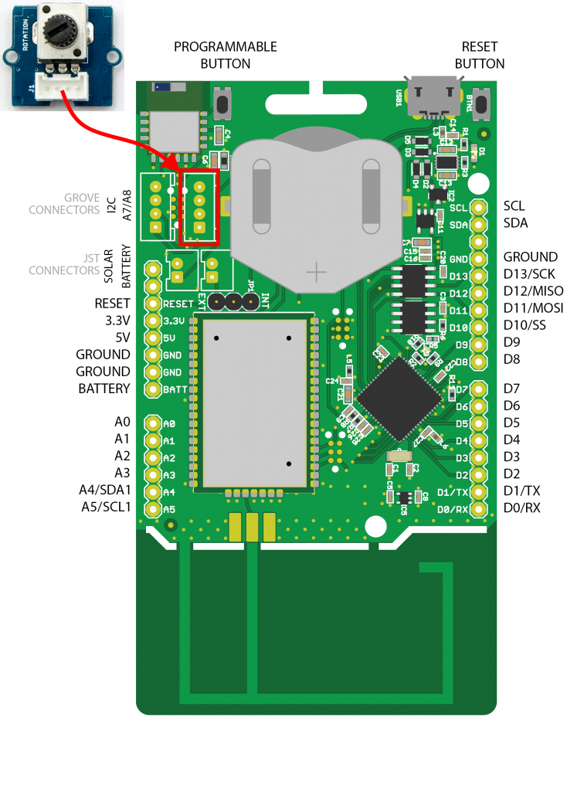

# Moisture Sensor

Vochtsensoren worden gebruikt voor het detecteren van het vocht van de grond of om te beoordelen of er water rond de sensor zit. Dit laat de plant in uw tuin de mens om hulp reiken als ze dorst hebben. Deze sensor is zeer eenvoudig te gebruiken, u kunt hem gewoon in de grond steken en de gegevens uitlezen.


## Aansluiten

Om de vochtsensor te verbinden met het SODAQ bord dien je eerst en vooral een **4-pins connector** aan te sluiten op de PCB. Vervolgens sluit je de andere zijde van de connector aan op het SODAQ bord. Opgelet, je dient hier wel de connectie te maken met de correcte header op het SODAQ bord, namelijk deze **met de digitale/analoge pins**, niet de I2C header. In volgende afbeelding wordt dit nog eens weergegeven.



Als je de markeringen op de PCB van de vochtsensor bekijkt en vergelijkt met deze op het SODAQ bord, zal je zien dat de output van de sensor (aangeduid met `SIG`) is aangesloten op `A8`. NC staat voor *Not Connected* of niet aangesloten.

## Starter Applicatie

Onderstaand vind je een demo sketch die de analoge spanning van de vochtsensor inleest om de `100` milliseconden. De huidige waarde van de sensor wordt vervolgens weergegeven in de console of kan je ook via de seriële plotter weergeven in een grafiek.

De vertraging kan worden aangepast.

```cpp
//**********************************************************
// Hier gaan we globale variabelen declareren.
// Deze zijn beschikbaar doorheen de volledige sketch.
//**********************************************************
const int MOISTURE_PIN = A8;           // Pin van de vochtsensor
const int MAX_MOISTURE_LEVEL = 1023;   // Maximale waarde van de analoge spanning

//**********************************************************
// De setup van Arduino, wordt in het begin van je sketch
// eenmalig uitgevoerd.
// Als je sensor moet initialiseren, dan doe je dit hier
//**********************************************************
void setup() {
  SerialUSB.begin(115200);

  // 10 seconden wachten op SerialUSB. 
  while ((!SerialUSB) && (millis() < 10000)) { }
  
  pinMode(MOISTURE_PIN, INPUT);          // Analoge pin als ingang

  SerialUSB.println("Starten van starter sketch vochtsensor.");
}

//**********************************************************
// De main loop van Arduino, deze blijft telkens herhalen.
//**********************************************************
void loop() {
  // Lees de spanning uit van de sensor
  int moistureVoltage = analogRead(MOISTURE_PIN);
  SerialUSB.print("Vochtgehalte: ");
  SerialUSB.println(moistureVoltage);

  // Omzetten naar een waarde tussen 0 en 255
  int byteValue = map(moistureVoltage, 0, MAX_MOISTURE_LEVEL, 0, 255);
  SerialUSB.print("=> Byte waarde: ");
  SerialUSB.println(byteValue);

  // 100 milliseconden wachten, kan je verhogen of verlagen
  delay(100);
}
```

De output zou er dan als volgt moeten uitzien:


Dit type sensor komt overeen met een temperatuursensor. Je leest de waarde periodiek in en stuurt deze dan door. Dus dit kan zonder veel aanpassing in de LoRaWAN sketch worden overgenomen.

<!-- TODO: Eigenlijk kunnen we dit ook benaderen met events. Detecteren wanneer grens wordt overschreven. -->

## Meer informatie

Meer informatie is beschikbaar op [https://wiki.seeedstudio.com/Grove-Moisture_Sensor/](https://wiki.seeedstudio.com/Grove-Moisture_Sensor/)

<!-- TODO: Things Network Decoder -->