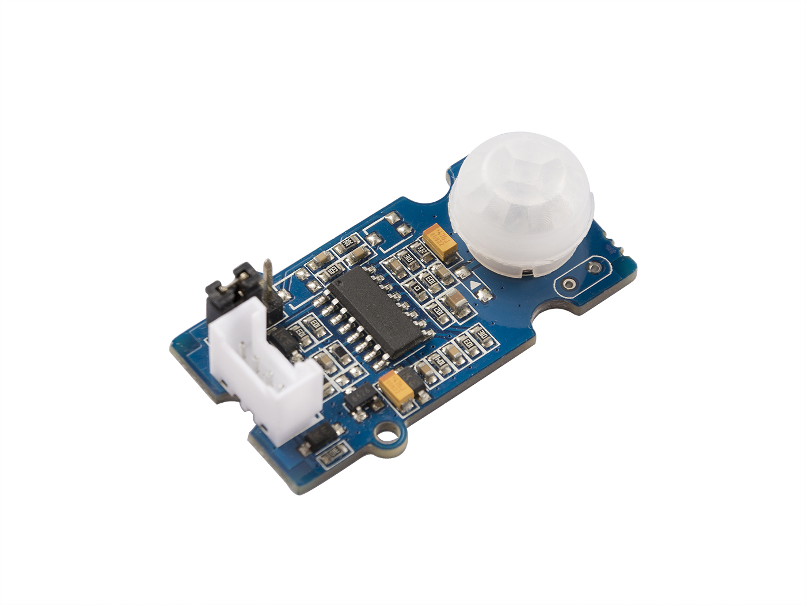
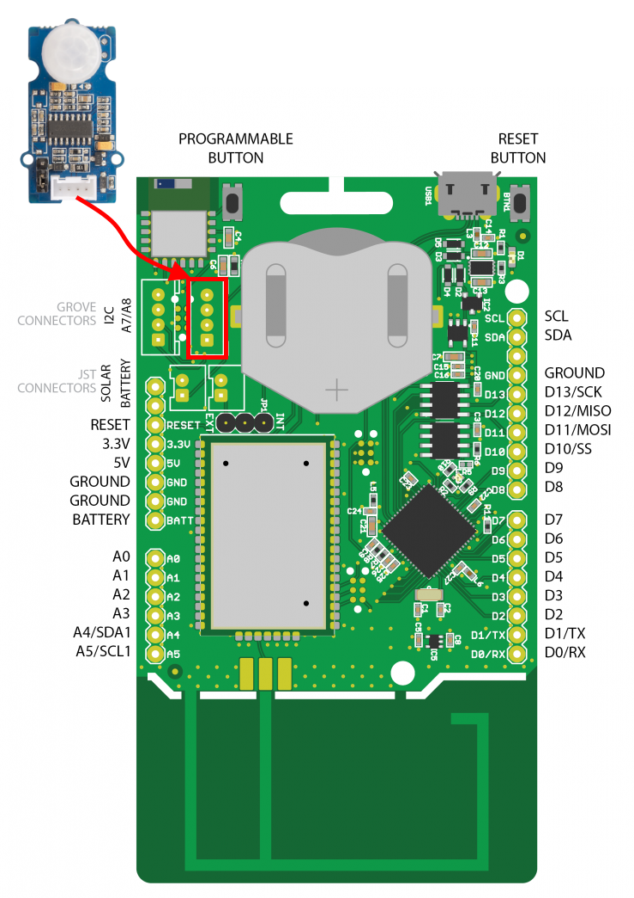
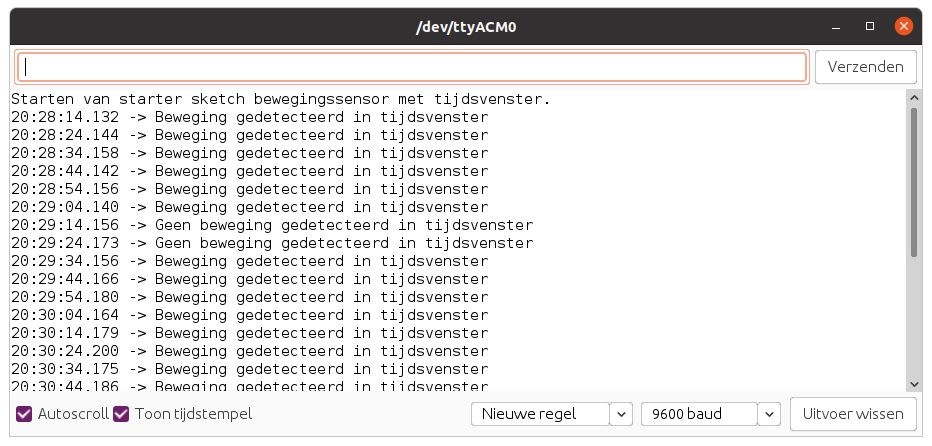

# PIR Motion Sensor

De Grove PIR Motion Sensor laat toe om beweging te gaan detecteren. Dit kan worden gebruikt om bijvoorbeeld een licht aan te doen wanneer iemand in de ruimte binnenkomt. De detectie afstand van deze sensor is beperkt tot een 6tal meter.



## Specificaties

| Parameter | Waarde |
| --- | --- |
| Spanning | 3V - 5V |
| Stroomverbruik bij 5V | 150uA |
| Detectie afstand | 0.1 - 6m |
| Default detectie afstand | 3m |
| Houdtijd | 1 - 25s |
| Golflengte | 7 - 14um |
| Detectiehoek | 120 graden |

## Aansluiten

Om de sensor te verbinden met het SODAQ bord dien je eerst en vooral een **4-pins connector** aan te sluiten op de PCB. Vervolgens sluit je de andere zijde van de connector aan op het SODAQ bord. Opgelet, je dient hier wel de connectie te maken met de correcte header op het SODAQ bord, namelijk deze **met de digitale/analoge pins**, niet de I2C header. In volgende afbeelding wordt dit nog eens weergegeven.



Als je de markeringen op de PCB van de drukknop bekijkt en vergelijkt met deze op het SODAQ bord, zal je zien dat de output van PIR sensor (aangeduid met `D1`) is aangesloten op `D15`. NC staat voor *Not Connected* of niet aangesloten.

## Starter Applicatie

Onderstaand vind je een demo sketch die de output van de PIR sensor leest om de 500 milliseconden. De resultaten van de bewegingsdetectie wordt vervolgens in de console weergegeven.

De vertraging kan worden aangepast.

```cpp
//**********************************************************
// Hier gaan we globale variabelen declareren.
// Deze zijn beschikbaar doorheen de volledige sketch.
//**********************************************************
const int PIR_PIN = 15;             // Pin van de bewegingssensor

//**********************************************************
// De setup van Arduino, wordt in het begin van je sketch
// eenmalig uitgevoerd.
// Als je sensor moet initialiseren, dan doe je dit hier
//**********************************************************
void setup() {
  SerialUSB.begin(115200);

  // 10 seconden wachten op SerialUSB. 
  while ((!SerialUSB) && (millis() < 10000)) { }
  
  pinMode(PIR_PIN, INPUT);          // Digitale pin als ingang

  SerialUSB.println("Starten van starter sketch bewegingssensor.");
}

//**********************************************************
// De main loop van Arduino, deze blijft telkens herhalen.
//**********************************************************
void loop() {
  // Lees de huidige stand van de PIR sensor in
  int pirState = digitalRead(PIR_PIN);

  if (pirState == HIGH) {
    SerialUSB.println("Beweging gedetecteerd");
  }
  else {
    SerialUSB.println("Geen beweging gedetecteerd");
  }

  // 500 milliseconden wachten, kan je verhogen of verlagen
  delay(500);
}
```

## Met tijdsvenster

In plaats van moment opnames te nemen willen we eigenlijk weten of er binnen een bepaald tijdsvenster beweging was. Dit kan dan worden doorgestuurd via LoRaWAN. Door een lus te maken die `1000x` de sensor controleert en telkens `10ms` wacht, komen we aan een tijdsvenster van `10s`.

```cpp
//**********************************************************
// Hier gaan we globale variabelen declareren.
// Deze zijn beschikbaar doorheen de volledige sketch.
//**********************************************************
const int PIR_PIN = 15;             // Pin van de bewegingssensor

//**********************************************************
// De setup van Arduino, wordt in het begin van je sketch
// eenmalig uitgevoerd.
// Als je sensor moet initialiseren, dan doe je dit hier
//**********************************************************
void setup() {
  SerialUSB.begin(115200);

  // 10 seconden wachten op SerialUSB. 
  while ((!SerialUSB) && (millis() < 10000)) { }
  
  pinMode(PIR_PIN, INPUT);          // Digitale pin als ingang

  SerialUSB.println("Starten van starter sketch bewegingssensor met tijdsvenster.");
}

//**********************************************************
// De main loop van Arduino, deze blijft telkens herhalen.
//**********************************************************
void loop() {
  bool motionDetected = false;
  
  for (int i = 0; i < 1000; i++) {
    // Lees de huidige stand van de PIR sensor in
    int pirState = digitalRead(PIR_PIN);

    // Als er ook maar 1x beweging is, dan gaan we dit detecteren
    if (pirState == HIGH) {
      motionDetected = true;
    }

    delay(10);    // 10ms * 1000 = tijdsvenster van 10 seconden
  }

  // Rapportering
  if (motionDetected) {
    SerialUSB.println("Beweging gedetecteerd in tijdsvenster");
  } else {
    SerialUSB.println("Geen beweging gedetecteerd in tijdsvenster");
  }
}
```

Dit zou dan volgende output moeten opleveren:



## Meer informatie

Meer informatie is beschikbaar op [https://wiki.seeedstudio.com/Grove-PIR_Motion_Sensor/](https://wiki.seeedstudio.com/Grove-PIR_Motion_Sensor/).
