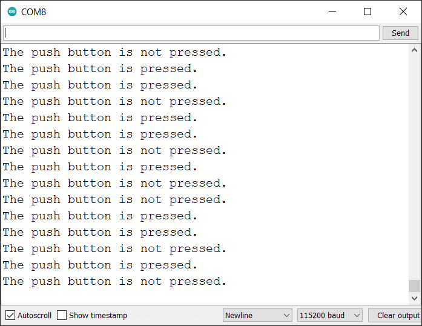
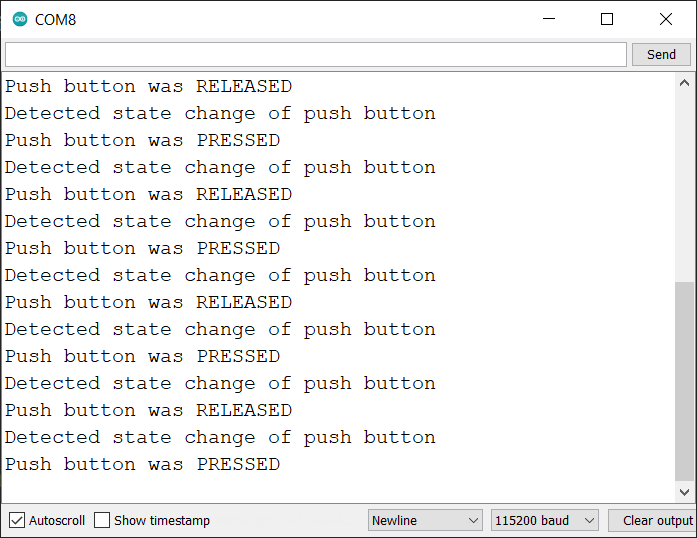

# Een Push Button

De Grove Push Button is een drukknop die ideaal is om dingen aan of uit te zetten. In tegenstelling tot een schakelaar blijft een drukknop niet in zijn positie staan. Dit betekent dus dat de knop zichzelf herstelt nadat deze is losgelaten.

Ondertussen bestaan er een aantal versies van deze module. Maar deze verschillen hoofdzakelijk in het uitzicht van de drukknop.


## Aansluiten

Om de drukknop te verbinden met het SODAQ bord dien je eerst en vooral een **4-pins connector** aan te sluiten op de PCB. Vervolgens sluit je de andere zijde van de connector aan op het SODAQ bord. Opgelet, je dient hier wel de connectie te maken met de correcte header op het SODAQ bord, namelijk deze **met de digitale/analoge pins**, niet de I2C header. In volgende afbeelding wordt dit nog eens weergegeven.


Als je de markeringen op de PCB van de drukknop bekijkt en vergelijkt met deze op het SODAQ bord (achterzijde), zal je zien dat de output van de drukknop (aangeduid met `SIG`) is aangesloten op `D15`. `NC` staat voor *Not Connected* of niet aangesloten.

## Starter Applicatie

Onderstaand vind je een demo sketch die de stand van de drukknop om de 100 milliseconden uitleest. De huidige stand van de drukknop wordt vervolgens weergegeven in de console.

De vertraging kan worden verkleind of vergroot naargelang de toepassing.

```cpp
//**********************************************************
// Hier gaan we globale variabelen declareren.
// Deze zijn beschikbaar doorheen de volledige sketch.
//**********************************************************
const int PUSH_BUTTON_PIN = 15;   // Pin van de drukknop

//**********************************************************
// De setup van Arduino, wordt in het begin van je sketch
// eenmalig uitgevoerd.
// Als je sensor moet initialiseren, dan doe je dit hier
//**********************************************************
void setup() {
  SerialUSB.begin(115200);

  // 10 seconden wachten op SerialUSB. 
  while ((!SerialUSB) && (millis() < 10000)) { }
  
  pinMode(PUSH_BUTTON_PIN, INPUT);          // Digitale pin als ingang

  SerialUSB.println("Starten van starter sketch push button.");
}

//**********************************************************
// De main loop van Arduino, deze blijft telkens herhalen.
//**********************************************************
void loop() {
  // Lees de huidige stand van de drukknop in
  int pushState = digitalRead(PUSH_BUTTON_PIN);

  if (pushState == HIGH) {
    SerialUSB.println("De drukknop is ingedrukt");
  }
  else {
    SerialUSB.println("De drukknop is niet ingedrukt");
  }

  // 100 milliseconden wachten, kan je verhogen of verlagen
  delay(100);
}

```

Als je de knop een aantal keer indrukt zou je een dergelijke output in de seriële monitor moeten krijgen.



## Event gebaseerd

De starter applicatie is goed om aan te tonen hoe de drukknop werkt, maar meestal zijn we niet geïnterpreteerd in de huidige staat op bepaalde momenten maar eerder in verandering. Met andere woorden, onze applicatie zou moeten detecteren wanneer er iemand de knop indrukt of los laat. Dit noemen we event gebaseerd.

De event gebaseerde optie is hier voor ons de meest toepasselijke omdat dit ook het best zal werken in samenwerking met LoRaWAN. Er werd hier ook gekozen voor de niet-blokkerende optie.

```cpp
//**********************************************************
// Hier gaan we globale variabelen declareren.
// Deze zijn beschikbaar doorheen de volledige sketch.
//**********************************************************
const int PUSH_BUTTON_PIN = 15;   // Pin van de drukknop

// Globale variabelen met de staat van de drukknop
int previousState = 0;
int currentState = 0;

//**********************************************************
// De setup van Arduino, wordt in het begin van je sketch
// eenmalig uitgevoerd.
// Als je sensor moet initialiseren, dan doe je dit hier
//**********************************************************
void setup() {
  SerialUSB.begin(115200);

  // 10 seconden wachten op SerialUSB. 
  while ((!SerialUSB) && (millis() < 10000)) { }
  
  pinMode(PUSH_BUTTON_PIN, INPUT);          // Digitale pin als ingang

  // We lezen ook de "start staat" in
  previousState = digitalRead(PUSH_BUTTON_PIN);
  currentState = previousState;

  SerialUSB.println("Starten van starter sketch niet-blokkerende push button events.");
}

//**********************************************************
// De main loop van Arduino, deze blijft telkens herhalen.
//**********************************************************
void loop() {
  if (has_button_been_pressed()) {
    // Versturen, verwerken, ... van de drukknop event
    SerialUSB.println("Er werd op de knop gedrukt");
  }

  // Hier kunnen we pas iets anders doen ...

}

//**********************************************************
// Controleer of er op de knop PUSH_BUTTON_PIN werd gedrukt
//**********************************************************
bool has_button_been_pressed() {
  currentState = digitalRead(PUSH_BUTTON_PIN);

  if (currentState != previousState) {
    // Nieuwe staat opslaan in oude staat
    previousState = currentState;
    delay(10);    // Even wachten voor ontdendering

    // We willen enkel het "loslaten" detecteren
    if (currentState == HIGH) {
      // Aangeven dat de knop werd ingedrukt
      return true;
    }
  }

  // Er vond geen verandering plaats
  return false;
}
```

Dit zou de volgende output moeten geven als je een aantal keer de knop indrukt en terug los laat.



Merk op dat je op deze manier nu kan kiezen op welke verandering je reageert. Op het drukken, het los laten of zelfs beiden.

## Meer informatie

Meer informatie kan je terugvinden op de website van Seeed Studio: [https://wiki.seeedstudio.com/Grove-Button](https://wiki.seeedstudio.com/Grove-Button).


<!-- TODO: Things Network Decoder -->