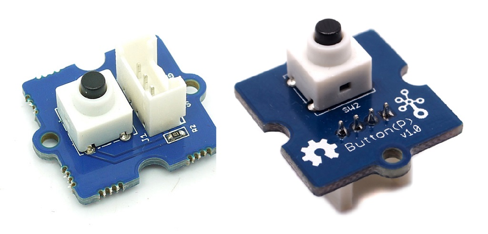
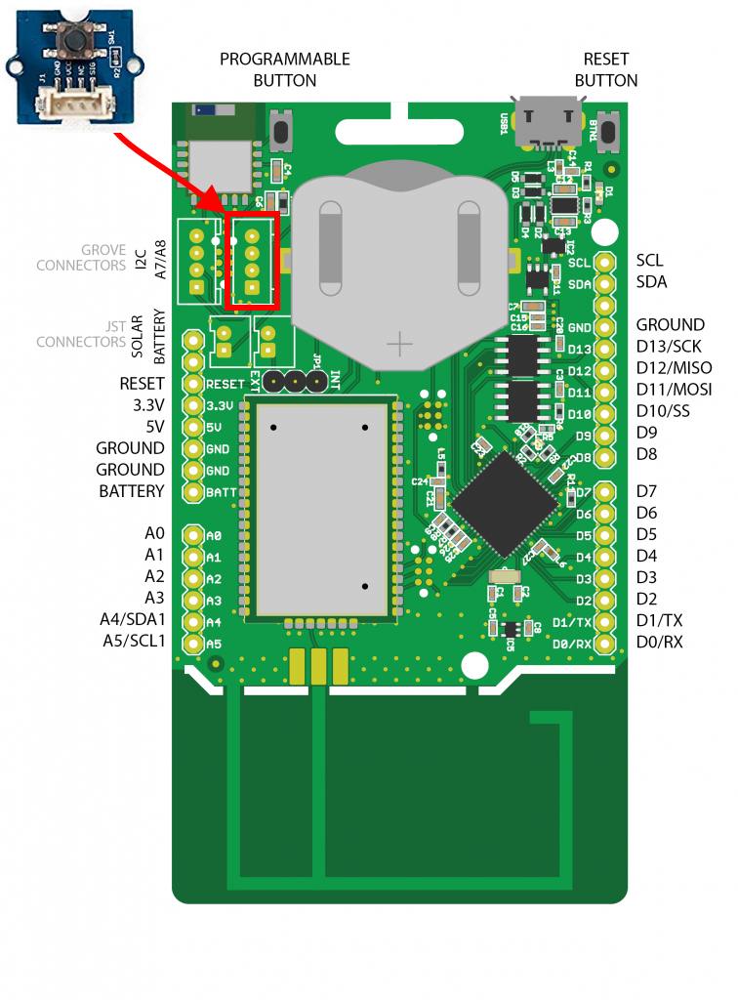

# Push Button

De Grove Push Button is een drukknop die ideaal is om dingen aan of uit te zetten. In tegenstelling tot een schakelaar blijft een drukknop niet in zijn positie staan. Dit betekent dus dat de knop zichzelf herstelt nadat deze is losgelaten.

Ondertussen bestaan er een aantal versies van deze module. Maar deze verschillen hoofdzakelijk in het uitzicht van de drukknop.



## Aansluiten

Om de drukknop te verbinden met het SODAQ bord dien je eerst en vooral een **4-pins connector** aan te sluiten op de PCB. Vervolgens sluit je de andere zijde van de connector aan op het SODAQ bord. Opgelet, je dient hier wel de connectie te maken met de correcte header op het SODAQ bord, namelijk deze **met de digitale/analoge pins**, niet de I2C header. In volgende afbeelding wordt dit nog eens weergegeven.



Als je de markeringen op de PCB van de drukknop bekijkt en vergelijkt met deze op het SODAQ bord, zal je zien dat de output van drukknop (aangeduid met `SIG`) is aangesloten op `D15`. NC staat voor *Not Connected* of niet aangesloten.

## Starter Applicatie

Onderstaand vind je een demo sketch die de stand van de drukknop om de 100 milliseconden uitleest. De huidige stand van de drukknop wordt vervolgens weergegeven in de console.

De vertraging kan worden verkleind of er zelfs worden uitgehaald.

```c++
const int pushPin = 15;   // Pin van de drukknop

void setup()
{
  // put your setup code here, to run once:
  SerialUSB.begin(115200);
  while ((!SerialUSB) && (millis() < 5000));
  SerialUSB.println("Starten van push button demo");
  pinMode(pushPin, INPUT);          // Digitale pin als ingang
}

void loop()
{
  // Lees de huidige stand van de drukknop in
  int pushState = digitalRead(pushPin);

  if (pushState == HIGH) {
    SerialUSB.println("De drukknop is ingedrukt");
  }
  else {
    SerialUSB.println("De drukknop is niet ingedrukt");
  }

  // 100 milliseconden wachten, kan je verhogen of verlagen
  delay(100);
}
```

## Event gebaseerd

De starter applicatie is goed om aan te tonen hoe de drukknop werkt, maar is niet zo praktisch voor te verzenden met LoRaWAN. We kunnen niet 10 maal per seconde de staat doorsturen. Om dit met LoRaWAN te combineren zou er beter worden gewerkt met detectie van verandering. Zo zou je onderstaande code kunnen aanpassen om via LoRaWAN de staat te kunnen doorsturen nadat de user de knop heeft ingedrukt (loslaten gaan we geen rekening mee houden).

```c++
const int pushPin = 15;   // Pin van de drukknop

void setup()
{
  // put your setup code here, to run once:
  SerialUSB.begin(115200);
  while ((!SerialUSB) && (millis() < 5000));
  SerialUSB.println("Starten van push button demo");
  pinMode(pushPin, INPUT);          // Digitale pin als ingang
}

void loop()
{
  // Lees de huidige stand van de drukknop
  int previousState = digitalRead(pushPin);
  int state = previousState;

  SerialUSB.println("Wachten voor event");

  // Wachten op verandering van de staat van de knop.
  // We wachten ook zolang de knop ingedrukt is (state == LOW)
  //    (loslaten negeren we dus, enkel indrukken)
  while (state == previousState || state  == LOW) {
    previousState = state;          // Nieuwe staat opslaan in oude staat
    state = digitalRead(pushPin);    // Nieuwe staat inlezen
    delay(10);    // Even wachten voor ontdendering
  }

  SerialUSB.println("Event is gebeurt");
}
```

## Meer informatie

Meer informatie is beschikbaar op [http://wiki.seeedstudio.com/Grove-Switch-P/](http://wiki.seeedstudio.com/Grove-Switch-P/).