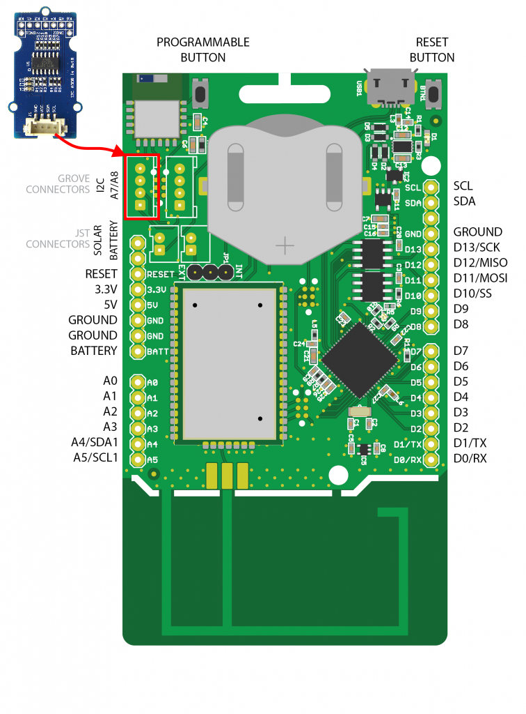

# Q Touch Sensor

De Q Touch Sensor is een capacitieve aanrakingsschakelaar met een hoge gevoeligheid en ruisimmuniteit. Deze is gebaseerd op de Atmel AT42QT1070 chip. De QT1070 elimineert nagenoeg de noodzaak voor externe componenten, waardoor aanraakingdetectie met behulp van een enkele pin mogelijk is.


## Specificaties

| Parameter | Waarde |
| --- | --- |
| Spanning | 3 - 5.5V |
| Toetsen | 3 aan de onderzijde (max 7 via header) |
| Communicatie protocol | I2C |
| I2C Address | 0x1B |

## Aansluiten

Om de Q Touch Sensor te verbinden met het SODAQ bord dien je eerst en vooral een **4-pins connector** aan te sluiten op de Touch Sensor PCB. Vervolgens sluit je de andere zijde van de connector aan op het SODAQ bord. Opgelet, je dient hier wel de connectie te maken met de correcte header op het SODAQ bord, namelijk deze **met de I2C aanduiding**, niet de digitale/analoge pins. In volgende afbeelding wordt dit nog eens weergegeven.



## Starter Applicatie

Vooraleer je onderstaande code snippet kan gebruiken om te starten dien je in een nieuwe Arduino sketch eerste de Grove Q Touch sensor bibliotheek in te laden. Dit kan je verwezenlijken door te navigeren naar `Sketch => Include Library => Manage Libraries`. en vervolgens te zoeken naar `grove touch`. Installeer de gevonden bibliotheek.


Nu kan je starten vanaf onderstaande code. Deze applicatie controleert of 1 van de 3 toetsen is ingedrukt (je kan maximaal 1 tegelijk induwen) en zoja, wordt er een gepast bericht naar de seriele monitor gestuurt.

```cpp
#include <Wire.h>
#include <Seeed_QTouch.h>

void setup()
{
    // put your setup code here, to run once:
    SerialUSB.begin(115200);
    while ((!SerialUSB) && (millis() < 5000));
    SerialUSB.println("Starten van Q Touch demo");
    Wire.begin();      //Sommige borden hebben dit nodig (ook SODAQ)
}

void loop()
{
    // put your main code here, to run repeatedly:
    int key = QTouch.touchNum();

    if (key == 0) {
      SerialUSB.println("Key 0 is touched");
    } else if (key == 1) {
      SerialUSB.println("Key 1 is touched");
    } else if (key == 2) {
      SerialUSB.println("Key 2 is touched");
    }

    // 500ms wachten, kan je verhogen of verlagen
    delay(500);
}
```

## Event gebaseerd

De starter applicatie is goed om aan te tonen hoe de Touch sensor werkt, maar is niet zo praktisch voor te verzenden met LoRaWAN. We kunnen niet 10 maal per seconde de staat doorsturen. Om dit met LoRaWAN te combineren zou er beter worden gewerkt met detectie van verandering. Zo zou je onderstaande code kunnen aanpassen om via LoRaWAN de staat kunnen doorsturen nadat de user een pad heeft aangeraakt of losgelaten.

```cpp
#include <Wire.h>
#include <Seeed_QTouch.h>

void setup()
{
    // put your setup code here, to run once:
    SerialUSB.begin(115200);
    while ((!SerialUSB) && (millis() < 5000));
    SerialUSB.println("Starten van Q Touch demo");
    Wire.begin();      //Sommige borden hebben dit nodig (ook SODAQ)
}

void loop()
{
  // Lees de huidige stand van de pads in
  int previousState = QTouch.touchNum();
  int state = previousState;

  SerialUSB.println("Wachten voor event");

  // Wachten op verandering van de staat van de touchpads.
  // We wachten ook zolang de pad aangeraakt blijft (state == -1)
  //    (loslaten negeren we dus, enkel indrukken)
  while (state == previousState || state  == -1) {
    previousState = state;          // Nieuwe staat opslaan in oude staat
    state = QTouch.touchNum();      // Nieuwe staat inlezen
    delay(100);    // Even wachten voor ontdendering
  }

  SerialUSB.println("Event is gebeurd");
  SerialUSB.print("Toets aangeraakt met id = ");
  SerialUSB.println(state);
}
```

## Meer informatie

Meer informatie is beschikbaar op [http://wiki.seeedstudio.com/Grove-Q_Touch_Sensor/](http://wiki.seeedstudio.com/Grove-Q_Touch_Sensor/).