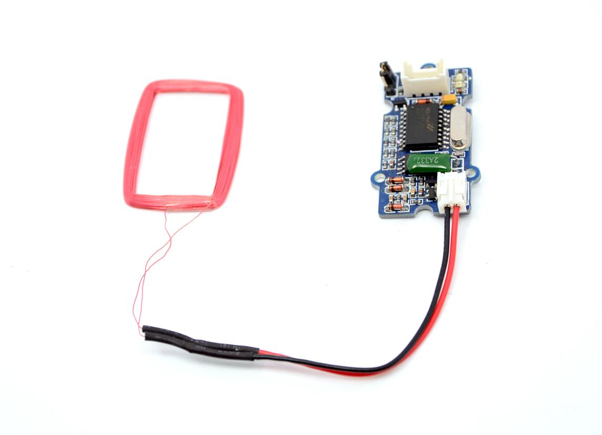
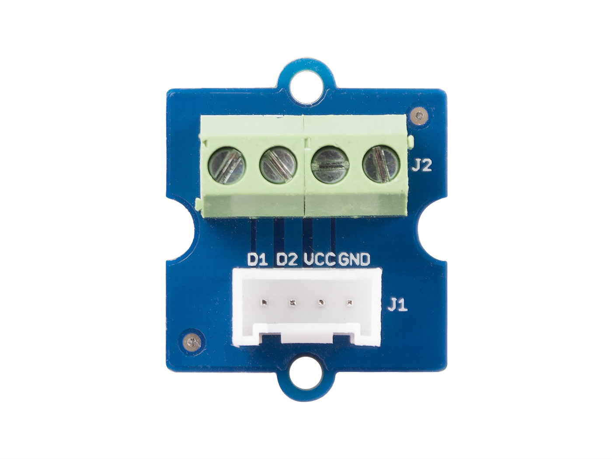
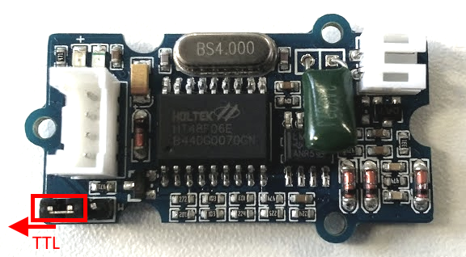

# RFID 125kHz Reader

De Grove RFID 125kHz Reader is een module die kan worden gebruikt om RFID kaarten draadloos uit te lezen. Dit soort sensoren wordt typisch toegepast voor toegangscontrole, track-en-trace van materiaal, ... Deze lezer kan kaarten uitlezen tot een maximaal theoretische afstand van 7cm (circa 5cm in de praktijk).



## Specificaties

| Parameter | Waarde |
| --- | --- |
| Spanning | 4.75-5.25V |
| Werkfrequentie | 125kHz |
| TTL Output | 	9600 baudrate, 8 data bits, 1 stop bit, no verify bit |
| Wiegand output | 26 bits Wiegand format, 1 even verify bit, 24 data bits, and 1 odd verify bit |

> **Wiegand**
>
> Wiegand is een van de meest gebruikte communicatiemethode voor apparaten voor toegangscontrole. De term Wiegand in BioStar is een communicatieprotocol dat het Suprema-apparaat en het apparaat van derden verbindt om ID-gegevens te verzenden of om het Suprema-apparaat te verbinden met een RF-lezer om ID-gegevens te verzenden.

De output mode kan worden geselecteerd aan de hand van de jumper:

* links: TTL
* rechts: Wiegand

## Aansluiten

Het aansluiten van de RFID lezer kan niet rechtstreeks via de Grove connector omdat het SODAQ bord niet voorzien is van een Grove connector voor een seriële poort (RX en TX). Daarom gebruiken we een Grove Screw Terminal bordje zoals hieronder afgebeeld.



Verbind vervolgens de terminals als volgt:

| Terminal zijde | SODAQ |
| --- | --- |
| GND (zwart) | GND |
| VCC (rood) | 5V |
| RX (wit) | D1 / TX |
| TX (geeld) | D0 / RX |

Zorg er ook voor dat de jumper op de lezer in volgende positie staat (TTL configuratie).



Vervolgens kan je ook de antenne aansluiten aan de 2-polige connector.

## Starter Applicatie

Onderstaand vind je een demo sketch die het ID uitleest van de kaart die voor de antenne wordt gehouden. Het huidige ID van de kaart wordt dan vervolgens naar de terminal geschreven.

```cpp
//**********************************************************
// Hier gaan we globale variabelen declareren.
// Deze zijn beschikbaar doorheen de volledige sketch.
//**********************************************************
const int SIZE_OF_BUFFER = 32;
char buffer[SIZE_OF_BUFFER] = {};

//**********************************************************
// De setup van Arduino, wordt in het begin van je sketch
// eenmalig uitgevoerd.
// Als je sensor moet initialiseren, dan doe je dit hier
//**********************************************************
void setup() {
  SerialUSB.begin(115200);

  // 10 seconden wachten op SerialUSB. 
  while ((!SerialUSB) && (millis() < 10000)) { }
  
  Serial.begin(9600);         // Serial is verbonden met de RFID lezer

  SerialUSB.println("Starten van starter sketch RFID lezer.");
}

//**********************************************************
// De main loop van Arduino, deze blijft telkens herhalen.
//**********************************************************
void loop() {
  // Lees het id van een RFID kaart
  read_rfid_card();   // Blokkeert tot een ID is gedetecteerd
  
  SerialUSB.print("Kaart gedetecteerd met ID = ");
  SerialUSB.println(buffer);   // buffer bevat ID

  // Welke tag werd gedetecteerd?
  if (!strcmp(buffer, "0A0069138AFA")) {
    SerialUSB.println("Rode tag gedetecteerd");
  } else if (!strcmp(buffer, "380067B6739A")) {
    SerialUSB.println("Blauwe tag gedetecteerd");
  } else if (!strcmp(buffer, "080066377821")) {
    SerialUSB.println("Gele tag gedetecteerd");
  } else {
    SerialUSB.println("Onbekende tag gedetecteerd");
  }
}

int read_rfid_card() {
  static int counter = 0;       // Een teller voor buffer
  int sizeOfId = 0;

  while (sizeOfId != 12) {
    while(Serial.available()) {
      char newChar = Serial.read();   // Lees karakter van Serial
      // ASCII 02: STX (Start of Text)
      // ASCII 03: ETX (End of Text)
      if (newChar != 2 && newChar != 3 && counter < SIZE_OF_BUFFER) {
        buffer[counter++] = newChar;
        buffer[counter] = '\0';
        sizeOfId = counter;
      } else {
        counter = 0;
      }
    }
  }
 
  return sizeOfId;
}
```

Bovenstaande demo is reeds event gebaseerd aangezien de `read_rfid_card()` functie wacht tot een kaart volledig is ingelezen. Dit is ideaal voor LoRaWAN.

## Meer informatie

Meer informatie is beschikbaar op [http://wiki.seeedstudio.com/Grove-125KHz_RFID_Reader/](http://wiki.seeedstudio.com/Grove-125KHz_RFID_Reader/).