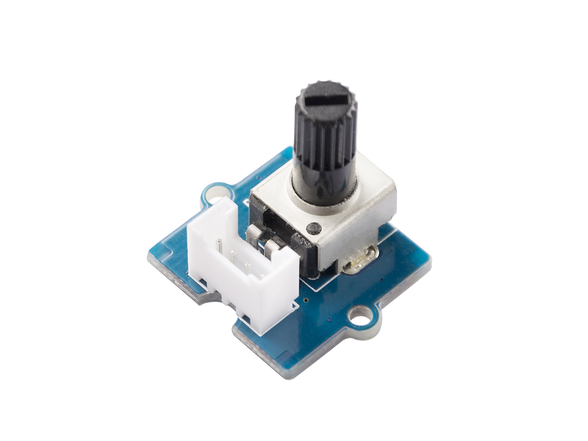
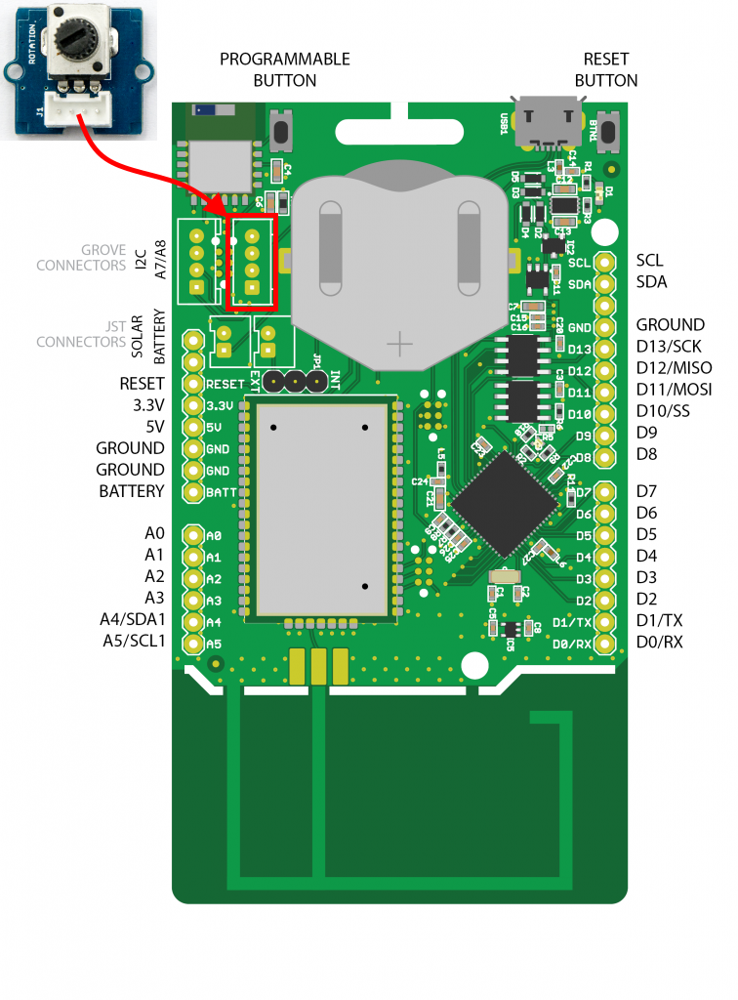

# Rotary Angle Sensor

De Rotary Angle Sensor is eigenlijk een potentiometer die een analoge waarde output tussen 0V en Vcc. Deze heeft een hoekverdraaiing van 300 graden en een lineair verloop. De weerstandswaarde van de POT is 10k.



## Aansluiten

Om de POT te verbinden met het SODAQ bord dien je eerst en vooral een **4-pins connector** aan te sluiten op de PCB. Vervolgens sluit je de andere zijde van de connector aan op het SODAQ bord. Opgelet, je dient hier wel de connectie te maken met de correcte header op het SODAQ bord, namelijk deze **met de digitale/analoge pins**, niet de I2C header. In volgende afbeelding wordt dit nog eens weergegeven.



Als je de markeringen op de PCB van de potentiometer bekijkt en vergelijkt met deze op het SODAQ bord, zal je zien dat de output van de POT (aangeduid met `SIG`) is aangesloten op `A8`. NC staat voor *Not Connected* of niet aangesloten.

## Starter Applicatie

Onderstaand vind je een demo sketch die de stand van de draaiknop om de 100 milliseconden uitleest. De huidige stand van de draaiknop wordt vervolgens weergegeven in de console.

De vertraging kan worden aangepast.

```c++
const int ROTARY_PIN = 8;      // Pin van de POT
const double POT_VCC = 5;      // Voedingsspanning van de POT (VCC)
const int POT_MAX_ANGLE = 300; // Maximale angle van de POT

void setup()
{
  // put your setup code here, to run once:
  SerialUSB.begin(115200);
  while ((!SerialUSB) && (millis() < 5000));
  SerialUSB.println("Starten van push button demo");
  pinMode(ROTARY_PIN, INPUT);
}

void loop()
{
  // Lees de waarde van de POT uit (tussen 0 en 255)
  int potValue = get_rotary_value();
  SerialUSB.print("Waarde van POT = ");
  SerialUSB.println(potValue);

  // 100 milliseconden wachten, kan je verhogen of verlagen
  delay(100);
}

int get_rotary_value() {
    int sensor_value = analogRead(ROTARY_PIN);
    float voltage = (float)sensor_value*POT_VCC/1023;
    float degrees = (voltage*POT_MAX_ANGLE)/POT_VCC;
    int byteValue = map(degrees, 0, POT_MAX_ANGLE, 0, 255);

    return byteValue;
}
```

Bovenstaande sensor komt overeen met een temperatuursensor. Je leest gewoon de waarde periodiek en stuurt deze dan door. Dus dit kan zonder veel aanpassing in de LoRaWAN sketch worden overgenomen.

## Meer informatie

More information:
[http://wiki.seeedstudio.com/Grove-Rotary_Angle_Sensor/](http://wiki.seeedstudio.com/Grove-Rotary_Angle_Sensor/)

