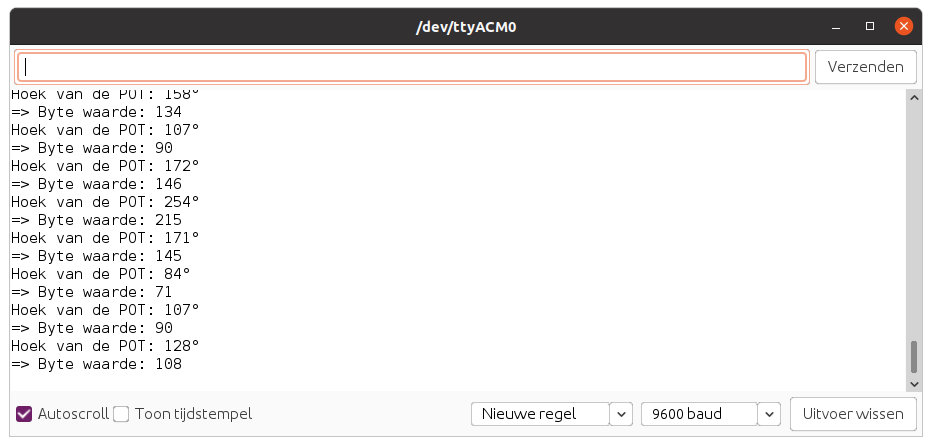

# Rotary Angle Sensor

De Rotary Angle Sensor is eigenlijk een potentiometer die een analoge waarde output tussen `0V` en `Vcc`. Deze heeft een hoekverdraaiing van `300` graden en een lineair verloop. De weerstandswaarde van de POT is `10k`.


## Aansluiten

Om de POT te verbinden met het SODAQ bord dien je eerst en vooral een **4-pins connector** aan te sluiten op de PCB. Vervolgens sluit je de andere zijde van de connector aan op het SODAQ bord. Opgelet, je dient hier wel de connectie te maken met de correcte header op het SODAQ bord, namelijk deze **met de digitale/analoge pins**, niet de I2C header. In volgende afbeelding wordt dit nog eens weergegeven.


Als je de markeringen op de PCB van de potentiometer bekijkt en vergelijkt met deze op het SODAQ bord, zal je zien dat de output van de POT (aangeduid met `SIG`) is aangesloten op `A8`. NC staat voor *Not Connected* of niet aangesloten.

## Starter Applicatie

Onderstaand vind je een demo sketch die de stand van de draaiknop om de `100` milliseconden uitleest. De huidige stand van de draaiknop wordt vervolgens weergegeven in de console.

De vertraging kan worden aangepast.

```cpp
//**********************************************************
// Hier gaan we globale variabelen declareren.
// Deze zijn beschikbaar doorheen de volledige sketch.
//**********************************************************
const int ROTARY_PIN = A8;      // Pin van de POT
const double POT_VCC = 5;       // Voedingsspanning van de POT (VCC)
const int POT_MAX_ANGLE = 300;  // Maximale angle van de POT

//**********************************************************
// De setup van Arduino, wordt in het begin van je sketch
// eenmalig uitgevoerd.
// Als je sensor moet initialiseren, dan doe je dit hier
//**********************************************************
void setup() {
  SerialUSB.begin(115200);

  // 10 seconden wachten op SerialUSB. 
  while ((!SerialUSB) && (millis() < 10000)) { }
  
  pinMode(ROTARY_PIN, INPUT);          // Analoge pin als ingang

  SerialUSB.println("Starten van starter sketch potentiometer.");
}

//**********************************************************
// De main loop van Arduino, deze blijft telkens herhalen.
//**********************************************************
void loop() {
  // Lees de hoek uit van de potentiometer
  int potAngle = get_rotary_angle();
  SerialUSB.print("Hoek van de POT: ");
  SerialUSB.print(potAngle);
  SerialUSB.println("°");

  // Omzetten naar een waarde tussen 0 en 255
  int byteValue = map(potAngle, 0, POT_MAX_ANGLE, 0, 255);
  SerialUSB.print("=> Byte waarde: ");
  SerialUSB.println(byteValue);

  // 100 milliseconden wachten, kan je verhogen of verlagen
  delay(100);
}

//**********************************************************
// Bepaal de hoek waarin de potentiometer staat gedraaid
//**********************************************************
double get_rotary_angle() {
  int sensor_value = analogRead(ROTARY_PIN);
  double voltage = (double)sensor_value*POT_VCC/1023;
  double degrees = (voltage*POT_MAX_ANGLE)/POT_VCC;

  return degrees;
}
```

De output zou er dan als volgt moeten uitzien:



Dit type sensor komt overeen met een temperatuursensor. Je leest de waarde periodiek in en stuurt deze dan door. Dus dit kan zonder veel aanpassing in de LoRaWAN sketch worden overgenomen.

## Meer informatie

Meer informatie is beschikbaar op [http://wiki.seeedstudio.com/Grove-Rotary_Angle_Sensor/](http://wiki.seeedstudio.com/Grove-Rotary_Angle_Sensor/)