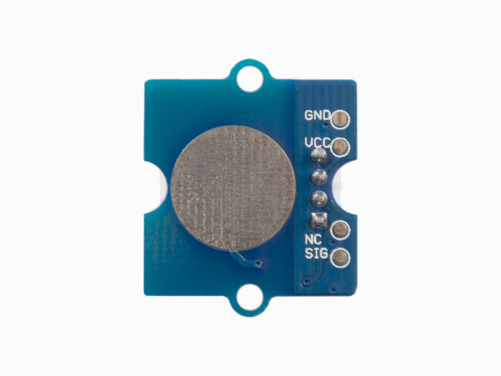
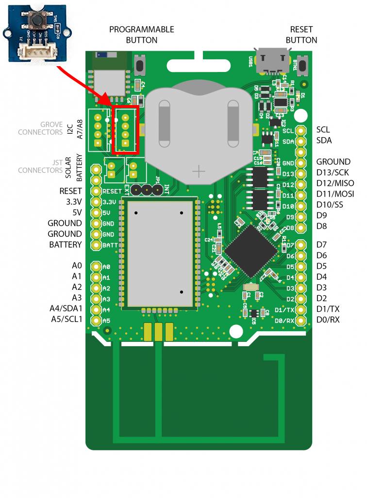
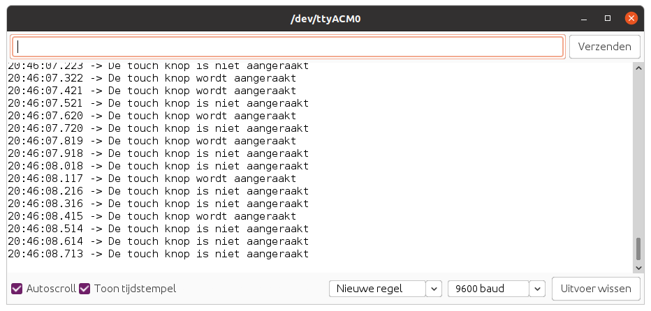
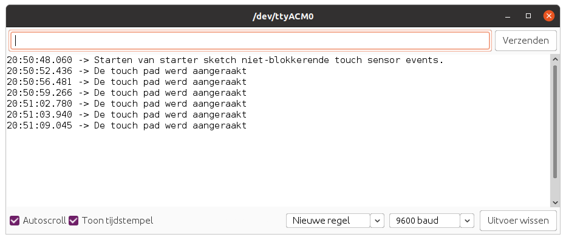

# Touch Sensor

De Touch Sensor of aanraaksensor stelt u in staat om een drukknop te vervangen door een capacitieve aanrakingssensor. Het kan de verandering in capaciteit detecteren wanneer een vinger in de buurt is. Dat betekent dat het niet uitmaakt of uw vinger de pad direct aanraakt of gewoon dicht bij de pad blijft.



## Specificaties

| Parameter | Waarde |
| --- | --- |
| Spanning | 2.0 - 5.5V |

## Aansluiten

Om de Touch Sensor te verbinden met het SODAQ bord dien je eerst en vooral een **4-pins connector** aan te sluiten op de PCB. Vervolgens sluit je de andere zijde van de connector aan op het SODAQ bord. Opgelet, je dient hier wel de connectie te maken met de correcte header op het SODAQ bord, namelijk deze **met de digitale/analoge pins**, niet de I2C header. In volgende afbeelding wordt dit nog eens weergegeven.



Als je de markeringen op de PCB van de drukknop bekijkt en vergelijkt met deze op het SODAQ bord (achterzijde), zal je zien dat de output van de drukknop (aangeduid met `SIG`) is aangesloten op `D15`. `NC` staat voor *Not Connected* of niet aangesloten.

## Starter Applicatie

Onderstaand vind je een demo sketch die aangeeft of de touch sensor wordt aangeraakt of niet.

De vertraging kan worden verkleind of vergroot naargelang de toepassing.

```cpp
//**********************************************************
// Hier gaan we globale variabelen declareren.
// Deze zijn beschikbaar doorheen de volledige sketch.
//**********************************************************
const int TOUCH_PIN = 15;   // Pin van de touch sensor

//**********************************************************
// De setup van Arduino, wordt in het begin van je sketch
// eenmalig uitgevoerd.
// Als je sensor moet initialiseren, dan doe je dit hier
//**********************************************************
void setup() {
  SerialUSB.begin(115200);

  // 10 seconden wachten op SerialUSB. 
  while ((!SerialUSB) && (millis() < 10000)) { }
  
  pinMode(TOUCH_PIN, INPUT);          // Digitale pin als ingang

  SerialUSB.println("Starten van starter sketch touch sensor.");
}

//**********************************************************
// De main loop van Arduino, deze blijft telkens herhalen.
//**********************************************************
void loop() {
  // Lees de huidige stand van de touch sensor in
  int touchState = digitalRead(TOUCH_PIN);

  if (touchState == HIGH) {
    SerialUSB.println("De touch knop wordt aangeraakt");
  }
  else {
    SerialUSB.println("De touch knop is niet aangeraakt");
  }

  // 100 milliseconden wachten, kan je verhogen of verlagen
  delay(100);
}
```

Als je de pad een aantal keer aanraakt zou je een dergelijke output in de seriële monitor moeten krijgen.



## Event gebaseerd

De starter applicatie is goed om aan te tonen hoe de touch werkt, maar meestal zijn we niet geïnterpreteerd in de huidige staat op bepaalde momenten maar eerder in verandering. Met andere woorden, onze applicatie zou moeten detecteren wanneer er iemand de touch aanraakt of los laat. Dit noemen we event gebaseerd.

De event gebaseerde optie is hier voor ons de meest toepasselijke omdat dit ook het best zal werken in samenwerking met LoRaWAN. Er werd hier ook gekozen voor de niet-blokkerende optie.

```cpp
//**********************************************************
// Hier gaan we globale variabelen declareren.
// Deze zijn beschikbaar doorheen de volledige sketch.
//**********************************************************
const int TOUCH_PIN = 15;   // Pin van de touch sensor

// Globale variabelen met de staat van de touch sensor
int previousState = 0;
int currentState = 0;

//**********************************************************
// De setup van Arduino, wordt in het begin van je sketch
// eenmalig uitgevoerd.
// Als je sensor moet initialiseren, dan doe je dit hier
//**********************************************************
void setup() {
  SerialUSB.begin(115200);

  // 10 seconden wachten op SerialUSB. 
  while ((!SerialUSB) && (millis() < 10000)) { }
  
  pinMode(TOUCH_PIN, INPUT);          // Digitale pin als ingang

  // We lezen ook de "start staat" in
  previousState = digitalRead(TOUCH_PIN);
  currentState = previousState;

  SerialUSB.println("Starten van starter sketch niet-blokkerende touch sensor events.");
}

//**********************************************************
// De main loop van Arduino, deze blijft telkens herhalen.
//**********************************************************
void loop() {
  if (has_pad_been_touched()) {
    // Versturen, verwerken, ... van de touch event
    SerialUSB.println("De touch pad werd aangeraakt");
  }

  // Hier kunnen we pas iets anders doen ...
}

//**********************************************************
// Controleer of iemand de touch heeft aangeraakt
//**********************************************************
bool has_pad_been_touched() {
  currentState = digitalRead(TOUCH_PIN);

  if (currentState != previousState) {
    // Nieuwe staat opslaan in oude staat
    previousState = currentState;

    // We willen enkel het "loslaten" detecteren
    if (currentState == HIGH) {
      // Aangeven dat de pad werd aangeraakt
      return true;
    }
  }

  // Er vond geen verandering plaats
  return false;
}
```

Dit zou de volgende output moeten geven als je een aantal keer de pad aanraakt en terug los laat.



Merk op dat je op deze manier nu kan kiezen op welke verandering je reageert. Op het aanraken, het los laten of zelfs beiden.

## Meer informatie

Meer informatie kan je terugvinden op de website van Seeed Studio: [https://wiki.seeedstudio.com/Grove-Touch_Sensor/](https://wiki.seeedstudio.com/Grove-Touch_Sensor/).
