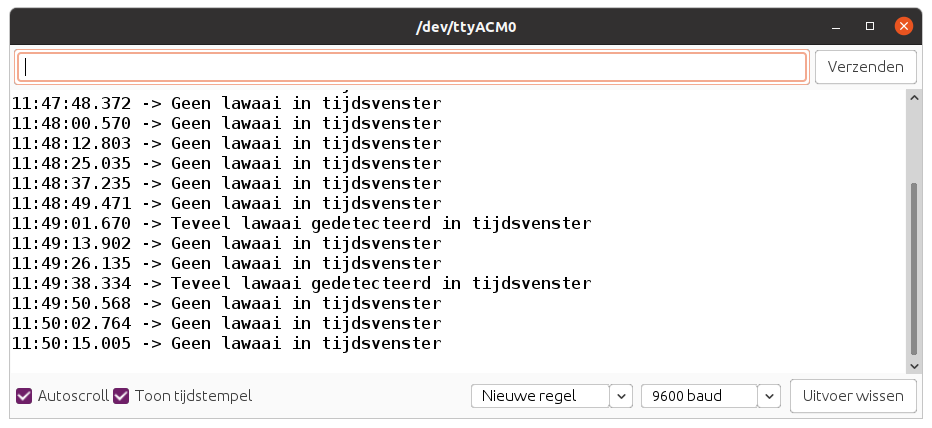

# Sound Sensor

De geluidssensor kan de geluidsintensiteit van de omgeving detecteren. Het hoofdbestanddeel van de module is een eenvoudige microfoon, die is gebaseerd op de L358-versterker en een elektretmicrofoon. De output van deze module is analoog en kan eenvoudig worden gesampled.


## Aansluiten

Om de geluidssensor te verbinden met het SODAQ bord dien je eerst en vooral een **4-pins connector** aan te sluiten op de PCB. Vervolgens sluit je de andere zijde van de connector aan op het SODAQ bord. Opgelet, je dient hier wel de connectie te maken met de correcte header op het SODAQ bord, namelijk deze **met de digitale/analoge pins**, niet de I2C header. In volgende afbeelding wordt dit nog eens weergegeven.


Als je de markeringen op de PCB van de geluidssensor bekijkt en vergelijkt met deze op het SODAQ bord, zal je zien dat de output van de sensor (aangeduid met `SIG`) is aangesloten op `A8`. NC staat voor *Not Connected* of niet aangesloten.

## Starter Applicatie

Onderstaand vind je een demo sketch die de analoge spanning van de geluidssensor inleest om de `100` milliseconden. De huidige waarde van de sensor wordt vervolgens weergegeven in de console of kan je ook via de seriële plotter weergeven in een grafiek.

De vertraging kan worden aangepast.

```cpp
//**********************************************************
// Hier gaan we globale variabelen declareren.
// Deze zijn beschikbaar doorheen de volledige sketch.
//**********************************************************
const int SOUND_PIN = A8;           // Pin van de geluidssensor
const int MAX_SOUND_LEVEL = 1023;   // Maximale waarde van de geluidssensor
const int AVERAGE_SAMPLES = 32;     // Aantal samples voor gemiddelde

//**********************************************************
// De setup van Arduino, wordt in het begin van je sketch
// eenmalig uitgevoerd.
// Als je sensor moet initialiseren, dan doe je dit hier
//**********************************************************
void setup() {
  SerialUSB.begin(115200);

  // 10 seconden wachten op SerialUSB. 
  while ((!SerialUSB) && (millis() < 10000)) { }
  
  pinMode(SOUND_PIN, INPUT);          // Analoge pin als ingang

  SerialUSB.println("Starten van starter sketch geluidssensor.");
}

//**********************************************************
// De main loop van Arduino, deze blijft telkens herhalen.
//**********************************************************
void loop() {
  // Lees het geluidsniveau uit van de sensor
  int soundLevel = get_sound_level();
  SerialUSB.print("Geluidsniveau: ");
  SerialUSB.println(soundLevel);

  // Omzetten naar een waarde tussen 0 en 255
  int byteValue = map(soundLevel, 0, MAX_SOUND_LEVEL, 0, 255);
  SerialUSB.print("=> Byte waarde: ");
  SerialUSB.println(byteValue);

  // 100 milliseconden wachten, kan je verhogen of verlagen
  delay(100);
}

//**********************************************************
// Bepaal het geluidsniveau van de geluidssensor.
//**********************************************************
int get_sound_level() {
  long averageSoundLevel = 0;
  for (int i = 0; i < AVERAGE_SAMPLES; i++) {
    averageSoundLevel += analogRead(SOUND_PIN);
  }

  return (int)(1.0 * averageSoundLevel / AVERAGE_SAMPLES);
}
```

De output zou er dan als volgt moeten uitzien:


## Event gebaseerd

De starter applicatie is goed om aan te tonen hoe de geluidssensor werkt, geluid is een snel veranderend gegeven. Een geluidssensor kunnen we eigenlijk beter benaderen als een soort detector. Dan kunnen we bv. gaan detecteren wanneer een bepaald geluidsniveau wordt overschreden.

In plaats van moment opnames te nemen willen we eigenlijk weten of er binnen een bepaald tijdsvenster veel lawaai was. Dit kan dan worden doorgestuurd via LoRaWAN. Door een lus te maken die 1000x de sensor controleert en telkens 10ms wacht, komen we aan een tijdsvenster van 10s.

::: tip analogRead
Merk op dat het sampelen van een analoge input ongeveer `100us` in beslag neemt. Hier dienen we ook rekening mee te houden.
:::

```cpp
//**********************************************************
// Hier gaan we globale variabelen declareren.
// Deze zijn beschikbaar doorheen de volledige sketch.
//**********************************************************
const int SOUND_PIN = A8;           // Pin van de geluidssensor
const int AVERAGE_SAMPLES = 32;     // Aantal samples voor gemiddelde
const int NOISY_LEVEL = 500;        // Wat zien we als "veel lawaai"

//**********************************************************
// De setup van Arduino, wordt in het begin van je sketch
// eenmalig uitgevoerd.
// Als je sensor moet initialiseren, dan doe je dit hier
//**********************************************************
void setup() {
  SerialUSB.begin(115200);

  // 10 seconden wachten op SerialUSB. 
  while ((!SerialUSB) && (millis() < 10000)) { }
  
  pinMode(SOUND_PIN, INPUT);          // Analoge pin als ingang

  SerialUSB.println("Starten van detector sketch geluidssensor.");
}

//**********************************************************
// De main loop van Arduino, deze blijft telkens herhalen.
//**********************************************************
void loop() {
  bool noiseDetected = false;
  
  for (int i = 0; i < (1000 / (AVERAGE_SAMPLES / 10)); i++) {
    // Lees het gemiddelde geluidsniveau in
    int soundLevel = get_sound_level();

    // Als er ook maar 1x veel lawaai is, dan gaan we dit detecteren
    if (soundLevel >= NOISY_LEVEL) {
      noiseDetected = true;
    }

    delay(10);    // 10ms * (1000 / (AVERAGE_SAMPLES / 10))
                  //    = tijdsvenster van circa 10 seconden
  }

  // Rapportering
  if (noiseDetected) {
    SerialUSB.println("Teveel lawaai gedetecteerd in tijdsvenster");
  } else {
    SerialUSB.println("Geen lawaai in tijdsvenster");
  }
}

//**********************************************************
// Bepaal het geluidsniveau van de geluidssensor.
//**********************************************************
int get_sound_level() {
  long averageSoundLevel = 0;
  for (int i = 0; i < AVERAGE_SAMPLES; i++) {
    averageSoundLevel += analogRead(SOUND_PIN);
  }

  return (int)(1.0 * averageSoundLevel / AVERAGE_SAMPLES);
}
```

Dit geeft dan volgende output:



## Meer informatie

Meer informatie is beschikbaar op [https://wiki.seeedstudio.com/Grove-Sound_Sensor/](https://wiki.seeedstudio.com/Grove-Sound_Sensor/)

<!-- TODO: Things Network Decoder -->