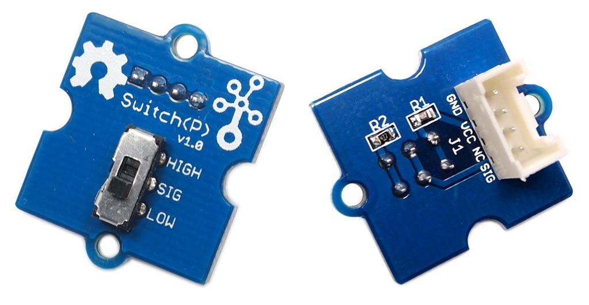
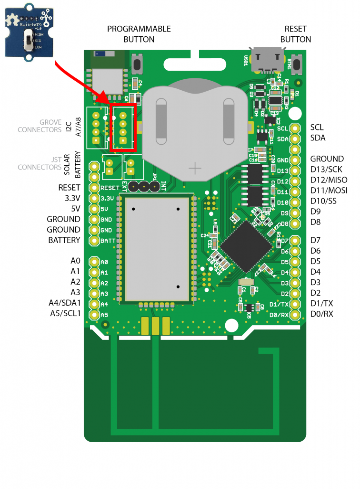

# Switch (P)

De Grove switch is een mini SPDT (single pole, double throw) schakelaar die ideaal is om dingen aan of uit te zetten. In tegenstelling tot een drukknop blijft een schakelaar in zijn positie staan.



## Aansluiten

Om de schakelaar te verbinden met het SODAQ bord dien je eerst en vooral een **4-pins connector** aan te sluiten op de switch PCB. Vervolgens sluit je de andere zijde van de connector aan op het SODAQ bord. Opgelet, je dient hier wel de connectie te maken met de correcte header op het SODAQ bord, namelijk deze **met de digitale/analoge pins**, niet de I2C header. In volgende afbeelding wordt dit nog eens weergegeven.



Als je de markeringen op de PCB van de switch bekijkt en vergelijkt met deze op het SODAQ bord, zal je zien dat de output van switch (aangeduid met `SIG`) is aangesloten op `D15`.

## Starter Applicatie

Onderstaand vind je een demo sketch die de stand van de switch om de 100 milliseconden uitleest. De huidige stand van de schakelaar wordt vervolgens weergegeven in de console.

De vertraging kan worden verkleind of er zelfs worden uitgehaald.

```c++
const int switchPin = 15;   // Pin van Switch

void setup()
{
  // put your setup code here, to run once:
  SerialUSB.begin(115200);
  while ((!SerialUSB) && (millis() < 5000));
  SerialUSB.println("Starten van switch demo");
  pinMode(switchPin, INPUT);        // Digitale pin als ingang
}

void loop()
{
  // put your main code here, to run repeatedly:

  // Lees de huidige stand van de schakelaar
  int switchState = digitalRead(switchPin);

  if (switchState == HIGH) {
    SerialUSB.println("De schakelaar staat in de AAN stand");
  }
  else {
    SerialUSB.println("De schakelaar staat in de UIT stand");
  }

  // 100 milliseconden wachten, kan je verlagen
  delay(100);
}
```

## Event gebaseerd

De starter applicatie is goed om aan te tonen hoe de schakelaar werkt, maar is niet zo praktisch voor te verzenden met LoRaWAN. We kunnen niet 10 maal per seconde de staat doorsturen. Om dit met LoRaWAN te combineren zou er beter worden gewerkt met detectie van verandering. Zo zou je onderstaande code kunnen aanpassen om via LoRaWAN de staat kunnen doorsturen nadat de user de knop heeft verschoven.

```c++
const int switchPin = 15;   // Pin van Switch

void setup()
{
  // put your setup code here, to run once:
  SerialUSB.begin(115200);
  while ((!SerialUSB) && (millis() < 5000));
  SerialUSB.println("Starten van switch demo");
  pinMode(switchPin, INPUT);        // Digitale pin als ingang
}

void loop()
{
  // put your main code here, to run repeatedly:

  // Lees de huidige stand van de schakelaar
  int previousState = digitalRead(switchPin);
  int state = previousState;

  SerialUSB.println("Wachten voor event");

  // Wachten op verandering van de staat van de schakelaar.
  while (state == previousState) {
    previousState = state;          // Nieuwe staat opslaan in oude staat
    state = digitalRead(switchPin);    // Nieuwe staat inlezen
    delay(10);    // Even wachten voor ontdendering
  }

  SerialUSB.println("Event is gebeurt");

  SerialUSB.println("De schakelaar is ");
  SerialUSB.println(state);
  
}
```

## Meer informatie

Meer informatie is beschikbaar op [http://wiki.seeedstudio.com/Grove-Switch-P/](http://wiki.seeedstudio.com/Grove-Switch-P/).