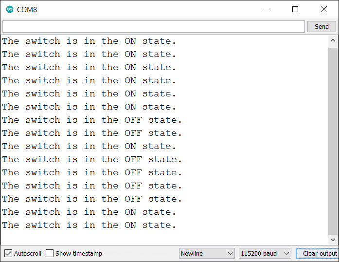
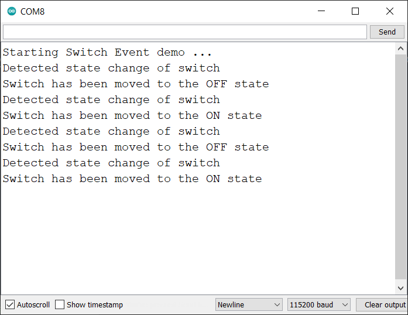

# Een Switch (P)

De Grove switch is een mini SPDT (single pole, double throw) schakelaar die ideaal is om dingen aan of uit te zetten. In tegenstelling tot een drukknop blijft een schakelaar in zijn positie staan.


## Aansluiten

Om de schakelaar te verbinden met het SODAQ bord dien je eerst en vooral een **4-pins connector** aan te sluiten op de switch PCB. Vervolgens sluit je de andere zijde van de connector aan op het SODAQ bord. Opgelet, je dient hier wel de connectie te maken met de correcte header op het SODAQ bord, namelijk deze **met de digitale/analoge pins**, niet de I2C header. In volgende afbeelding wordt dit nog eens weergegeven.


Als je de markeringen op de PCB van de drukknop bekijkt en vergelijkt met deze op het SODAQ bord (achterzijde), zal je zien dat de output van de switch (aangeduid met `SIG`) is aangesloten op `D15`. `NC` staat voor *Not Connected* of niet aangesloten.

## Starter Applicatie

Onderstaand vind je een demo sketch die de stand van de switch om de 100 milliseconden uitleest. De huidige stand van de schakelaar wordt vervolgens weergegeven in de seriele monitor.

De vertraging kan worden verkleind of vergroot naargelang de toepassing.

```cpp
const int SWITCH_PIN = 15;   // Pin of Switch

// Put your setup code here, to run once:
void setup() {
  SerialUSB.begin(115200);

  // Configure switch pin as digital input
  pinMode(SWITCH_PIN, INPUT);

  // Wait for SerialUSB or start after 10 seconds
  while ((!SerialUSB) && (millis() < 10000)) {}

  SerialUSB.println("Starting Switch demo ...");
}

// Put your main code here, to run repeatedly:
void loop() {
  // Read out the current state of the switch
  int switchState = digitalRead(SWITCH_PIN);

  if (switchState == HIGH) {
    SerialUSB.println("The switch is in the OFF state.");
  } else {
    SerialUSB.println("The switch is in the ON state.");
  }

  // Wait 100 milliseconds between each read.
  // You can lower or raise this
  delay(100);
}
```

Als je de schakelaar een aantal keer van positie verandert zou je een dergelijke output in de seriele monitor moeten krijgen.



## Event gebaseerd

Net zoals bij de [Push Button](/sensors/push_button/README.md#event-gebaseerd) kunnen we ook hier een variant op maken die verandering detecteert.

```cpp
const int SWITCH_PIN = 15;   // Pin of Switch

// Previous state of Switch
int previousState = 0;
int currentState = 0;

// Put your setup code here, to run once:
void setup() {
  SerialUSB.begin(115200);

  // Configure switch pin as digital input
  pinMode(SWITCH_PIN, INPUT);
  previousState = digitalRead(SWITCH_PIN);    // Read start state
  currentState = previousState;             // Starting with this state

  // Wait for SerialUSB or start after 10 seconds
  while ((!SerialUSB) && (millis() < 10000)) {}

  SerialUSB.println("Starting Switch Event demo ...");
}

// Put your main code here, to run repeatedly:
void loop() {
  currentState = digitalRead(SWITCH_PIN);

  if (currentState != previousState) {
    SerialUSB.println("Detected state change of switch");

    // What is the current state?
    if (currentState == LOW) {
      SerialUSB.println("Switch has been moved to the ON state");
    } else {
      SerialUSB.println("Switch has been moved to the OFF state");
    }

    // Set the current state as the previous state
    previousState = currentState;
    delay(10);      // Do some debouncing
  }
}
```

Dit zou de volgende output moeten geven als je een aantal keer de schakelaar van stand verandert.



Merk op dat je op deze manier nu kan kiezen op welke verandering je reageert. Op de *AAN* stand, de *UIT* stand of zelfs beiden.

## Meer informatie

Meer informatie kan je terugvinden op de website van Seeed Studio: [https://wiki.seeedstudio.com/Grove-Switch-P/](https://wiki.seeedstudio.com/Grove-Switch-P/).
