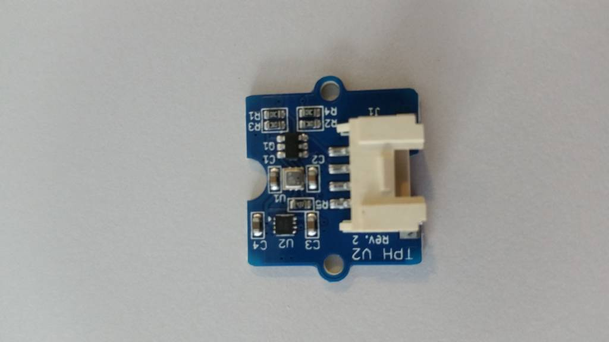
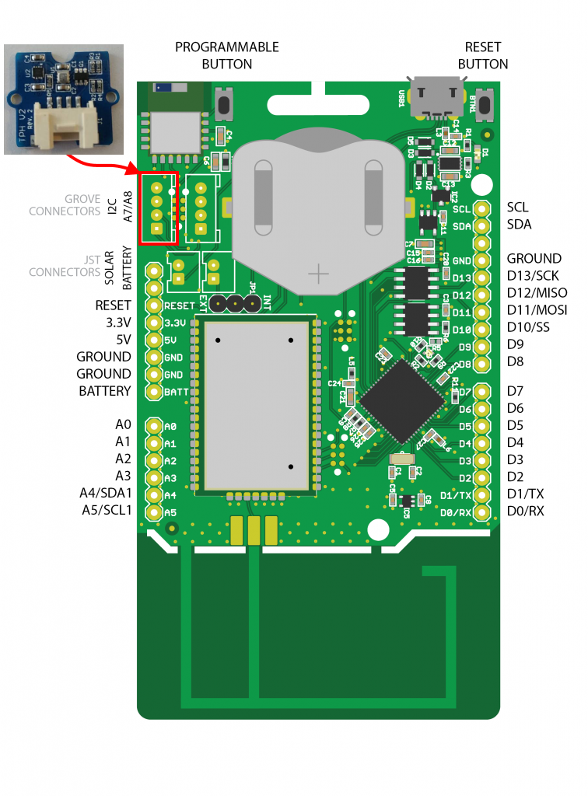
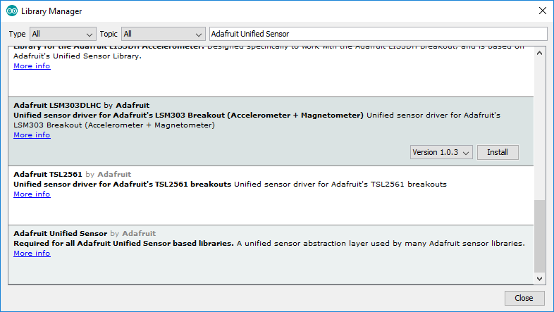

# TPHv6 Sensor

De nieuwe versie van de TPH (Temperature, Pressure and Humidity) sensor (v2) is nu nog beter in het meten van temperatuur, barometerdruk en vochtigheid. Met de opnieuw ontworpen BME280-chip is dit omgevingssensorbord met precisie en nauwkeurigheid gemaakt om uw metingen nog betrouwbaarder dan ooit te maken. Het is geweldig voor verschillende weersomstandigheden en kan zowel met I2C als SPI worden gebruikt om uw projecten nog meer flexibiliteit te geven.



## Specificaties

| Parameter | Waarde |
| --- | --- |
| Vochtigheid | ±3% |
| Barometerdruk | ±1 hPa (absolute accuraatheid) |
| Temperatuur | ±1.0 °C |
| Communicatie protocol | I2C of SPI |
| I2C Address | 0xEC |

## Aansluiten

Om de TPH sensor te verbinden met het SODAQ bord dien je eerst en vooral een **4-pins connector** aan te sluiten op de sensor PCB. Vervolgens sluit je de andere zijde van de connector aan op het SODAQ bord. Opgelet, je dient hier wel de connectie te maken met de correcte header op het SODAQ bord, namelijk deze **met de I2C aanduiding**, niet de digitale/analoge pins. In volgende afbeelding wordt dit nog eens weergegeven.



## Starter Applicatie

Vooraleer je onderstaande code snippet kan gebruiken om te starten dien je in een nieuwe Arduino sketch eerst de `Adafruit Unified Sensor` en `Adafruit BME280` bibliotheken in te laden. Dit kan je verwezenlijken door te navigeren naar `Sketch => Include Library => Manage Libraries`. en vervolgens te zoeken naar `Adafruit Unified Sensor` en `Adafruit BME280`. Installeer de gevonden bibliotheken.




Nu kan je starten vanaf onderstaande code. Hierbij worden zowel de temperatuur, barometerdruk als luchtvochtigheid weergegeven.

```c++
#include <Wire.h>
#include <Adafruit_Sensor.h>
#include <Adafruit_BME280.h>

// De TPH sensor
Adafruit_BME280 bme;

void setup() {
    // put your setup code here, to run once:
    SerialUSB.begin(115200);
    while ((!SerialUSB) && (millis() < 5000));
    SerialUSB.println("Starten van TPH demo");
    bme.begin();      // Init de TPH sensor
}

void loop() {
    SerialUSB.print("Temperature = ");
    SerialUSB.print(bme.readTemperature());
    SerialUSB.println(" *C");

    SerialUSB.print("Pressure = ");
    SerialUSB.print(bme.readPressure() / 100.0F);
    SerialUSB.println(" hPa");

    SerialUSB.print("Humidity = ");
    SerialUSB.print(bme.readHumidity());
    SerialUSB.println(" %");

    SerialUSB.println();
    delay(2000);
}
```

## Alles samen

Het probleem is nu natuurlijk dat deze gegevens in een buffer moeten worden geplaatst om te kunnen versturen met LoRaWAN. Dit lost volgende code snippet op. Hierbij worden de gegevens omgezet naar bytes die dan in de buffer worden opgeslagen.

```c++
#include <Wire.h>
#include <Adafruit_Sensor.h>
#include <Adafruit_BME280.h>

// De TPH sensor
Adafruit_BME280 bme;

// Met een byte buffer zoals bij LoRaWAN
const int SIZE_OF_BUFFER = 6;
uint8_t buffer[SIZE_OF_BUFFER];

void setup() {
    // put your setup code here, to run once:
    SerialUSB.begin(115200);
    while ((!SerialUSB) && (millis() < 5000));
    SerialUSB.println("Starten van TPH demo");
    bme.begin();      // Init de TPH sensor
}

void loop() {
    read_tph_sensor_to_buffer();
    SerialUSB.println();
    delay(2000);
}

void read_tph_sensor_to_buffer()
{
    float temperature = bme.readTemperature();
    buffer[0] = ((int)(temperature * 100) >> 8) & 0xFF;
    buffer[1] = ((int)(temperature * 100) >> 0) & 0xFF;
    SerialUSB.print("Temperature = ");
    SerialUSB.print(temperature);
    SerialUSB.println(" *C");

    int pressure = bme.readPressure();
    buffer[2] = (pressure >> 16) & 0xFF;
    buffer[3] = (pressure >> 8) & 0xFF;
    buffer[4] = (pressure >> 0) & 0xFF;
    SerialUSB.print("Pressure = ");
    SerialUSB.print(pressure / 100.0F);
    SerialUSB.println(" hPa");

    buffer[5] = bme.readHumidity();
    SerialUSB.print("Humidity = ");
    SerialUSB.print(buffer[5]);
    SerialUSB.println(" %");
}
```

## Meer informatie

More information:
[https://shop.sodaq.com/tph-v2.html]()
