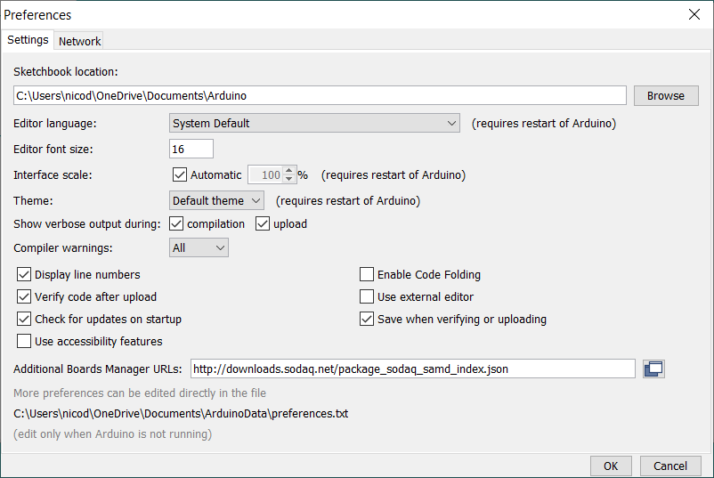

# De SODAQ ExpLoRer

Het SODAQ ExpLoRer ontwikkelbord is een Arduino compatibel bord gemaakt voor onderzoeks- en labo doeleinden. Doordat het een Arduino compatibel bord is, is het natuurlijk ook heel toegankelijk voor studenten.

Naast een **LoRaWAN module** voor draadloze communicatie, bevat het bord eveneens een **Bluetooth Low Energy** (BLE) module. Standaard is het bord voorzien van een **oplaadbare batterij** die kan worden opgeladen via USB, externe voeding of een **zonnepaneel**. **Externe sensoren** kunnen daarbij via de I/O's of het **Grove systeem** worden aangekoppeld. Kortom heel wat functionaliteit voor zo'n klein bordje.


## Eigenschappen

| Eigenschap | Waarde |
| ------ | ----- |
| Microcontroller | ATSAMD21J18, 32-Bit ARM Cortex M0+ |
| Compatibiliteit | Arduino M0 |
| Grootte | 93 x 55 mm |
| Voeding | 3.3V |
| I/O | 20 pinnen |
| Analoge outputs | 10-bit DAC |
| Externe interrupts | Mogelijk op alle pinnen |
| Maximale DC stroom per I/O | 7 mA |
| Flash geheugen | 256KB en 4MB (externe flash) |
| SRAM | 32KB |
| EEPROM | Tot 16KB door emulatie |
| Kloksnelheid | 48 MHz |
| Stroomvoorziening | 5V USB power and/or 3.7 LiPo batterij |
| Opladen | Via zonnepaneel charger, tot 500mA oplaadstroom |
| LEDs | RGB LED, Blue LED |
| LoRa | Microchip RN2483 module |
| Bluetooth | Microchip RN4871 module |
| Cryptochip | ATECC508A |
| Temperatuursensor | MCP9700AT |
| USB | MicroUSB Port |

## Starten met de SODAQ ExpLoRer

Begin met het downloaden van de laatste nieuwe **Arduino IDE** van de website van Arduino [https://www.arduino.cc/en/software](https://www.arduino.cc/en/software).

::: tip Arduino op de Raspberry Pi
Tijdens de workshop moet je Arduino IDE niet meer installeren. Dit werd reeds voor jullie gedaan. Op de Raspberry Pi's kan je niet de standaard Arduino IDE op installeren. Hier heb je de **Linux ARM** editie voor nodig. De installatieinstructies hiervoor kan je hier terugvinden: [Install the Arduino Software (IDE) on Linux](https://www.arduino.cc/en/Guide/Linux)
:::

Start de Arduino IDE op.

Vooraleer er van start kan worden gegaan moet het ontwikkelbord worden toegevoegd aan de board manager van Arduino. Dit doe je door in de Arduino IDE te navigeren naar `File => Preferences` en in het invulvak `Additional Boards Managers URLs` het volgende in te vullen:

```text
http://downloads.sodaq.net/package_sodaq_samd_index.json
```



Vervolgens dienen we de nieuwste definitie van dit bord te installeren. Ga hiervoor naar `Tools => Board => Boards Manager ...` en type dan `sodaq` in het **filterveld**.


Klik vervolgens op **Install** voor het bord `SODAQ SAMD Boards by SODAQ`.

Zorg er vervolgens voor dat het **SODAQ ExpLoRer** bord is geselecteerd onder `Tools => Board => SODAQ SAMD (32-bits ARM Cortex-M0+ ) Boards`.


Als laatste dien je ook aan te duiden op welke seriele poort het bord is aangesluiten. Ga naar `Tools => Port` en selecteer de correcte poort.

## Pin benamingen

Onderstaand vind je de benamingen van de pinnen die je kan gebruiken binnen je Arduino sketch.


### Handige benamingen voor veelgebruikte pinnen

Naast de standaard Arduino benamingen kan je tevens gebruik maken van een aantal handige benamingen voor de veelgebruikte pinnen. Deze worden voorzien door de definitie van het bord dat werd ingeladen.

| Beschrijving | Pin nummer | Benaming |
| --- | --- | --- |
| RGB Red LED | | LED_RED |
| RGB Green LED | | LED_GREEN |
| RGB Blue LED | | LED_BLUE |
| Blue LED | D13 | LED_BUILTIN |
| Bluetooth Wake | | BLUETOOTH_WAKE |
| Bluetooth Reset* | | BT_RESET |
| Push Button* | | BUTTON |
| LoRa Reset* | | LORA_RESET |
| Temperature Sensor | A6 | TEMP_SENSOR |

*Bord revisie 5 en hoger

## Batterijbeheer

De ExpLoRer werkt op een oplaadbare knoopcel batterij die er standaard wordt bijgeleverd. Om de batterij op te laden, kan de ExpLoRer op USB en/of op een zonnepaneel worden aangesloten.

De ExpLoRer kan echter maar 1 batterij tegelijkertijd gebruiken. Verplaats de schakelaar om te kiezen tussen de interne knoopcel batterij of een externe batterij. Enkel de geselecteerd batterij wordt opgeladen.

Je kan eveneens een 3,3V tot 5,2V voeding aansluiten op de zonnepaneel-connector om de batterij op de laden.

### Bootloader mode

Om stroom uit te sparen is het eveneens mogelijk om de USB-verbinding uit te schakelen. Als de **reset-knop** dan binnen een seconde tweemaal wordt ingedrukt, wordt er de bootloader gestart in plaats van de Arduino sketch. Dit laat dan toe om een nieuwe sketch in te laden. Merk wel op dat je een andere COM-poort zal zien op de computer.

## Hardware seriele poorten

De SODAQ ExpLoRer heeft 4 hardware seriele poorten:

* **SerialUSB** – Deze kan je gebruiken om te communiceren met je computer via de seriele monitor in je Arduino IDE.
* **Serial** – Dit is een seriele poort die naar buiten werd gebracht om te communiceren met andere hardware (via pin `D1/TX` en `D0/RX`).
* **Serial1** – Deze wordt gebruikt om de Bluetooth module aan te sturen.
* **Serial2** – Deze wordt gebruikt om de RN2483 LoRaWAN module aan te sturen.

De snelheden (te kiezen uit `9600`, `19200`, `38400`, `57600`, `74880`, `115200`, ...) van de verschillende seriele poorten kan je instellen door dit mee te geven met de `begin()` methode. Hieronder vind je een starter voorbeeld van een sketch die de poort instelt op `115200` en vervolgens om de 5 seconden `Hello World` uitstuurt op `SerialUSB` (dit kan je zien via de seriele monitor in je Arduino IDE).

```cpp
// Put your setup code here, to run once:
void setup() {
  SerialUSB.begin(115200);
}

// Put your main code here, to run repeatedly:
void loop() {
  // Output "Hello World" to SerialUSB which is connected
  // to the computer via USB
  SerialUSB.println("Hello World");

  // Wait 5 seconds before continueing
  delay(5000);
}
```

Selecteer het *upload* icoon (pijl naar rechts) om de sketch te compileren en in het bord te laden. Als je de seriele monitor opent en de snelheid instelt op `115200` zou je volgende output moeten krijgen:


### Even wachten

De sketch wordt na het opladen of het inpluggen van de voeding direct gestart. Als je dan een seriele monitor opent zal de code niet herstarten en kan het dus zijn dat je de beginberichten van je sketch niet ziet. Dit kan je oplossen door de sketch te laten wachten tot er een seriele monitor is aangesloten. Door er tevens een timeout op te zetten, zal de sketch toch starten indien binnen de aangegeven tijd geen seriele monitor wordt aangesloten.

```cpp{5-8}
// Put your setup code here, to run once:
void setup() {
  SerialUSB.begin(115200);

  while ((!SerialUSB) && (millis() < 10000)) {
    // Wait for SerialUSB or start after 10 seconds
  }
  SerialUSB.println("Starting Hello World demo code ...");
}

// Put your main code here, to run repeatedly:
void loop() {
  // Output "Hello World" to SerialUSB which is connected
  // to the computer via USB
  SerialUSB.println("Hello World");

  // Wait 5 seconds before continueing
  delay(5000);
}
```

Je zou dan volgende output moeten krijgen:


### Alive LED

Een device zoals dit is niet altijd aangesloten op een computer. Toch willen we soms in een oogopslag zien of het device nog werkt. Vandaar dat we dit soort systemen meestal voorzien van een LED die af en toe eens knippert. Typisch noemen we dit een alive LED.

Onderstaande sketch voegt ook nog een alive LED toe aan het "Hello World" programma.

```cpp{6,21-23}
// Put your setup code here, to run once:
void setup() {
  SerialUSB.begin(115200);

  // Configure LED_BUILTIN  as output
  pinMode(LED_BUILTIN, OUTPUT);

  while ((!SerialUSB) && (millis() < 10000)) {
    // Wait for SerialUSB or start after 10 seconds
  }
  SerialUSB.println("Starting Hello World demo code ...");
}

// Put your main code here, to run repeatedly:
void loop() {
  // Output "Hello World" to SerialUSB which is connected
  // to the computer via USB
  SerialUSB.println("Hello World");

  // Blink LED shortly
  digitalWrite(LED_BUILTIN, HIGH);
  delay(200);
  digitalWrite(LED_BUILTIN, LOW);

  // Wait 5 seconds before continueing
  delay(5000);
}
```

Indien de batterij van het device is opgeladen, kan je de USB connector even uitrekken om te kijken of het systeem nog steeds operationeel is. Dit natuurlijk nadat je de nieuwe firmware hebt ingeladen.

## Bluetooth

Het ExpLoRer bord bevat eveneens een **Bluetooth Low Energy** module (RN4871) die je kan gebruiken om draadloos te communiceren met andere apparaten zoals bv. een GSM of laptop. Indien je dit wil doen dien je wel de Bluetooth bibliotheek voor Arduino te downloaden.

Deze kan je vinden op [Microchip_RN487x](http://support.sodaq.com/wp-content/uploads/2016/11/Microchip_RN487x.zip).

## Bord schema's

Indien je dit ooit nodig heb, kan je hieronder ook de schema's van de verschillende bord revisies downloaden.

* [explorer_schematic_rev6c_868](http://support.sodaq.com/wp-content/uploads/2018/02/explorer_schematic_rev6c_868.pdf)
* [explorer_schematic_rev6c_915](http://support.sodaq.com/wp-content/uploads/2018/02/explorer_schematic_rev6c_915.pdf)
* [explorer_schematic_rev5b](http://support.sodaq.com/wp-content/uploads/2016/11/Explorer_schematic_rev5b.pdf)
* [explorer_schematic_rev3-3](http://support.sodaq.com/wp-content/uploads/2016/11/Explorer_schematic_rev3-3.pdf)
